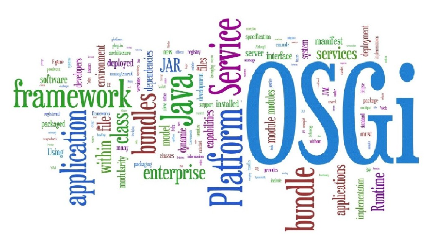

# OSGI
OSGi（Open Service Gateway Initiative，直译为“开放服务网关”）实际上是一个由OSGi联盟（OSGi Alliance）发起的以Java为技术平台的动态模块化规范。

OSGi联盟是由Sun Microsystems、IBM、Ericsson等公司于1999年3月成立的一个世界性的开放标准化组织，最初的名称为Connected Alliance，该组织成立的主要目的原本在于使服务提供商通过住宅网关为各种家庭智能设备提供服务。最初的OSGi规范也只是关注于嵌入式领域，前三个版本的OSGi规范主要满足诸如机顶盒、服务网关、手机等应用环境的模块化需求。从第四个版本开始，OSGi将主要关注点转向了Java SE和EE领域，并且在这些领域中获得了很大的发展，成为Java平台事实上的模块化规范。

随着OSGi技术的不断发展，OSGi联盟的成员数量已经由最开始的几个增长到目前超过100个，很多世界著名的IT企业都加入到OSGi的阵营之中，如Adobe、IBM、Oracle、SAP、RedHat和Siemens等。它们推出的许多产品都支持OSGi技术，甚至产品本身就使用了OSGi技术构建，例如IBM的WebSphere、Lotus和JAZZ，Oracle的GlassFish和Weblogic，RedHat的JBoss，Eclipse基金会的Eclipse IDE、Equinox及之下的众多子项目，Apache基金会的Karaf、Aries、Geronimo、Felix及之下的众多子项目等。这些IT巨头的踊跃参与，也从侧面证明了OSGi技术有着非常广阔的市场前景。

OSGi技术的影响同时也延伸到了Java社区，JSR-232提案的通过说明OSGi技术已经被Java ME领域所认可，而JSR-291提案则奠定了OSGi技术在Java SE和Java EE领域标准模块化规范的地位。

OSGi的诸多优秀特性，如动态性、模块化和可扩展能力逐渐被越来越多的开发者所认识和欣赏，越来越多的系统基于OSGi架构进行开发。在这些系统的开发过程中，又会向OSGi提出一个又一个新的需求，所以OSGi规范所包括的子规范与技术范畴也在不断发展、日益壮大。

今天，OSGi的已经不再是原来Open Service Gateway Initiative的字面意义能涵盖的了，OSGi联盟给出的最新OSGi定义是The Dynamic Module System for Java，即面向Java的动态模块化系统。

2012年7月，OSGi联盟发布了最新版的OSGi R5.0规范，这次发布的规范包括OSGi核心规范R5.0和OSGi企业级规范R5.0。在Java SE领域，Eclipse和NetBean两款集成开发工具的成功已经完全证明了OSGi在桌面领域是能担当重任的。最近两三年来，OSGi的发展方向主要集中在Java EE领域，在OSGi企业专家组（EEG）的努力下，OSGi的企业级规范R5.0版相比两年前发布的R4.2版又增加了许多新的内容，OSGi技术在服务端和企业级领域正迅速走向成熟。
## OSGI规范的演进
OSGi在R4版之前都处于初级阶段，规范的主要关注点是在移动和嵌入式设备上的Java模块化应用。在这个初级阶段中有一些很成功的案例，比如BMW（宝马）汽车使用OSGi架构实现的多媒体设备控制程序（内部是西门子VDO系统），要使用不同型号的电子设备，只更换对应程序模块便取得了很好的效果。但是初级阶段的OSGi在Java其他主流应用领域（企业级、互联网、服务端、桌面端等）的影响力还比较有限，因此下面简要介绍这部分的历史。OSGi规范在初级阶段一共发布了三个版本：
- OSGi Release 1(R1)：2000年5月发布。
- OSGi Release 2(R2)：2001年10月发布。
- OSGi Release 3(R3)：2003年3月发布。

从OSGi R4版开始，OSGi的目标就从“在移动和嵌入式设备上的Java模块化应用”发展为“Java模块化应用”，去掉了“在移动和嵌入式设备上的”这个限定语，这意味着OSGi开始脱离Java ME的约束，向Java其他领域进军。同时也意味着OSGi需要考虑如何去迁移遗留的异构系统、如何去支持大规模开发等非嵌入式领域的问题了。因此，OSGi R4版规范的复杂度相应地高出R3版许多。笔者可以给出两个最直观的数据：规范文档的页数从R3的450页增加到900页，规范中定义的外部接口（统计API中public方法）数量从R3的661个增加到1432个。

OSGi R4版本分为两个部分，2005年10月发布的核心规范（包含服务纲要规范）和2006年9月发布的移动设备规范（移动设备规范已停止发展，目前最新的OSGi移动设备规范依然是这个版本）。从更具体的角度来讲，OSGi R4解决了R3的许多遗留问题和限制，以下列举了部分在核心规范中比较关键的改进：

在OSGi R3版本中，模块导出的Package是全局唯一的，不允许同一个Package存在多个版本。这点限制放在资源受限的嵌入式环境中一般不会有问题，但是放在整个Java领域就不妥了，因为引用不同版本的第三方包对于规模稍大一点的程序来说是很常见的事情。

OSGi R3中的模块缺乏对模块本身的扩展机制，所有的资源、代码都必须在模块中是静态存在的，无法运行时动态添加。在OSGi R4中，出现了Fragment Bundle的概念。

OSGi R3的Package导入和导出无论是版本、可见性和可选择性都很粗糙，例如在导入时指明一个Package的版本，语义就只能是导入不小于这个版本的Package，而对于要明确具体版本范围（如[2.5，3.0)）的需求就不适用；又如在导出Package时，一个Package中的所有类要么全部导出，要么全部隐藏。在OSGi R4中改进了version参数，也为导入导出加入了许多子参数来方便精确过滤范围。

除了在核心规范中对R3版的改进外，许多目前非常常用的、在服务纲要规范中的OSGi服务也是在R4版才开始出现的。这些服务对提升开发人员的工作效率及系统的鲁棒性有很大帮助，例如R4版首次出现的声明式服务就是对R3版之前的程序化服务模型的重大改进。

尽管从OSGi R3到OSGi R4发生了很大的变化，R4版规范依然保持了很好的向后兼容性，绝大部分能运行于OSGi R3的模块都可以不经修改地迁移到OSGi R4之中。

2007年5月发布的OSGi R4.1是一个修正版性质的规范，只是核心规范发生了很小的变化，服务纲要规范和移动设备规范并没有跟随发布R4.1版，整个R4.1版没有新增任何服务。OSGi R4.1版本的推出，最重要的任务是适配JSR-291提案，让JSR-291提案顺利通过JCP的投票，成为整个Java业界标准的一部分。

在OSGi R4.1版本中，值得一提的改进是处理了Bundle延迟初始化的问题，增加了Bundle-ActivationPolicy标识来指明Bundle的启动策略。在此之前，OSGi实现框架只能通过自己的非规范的标识来完成类似的事情，例如Equinox的私有的Eclipse-LazyStart标识。

2009年9月，OSGi R4.2版核心规范发布；在次年3月，还发布了OSGi R4.2企业级规范。OSGi R4.2是一个包含了许多重要改进的版本。首先，随着OSGi实现框架的数量逐渐增多，OSGi R4.2开始着手解决OSGi框架自身的启动问题，提供了操作OSGi框架的统一API。在此之前，启动Felix、Equinox、Knopflerfish或其他OSGi框架，必须使用完全不同的私有API来实现，这点不利于程序在不同OSGi上实现平滑迁移。另外，OSGi R4.2还向开发者提供了影响OSGi框架运作的能力，如Bundle Tracker、Service Hooks这些工具的出现，让由非OSGi实现框架的开发人员去实现OSGi系统级的模块成为可能。

在具体服务方面，OSGi R4.2的主旋律是企业级服务的改进。许多企业级服务在这个版本中首次出现，例如远程服务规范和Blueprint容器（提供依赖注入和反转控制的容器，类似于Spring的功能）规范。说到企业级服务，OSGi R4.2专门独立发布企业级服务规范的一个重要任务就是解决OSGi与Java EE服务之间关系的问题。Java EE体系中的许多重要服务如JNDI、JPA和JDBC等在企业级开发中都是不可或缺的，因此在OSGi R4.2中相应定义了JNDI、JPA和JDBC等服务规范，将Java EE的服务引入到OSGi容器中来。

除此之外，OSGi R4.2还制定了Web Applications规范，使OSGi中包含Web页面的模块可以使用标准WAR格式来打包（打包后的产品为以.wab为扩展名的JAR格式文件），允许将这些模块直接安装到支持OSGi和Web Applications规范的应用服务器之中。

2011年4月和2012年3月，分别发布了OSGi R4.3的核心规范和服务纲要规范。在这个版本中，OSGi的API接口终于开始使用已经有8年历史的、从Java SE 5开始提供的泛型。OSGi对Java平台版本迟缓响应，很大程度是因为顾及到嵌入式环境的虚拟机版本，很多设备还没有升级到Java 1.5，同时还顾及其中存在的遗留系统。OSGi R4.3有了这样的变化，也从侧面说明OSGi的重心已经开始向服务端应用等领域偏移了。

OSGi R4.3的另一个重要改进是在核心规范中添加了Bundle Wiring API子规范，该规范引入了Capabilities和Requirements的概念。在此之前，OSGi中的依赖单元要么是某个Package，要么是整个Bundle（分别使用Import-Package和Require-Bundle标识来描述），这种粒度的依赖单元能够满足代码上的依赖需要，却无法描述某些非代码的依赖特性，例如说明一个功能要依赖某个Java虚拟机版本、依赖某种架构的操作系统、依赖某些资源文件或依赖一定数量的CPU或内存等。以前虽然可以使用Bundle-RequiredExecutionEnvironment标识来描述部分执行环境的特性（如指明JDK版本是Java SE 6），但是有一些特性不是在执行环境中天然存在的，是由某个Bundle安装后带来的，有了Require-Capability和Provide-Capability标识之后，才可以精确描述这类依赖关系。

继在OSGi R4.2中引入Service Hooks之后，OSGi R4.3大幅增加了OSGi的Hooks挂接点数量，新增了Weaving Hook、Resolver Hook、Bundle Hook、Weaving Hook和Service EventListener Hook。

Weaving Hook让用户模块可以获得在其他类加载时动态植入增强的能力。Resolver Hook和Bundle Hook代替了以前的OSGi框架嵌套和组合模块（Composite Bundle）的功能，让用户可以创建虚拟的模块集合，使不同集合之间的模块互不可见（这点在OSGi R5中提供了更完美的解决方案）。Service EventListener Hook让用户可以插手服务事件分派的过程。

2012年7月，OSGi R5发布（同时发布了核心规范和企业级规范的OSGi R5版本），这是目前最新的OSGi规范版本。OSGi R5的一个主要目标是建立一套基于OSGi的模块仓库系统（为下一步的OSGi in Cloud做准备）。Apache Maven已经建成了类似的仓库系统，它的中央仓库中保存了Java业界中许多项目的依赖信息和JAR包。其实OSGi在这个领域本应有着得天独厚的优势，模块的元数据信息在某种意义上就是依赖描述的信息，但迟迟未在规范上踏出这一步。在OSGi R5出现之前，就已经有了Equinox P2、OSGi Bundle Repository（OBR）等技术出现，在OSGi R5版规范中提出的Subsystem Service子规范和Repository Service子规范终于把这些技术统一起来。

OSGi R5还对许多之前发布的子规范进行了更新和功能增强，例如JMX Management Model规范开始支持Bundle Wiring API了，Configuration Admin在这个版本中能够支持多个Bundle共享同一个配置对象，声明式服务规范开始支持注解（这些注解用于供BndTools这类工具自动生成XML配置文件之用，实际上OSGi运行期还是没有使用泛型之外的Java SE 5后的语法特性）。

>更多内容，请参阅其他相关资料
