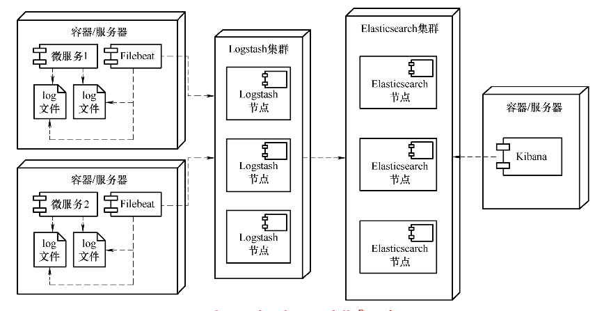
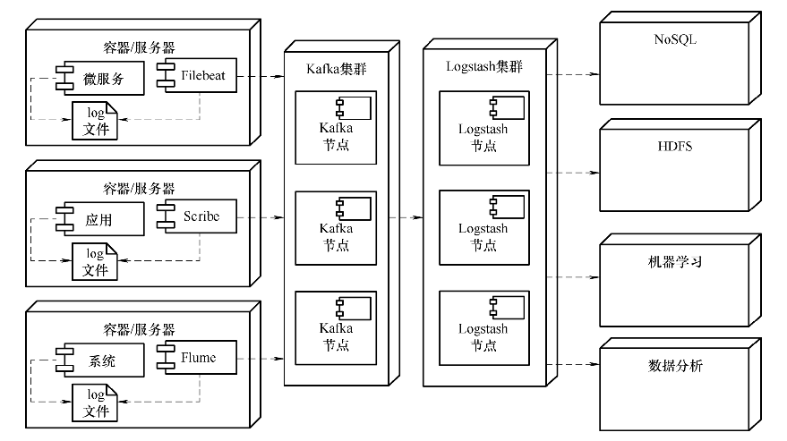
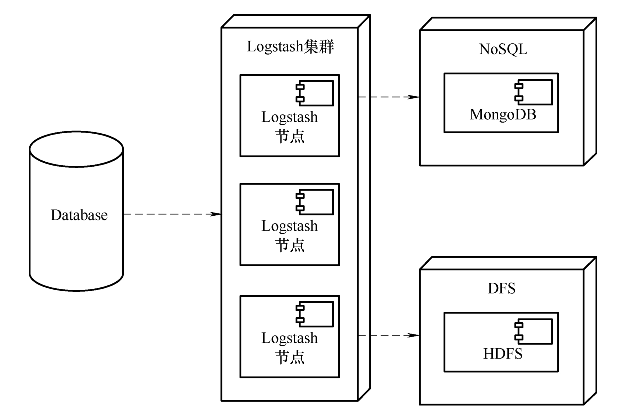

# Elastic Stack
Elastic Stack早期的名字叫ELK，是由三个开源软件组成的数据处理框架。后期由于有新的成员加入到ELK中，ELK更名为Elastic Stack以反映其组成成员的变化情况。Elastic Stack家族成员既可以放在一起使用，也可以单独使用，它们要解决的核心问题都是数据。在当前的互联网时代，数据已经成为企业的核心财富之一。如何收集、存储并且挖掘数据价值是每一个企业必须要面对的关键问题，而Elastic Stack则给出一套完整的解决方案。正是Elastic Stack完整的方案，使得它在国内和国外得到了越来越广泛的应用。对于许多开发和运维人员来说，Elastic Stack甚至已经成为一种必须要掌握的知识。
## 从ELK到Elastic Stack
如果从单词的角度看待ELK，它的英文含义是麋鹿。所以在ELK相关的一些文献中，经常会有卡通小鹿的形象出现。但实际上ELK是三个单词的首字母缩写，即Elasticsearch、Logstash和Kibana，这三者就是ELK最初创建的成员。其中，Elasticsearch用于数据存储与检索，Logstash用于数据传输与清洗，而Kibana则用于数据可视化等领域。目前，它们由一家名为Elastic的公司司管理，并按Apache Licence 2.0开放了源代码。Elastic公司的官方网站为<http://www.elastic.co>，在这个网站上包含了非常丰富的权威文档，对于学习Elastic Stack很有帮助。
### 历史
按照Elastic官方说法，ELK的一切都从Elasticsearch开始。Elasticsearch的第一个版本叫Compass，是Elastic创始人Shay Banon在2004年创建的一个搜索引擎。这个搜索引擎最初的目的是为了搜索食谱，而它的第一个用户是Shay Banon正在学习厨艺的妻子。这个搜索引擎的第二个版本基于Apache Lucene开发，并在2010年以Elasticsearch为名开源。由于Elasticsearch受到了社区用户的极大关注，Shay Banon在2012年创办了Elasticsearch公司，并于2015年更名为Elastic，专门从事与Elasticsearch相关的商业服务。由于Elasticsearch的影响不断扩大，催生了两个与其相关的开源项目，它们就是Logstash和Kibana。由于这两个项目填补了Elasticsearch在数据传输、数据可视化等方面的欠缺，所以不久之后这两个项目也加入了Elastic公司，于是ELK就这样诞生了。

在2015年，一个名为Packetbeat的开源项目引起了Elastic公司的重视。它是由一对德国夫妻设计的、以一种轻量级方式将网络数据发送到Elasticsearch的开源项目。Elastic开发团队由此引申，计划开发出一组专门用于数据传送的轻量级组件，可以将网络、日志、指标、审计等各种数据从不同的数据源头发送到Logstash或Elasticsearch。Elastic公司给这种组件起了一个统一的名字，这就是Beats组件。

Beats组件的加入，使得ELK这个名称不能再概括Elastic的所有开源项目了，于是ELK就自然而然地更名为ELK Stack。但ELK这个名称本身又有一定的缩写含义，依然容易引起误会，所以最终它们被统一称为Elastic Stack。名称的变化说明Elastic Stack不仅只是Elasticsearch、Logstash、Kibana和Beats，未来还可能会有新的软件加入其中。但它们作为一个整体，目的依然是要提供一套整体处理大数据的解决方案，包括数据的收集、清洗、整理、传输、存储、检索、应用等各个方面。

2018年10月6日，Elastic公司在纽约证券交易所挂牌上市，Shay Banon为妻子开发Elasticsearch的故事也流传得更广泛了。从Elasticsearch公司创立到最终上市只用了六年时间，演绎了又一出程序员创业的科技神话。
### 版本演变
早期，由于Elastic Stack包含的开源项目“各自为政”，每个项目都有一套自己管理版本的办法。Kibana使用betas， Logstash使用里程碑，Elasticsearch则使用数字，这使得Elastic Stack家族成员的版本异常混乱。不仅如此，由于这些开源项目的不同版本之间又无法自动处理兼容问题，使得用户必须要了解并处理不同版本之间的兼容问题。这不仅给用户造成极大困扰，Elastic开发团队也不得不维护一个巨大的版本支持表格。

2015年ELK 2.0作为一个整体同时发布，解决了版本协调同步与兼容问题，也是ELK整体迈向成熟产品的第一步。到2016年，ELK 5.0发布时，ELK整体变得更加友好、更加稳定，同时还提供了丰富的文档，使用户在入门时更加容易易掌握。尽管如此，在使用Elastic Stack时，版本问题还是存在不兼容情况。例如，由于Kibana完全基于Elasticsearch，所以Kibana和Elasticsearch主版本号必须要一致，否则将导致兼容问题。
### 许可授权
在ELK 5.0版本以后，Elastic将所有的商用插件捆绑到一个名为X-Pack的扩展中，它包含了类似安全、监控、报警等扩展功能，这应该是Elastic Stack商业化的一次尝试。在2018年2月，Elastic将这些商用X-Pack开放了源代码，但依然需要商用授权许可。在Elastic Stack文档中也有多处提及X-Pack，读者可以将它们理解为Elastic Stack的扩展组件。至2017年，Elastic发布了名为ECE（Elastic Cloud Enterprise）的云服务平台，这应该是Elastic在商业化道路上的又一次尝试。

Elastic Stack授权分为四级，即开源、基础级、黄金级和白金版，它们支持的功能依次增加。其中，开源和基础级授权所提供的功能可免费使用，而黄金级和白金版的功能则属于商业授权。在Elastic Stack早期版本上使用开源或基础级授权时存在一个非常大的问题，那就是它们都不支持用户身份认证、访问控制等基础的安全功能。所以为了保证数据安全，用户在实际商用时要么自

行开发认证和授权机制，要么使用Elastic Stack商业授权，这成为许多公司商用Elastic Stack的最大障碍之一。可喜的是，从Elastic Stack 6.8和7.1版本开始，Elasticsearch的核心安全功能（TLS加密、原生和基于文件的身份验证，以及基于角色的访问控制）已经可以免费使用了。一些高级安全功能，比如单点登录、LDAP等目前依然没有开放，但这些核心安全功能对于大多数应用来说已经足够了。

从监控的角度来看，开源和基础级授权提供了监控组件运行状态的功能，但不支持在组件运行异常时报警的功能。另外，在分布式环境下组件的集中管理功能也不被开源和基础级授权支持。但对于Beats组件来说，集中管理功能几乎是一项必备的功能。因为Beats组件往往分散于集群的各个应用中且数量众多，如果没有集中的停止和启动功能，那么Beats在管理上将是一个非常大的问题。除此之外，白金版中还提供了机器学习的相关功能，这也是当下数据应用的一个热点。

尽管如此，Elastic Stack提供的开源和基础级授权仍然可以满足实际应用中的绝大多数需求。用户可以根据需求定制使用Elastic Stack的不同授权，或是在开源授权基础之上做二次开发以满足实际需要。
### 应用场景
由于同属一个家族，Elastic Stack四大组件放在一起使用当然最为方便。Beats组件从分布式环境中的主机节点上采集数据发送给Logstash，而Logstash根据配置将数据过滤、清洗后再发送给Elasticsearch并编入索引，最后在Kibana中配置仪表盘、画布等并从Elasticsearch中读取数据将它们可视化。最典型的应用场景就是使用Elastic Stack从文件中收集日志，如图所示的就是一个在分布式环境中收集日志数据的部署图。

在典型的微服务应用场景中，日志文件分散在不同的主机节点上。这种分散的日志文件不仅不利于查看，对于日后的数据分析和数据挖掘也是很大的阻碍。但是将这些日志数据集中写入到传统的关系型数据库中又不现实，因为日志数据是典型的大数据，大多数互联网应用一天产生的日志量就有几十GB甚至上百GB。传统的关系型数据库不仅存储不了这么大量的数据，而且随着数据量的增加，查询数据也会变得越来越慢。而Elasticsearch不仅自身天然支持分片和复制，而且还可以通过倒排索引等机制来提供快速检索的能力，能够完美地解决大数据查询、存储和容灾等问题，所以使用Elastic Stack收集存储日志几乎是多数应用的备选方案之一。在图1-1中，Filebeat组件与微服务组件部署在同一台主机或同一个Docker容器中，它负责从微服务产生的日志文件中将日志采集出来并发送给Logstash。Logstash和Elasticsearch一般需要搭建成集群，以实现负载均衡和容灾容错。

Elastic Stack另一个典型应用场景是系统运行状态监控。与收集日志不同的是，在这种应用场景下部署在主机节点上的Beats组件是Metricbeat或者Heartbeat，收集到的数据是系统指标数据和系统是否可达数据。这些监控数据不仅可通过Kibana轻松地实现可视化，还可以与Watcher组件或其他第三方应用结合起来实现报警功能。

除了组合在一起使用，Elastic Stack中的每一种组件又可以独立使用，或者是与第三方应用结合在一起使用。一种典型的应用场景是与Kafka等第三方MQ组件结合使用，以防止瞬间流量爆发导致的系统崩溃，如图所示。

在上图中，在容器或服务器中使用Filebeat、Scribe、Flume等组件收集日志，然后发送给Kafka集群。这一方面起到了适配Logstash的作用，更重要的是Kafka集群能在流量瞬间爆发时起到削峰填谷平滑流量的作用。Logstash也可以脱离Beats和Elasticsearch作为一个数据传输管道单独使用，比如可以使用Logstash从关系型数据库中收集表格中的数据，然后将它们传输到类似MogonDB这样的NoSQL数据库中，这其实就是结构化数据实现全文检索的典型应用场景。与此同时，还可以将这些结构化数据存储到S3、HDFS等分布式文件系统中，这其实就实现了海量结构化数据的备份功能。如下图所示为Logstash在这两种场景下的部署图。

另一方面，Beats组件也可以跳过Logstash直接将数据发送给Elasticsearch，甚至是类似Redis、Kafka这样的第三方数据源。在更多的应用场景中，Elasticsearch则会被单独拿出来使用。Elasticsearch在很多时候都被视为一种基于文档的NoSQL数据库，这与MongoDB的定位完全相同，所以Elasticsearch的应用场景比其他组件更加广泛。可能惟一不会独立使用的组件就是Kibana，因为至少到目前它还是基于Elasticsearch的可视化工具，所以一般都需要与Elasticsearch共同使用。

总之，无论是整体应用Elastic Stack组件，还是单独应用其中的任意一个组件，Elastic Stack都可以完全胜任。
