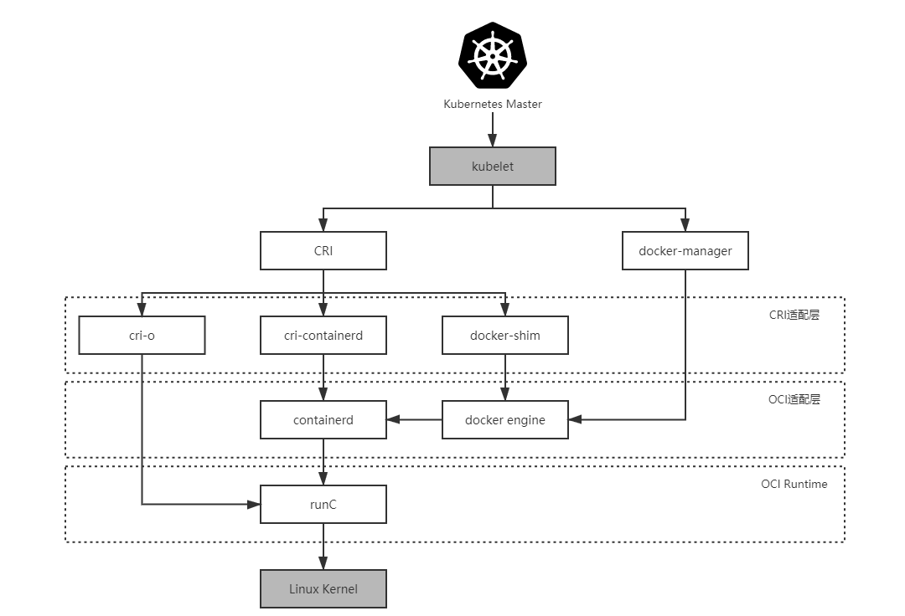

# Cloud Native & Container Technology
- Kubernetes：用于容器间的编排，以及容器集群的管理等
    - [官方网站](https://kubernetes.io/zh/)
- Docker：容器级别的工具，创建、管理容器等
    - [官方网站](https://www.docker.com/)

>Kubernetes 与容器引擎的调用关系

Kubernetes从1.5引入CRI规范，通过插件接口模式，Kubernetes无须重新编译就可以使用更多的容器运行时。Docker的CRI实现在Kubernetes 1.6中被更新为Beta版本，并在kubelet启动时默认启动。 Dokcer自此对于Kubernetes不再是不可或缺的了。
