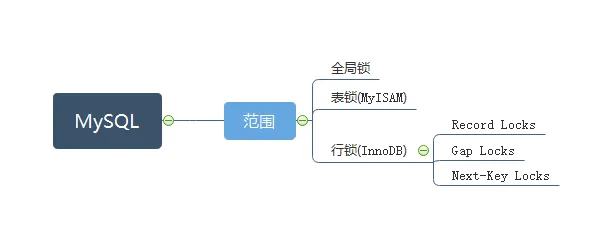

# MySQL——锁
数据库锁设计的初衷是为了解决程序并发访问时，资源的合理访问问题，即锁是用来实现访问规则的重要数据结构。根据加锁范围，MYSQL中的锁大致可以分为全局锁、表级锁以及行锁三大类。
## 全局锁
全局锁即对整个数据库实例进行加锁。MySQL 提供了加全局读锁的方法，对应命令是 Flush tables with read lock (FTWRL)。如果需要整个库处于只读状态时，可执行这个命令，执行以后，其他线程处理数据更新（数据的增删改）、数据定义（建表、更新表结构）、更新类事务的语句都会被阻塞。

全局锁典型应用场景为全库逻辑备份，即把整库每张表都保存成文本。MySQL自带的逻辑备份工具是mysqldump。mysqldump命令，如果使用参数–single-transaction 时，可以保证导出时视图的一致性，且由于MVCC的支持，导出过程中，数据是可以正常更新的。
```
例如：
./mysqldump –h127.0.0.1 –uroot –p123456 –P33061 --default-character-set=utf8mb4 --single-transaction  --hex-blod -–databases test
```
但是single-transaction 方法只适用于所有的表都使用事务引擎的库。如果有的表使用了不支持事务的引擎，例如MyISAM，那么备份就只能通过 FTWRL 方法，故这也是 DBA 要求业务开发人员使用 InnoDB 替代 MyISAM 的原因之一。
## 表级锁
MySQL中表级锁分为两种：表锁、元数据锁（meta data lock，MDL）。
- 表锁
  
    表锁即对一整张表加锁，语法是lock tables … read/write。表锁会限制别的线程对表的读写，但也限制了本线程接下来的操作对象，故一般在DDL处理时使用。

    表锁以后，与 FTWRL 类似，可以用 unlock tables 主动释放锁，也可以在客户端断开连接时自动释放。还没有出现更细粒度的锁的时候，表锁是最常用的处理并发的方式，MyISAM使用的是MySQL Server 提供的表锁机制，但是InnoDB是支持行锁的引擎，一般不使用lock tables 命令来控制并发，毕竟锁住整个表的影响面还是太大。
- 元数据锁
  
  MDL主要是解决当一个线程正常查询一个表数据时，另一个线程对表结果做变更，例如删除某一列，从而影响查询线程拿到的结果跟表结果对应不上的问题，用于保证读写的正确性，在访问一个表的时候会自动加上。在MySQL5.5 版本以上引入，当对一个表做增删改查操作的时候，自动加 MDL 读锁；当要对表做结构变更操作的时候，自动加 MDL 写锁，特性如下：
    1. 读锁之间不互斥，因此你可以有多个线程同时对一张表增删改查。
    2. 读写锁之间、写锁之间是互斥的，用来保证变更表结构操作的安全性。因此，如果有两个线程要同时给一个表加字段，其中一个要等另一个执行完才能开始执行
    >需要注意的是：MDL 会直到事务提交才释放，在做表结构变更的时候，你一定要小心不要导致锁住线上查询和更新。
## 行锁
MySQL 的行锁是在引擎层由各个引擎自己实现的，故并不是所有的引擎都支持行锁，例如 MyISAM 引擎就不支持行锁，意味着并发控制只能使用表锁，对于这种引擎的表，同一张表上任何时刻只能有一个更新在执行，这就会影响到业务的并发度；InnoDB 是支持行锁的，这也是 MyISAM 被 InnoDB 替代的重要原因之一。

InnoDB行锁又可细分Record Locks、Gap Locks、 Next-Key Locks。
- 记录锁（Record Locks）
    - 记录锁就是为某行记录加锁，它封锁该行的索引记录。
    - 实现方式：通过 主键索引 与 唯一索引 对数据行进行 UPDATE 操作时
```
例如：
UPDATE SET age = 50 WHERE id = 1;
SELECT * FROM table WHERE id = 1 FOR UPDATE;
当id 列为主键列或唯一索引列时，执行以上任意语句时，id=1的记录会被锁住。
```
>需要注意的是：id 列必须为唯一索引列或主键列，否则上述语句加的锁就会变成临键锁。同时查询语句必须为精准匹配（=），不能为 >、<、like等，否则也会退化成临键锁。
- 间隙锁（Gap Locks）
  
间隙锁基于非唯一索引，它锁定一段范围内的索引记录，锁住的是一个区间，而不仅仅是这个区间中的每一条数据。

例如：
MySql，InnoDB，Repeatable-Read：table(id PK, number INX)

- 临键锁（Next-Key Locks）

Next-Key 可以理解为一种特殊的间隙锁。通过临建锁可以解决幻读的问题。 每个数据行上的非唯一索引列上都会存在一把临键锁，当某个事务持有该数据行的临键锁时，会锁住一段左开右闭区间的数据。需要强调的一点是，InnoDB 中行级锁是基于索引实现的，临键锁只与非唯一索引列有关，在唯一索引列（包括主键列）上不存在临键锁。

## 总结
MySQL中，根据锁的范围分为了全局锁、表锁、行锁，其中MyISAM支持表锁， InnoDB支持行锁。



- 在MySQL中，很容易发生死锁现象，造成接口失败，从而严重影响用户体验，并且耗费系统资源。通过对MySQL InnoDB行锁的特性了解，我们就能避免大部分MySQL InnoDB的死锁问题，或者在发生死锁问题时，能够帮助大家更快排查到死锁原因。InnoDB行锁的特性总结如下：
    - InnoDB 中的行锁是在需要的时候才加上的，但并不是不需要了就立刻释放，而是要等到事务结束时才释放。它的实现依赖于索引，一旦某个加锁操作没有使用到索引，那么该锁就会退化为表锁。
    - 记录锁存在于包括主键索引在内的唯一索引中，锁定单条索引记录。
    - 间隙锁存在于非唯一索引中，锁定开区间范围内的一段间隔，它是基于临键锁实现的。
    - 临键锁存在于非唯一索引中，该类型的每条记录的索引上都存在这种锁，它是一种特殊的间隙锁，锁定一段左开右闭的索引区间。
