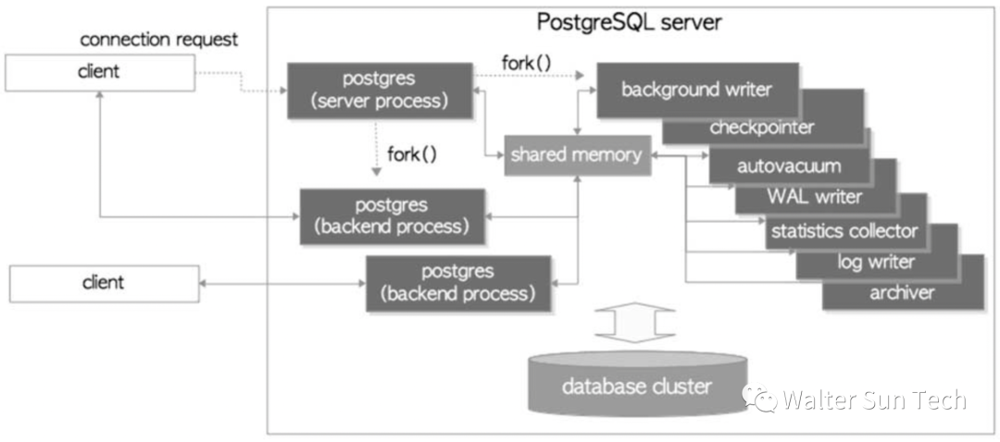
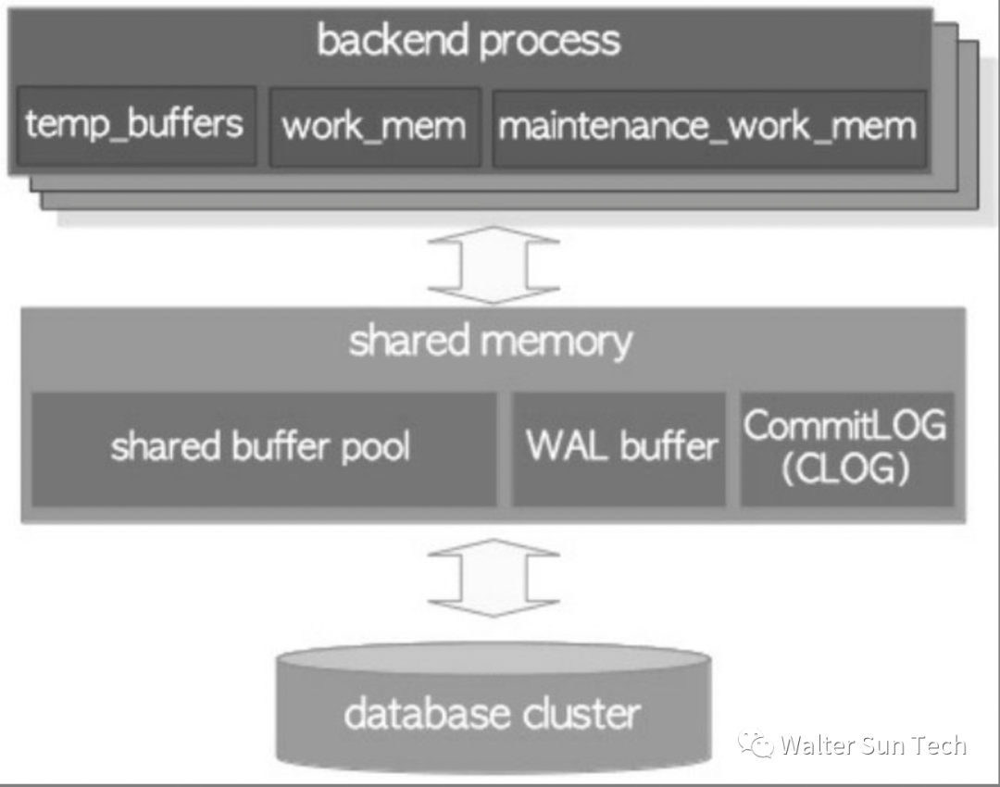

## The Process Architecture of PostgreSQL
The process architecture of PostgreSQL is composed of multiple processes, each with different roles and responsibilities. The following is a detailed explanation of the process architecture of PostgreSQL:
### Background process (Postmaster)
The Background process is the first process created when PostgreSQL starts. It is responsible for managing and controlling the global operations of the database system, such as starting and closing other processes, managing shared caches, processing global locks, processing global transactions, and managing logs. In PostgreSQL, each connection process has a separate Background process corresponding to it. This Background process will monitor and manage its corresponding connection process.
### Connection process
The connection process is a process that provides services for client requests, and each connection process corresponds to a client and provides services for that client. When the client requests a connection, the Background process will assign a new connection process to it. The connection process is responsible for processing the SQL statements issued by the client and returning the corresponding query results to the client. The connection processes are completely isolated, and they cannot share Shared memory or information.
### Background Worker Process
Background worker processes are processes used in PostgreSQL to execute background tasks, which can perform various tasks such as backup and recovery, automatic analysis and maintenance, monitoring, automatic diagnosis and repair, etc. The background work process is usually triggered by cron tasks or other scheduled tasks in the configuration file, and does not require interaction with the client.
### Background process
Background process is a process used by PostgreSQL to monitor system status. It can automatically monitor system status, such as logging, sending alert notifications, and monitoring resource usage. The Background process usually executes periodically in order to find and solve various problems in a timely manner.

In summary, the process architecture of PostgreSQL is very complex, including multiple processes and various types of responsibilities and roles. Understanding the process architecture of PostgreSQL can help developers better understand its working principles and enable better performance optimization and troubleshooting.

Example process architecture diagram of PostgreSQL:

## The Memory Architecture of PostgreSQL
The memory architecture of PostgreSQL includes Shared memory and process memory, which play different roles.
### Shared memory
Shared memory is the memory area allocated when PostgreSQL starts. It is shared by all connection processes and Background process. Shared memory includes:
- Buffer Cache: Caches recently queried tables, indexes, and other data for quick access in subsequent queries.
- Shared memory: Contains various global state information, such as transaction status, lock information, process and connection information.
- Internal Cache: A cache used to store internal data structures, such as lock tables, Hash table, and wait event queues in Shared memory.
- WAL Buffer: Used to cache data from WAL logs for sorting and buffering before writing to the WAL file.

- The advantage of Shared memory is that it can reduce the reuse of memory, thus improving the performance and efficiency of PostgreSQL. However, the use of Shared memory needs to consider concurrency, locks, memory management and other issues, so it needs to be designed and managed reasonably.
### Process memory
Process memory is memory allocated separately by each connected process, which includes:
- Connection information: stores client connection information and connection status, such as username, password, and connection options.
- Query Execution Plan: Stores the plan and status information for query execution, such as the query plan tree and runtime status information.
- Temporary buffer: used to store intermediate results and temporary calculation data.
- Status information: Stores the status information of the current process, such as transaction status, lock information, etc.

The advantage of process memory is that it can improve data isolation and security, thereby protecting the data and state of each connected process. However, the use of process memory needs to consider issues such as memory allocation and release, data isolation and sharing, and therefore requires reasonable design and management.

In a word, the memory architecture of PostgreSQL is composed of Shared memory and process memory, which play different roles. Shared memory provides data sharing and reuse, which improves performance and efficiency, while process memory improves data isolation and security, thus protecting the data and status of each connected process. Understanding the memory architecture of PostgreSQL can help developers better understand its working principles and enable better performance optimization and troubleshooting.

Example diagram of PostgreSQL's memory architecture:
