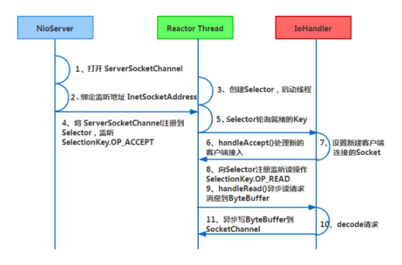
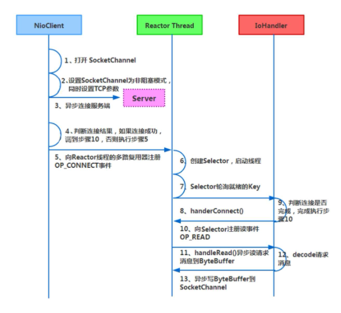

## Netty高性能的三个主题
1. I/O传输模型：用什么样的通道将数据发送给对方，是BIO、NIO还是AIO，I/O传输模型在很大程度上决定了框架的性能。
2. 数据协议：采用什么样的通信协议，是HTTP还是内部私有协议。协议的选择不同，性能模型也就不同。一般来说内部私有协议比公有协议的性能更高。
3. 线程模型：线程模型涉及如何读取数据包，读取之后的编解码在哪个线程中进行，编解码后的消息如何派发等方面。线程模型设计得不同，对性能也会产生非常大的影响。
## Netty高性能之核心法宝NIO
Netty就是一个满足高性能、高并发的网络通信框架。Netty底层是采用Reactor线程模型来设计和实现的，先来看Netty服务端API的通信步骤，其序列图如下图所示:

Netty客户端API的通信步骤:

