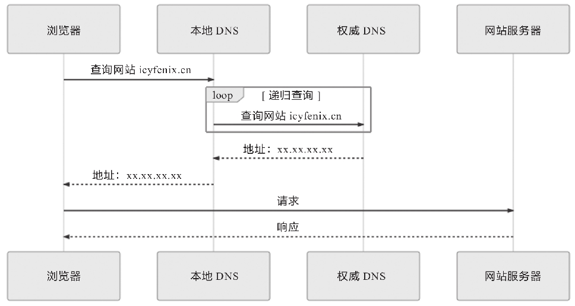

# 内容分发网络
内容分发网络（Content Distribution Network，CDN，也有写作Content Delivery Network）。

内容分发网络是一种十分古老的应用，相信大部分读者都或多或少对其有一定了解，至少听过它的名字。如果把某个互联网系统比喻为一家企业，那内容分发网络就是它遍布世界各地的分支销售机构。假设现在有客户要买一块CPU，那么订机票飞到美国加州Intel总部肯定是不合适的，到本地电脑城找个装机铺才是通常的做法，在此场景中，内容分发网络就相当于电脑城里的本地经销商。

内容分发网络又是一种十分透明的应用，可能绝大多数读者对于它为互联网站点分流的工作原理并没有什么系统性的概念，至少没有自己亲自使用过。

如果抛却其他影响服务质量的因素，仅从网络传输的角度看，一个互联网系统的速度取决于以下四个因素。
- 网站服务器接入网络运营商的链路所能提供的出口带宽。
- 用户客户端接入网络运营商的链路所能提供的入口带宽。
- 从网站到用户经过的不同运营商之间的互联节点的带宽，一般来说两个运营商之间只有固定的若干个点是互通的，所有跨运营商之间的交互都要经过这些点。
- 从网站到用户的物理链路传输时延。爱打游戏的读者应该都清楚，延迟（Ping值）比带宽更重要。

以上四个因素，除了第二个只能通过换一个更好的宽带才能改善之外，其余三个都能通过内容分发网络来显著改善。一个运作良好的内容分发网络，能为互联网系统解决跨运营商、跨地域物理距离所导致的时延问题，能为网站流量带宽起到分流、减负的作用。举个例子，如果不是有遍布全国乃至全世界的阿里云CDN网络支持，哪怕把整个杭州所有市民上网的权力都剥夺了，把带宽全部让给淘宝的机房，恐怕也撑不住全国乃至全球用户在双十一期间的疯狂“围殴”。

内容分发网络的工作过程，主要涉及路由解析、内容分发、负载均衡和CDN应用四个方面，由于下一节会专门讨论负载均衡的内容，所以这部分在本节暂不涉及，下面我们来逐一了解其余三个方面。
## 路由解析
在介绍DNS域名解析时，笔者曾提到翻译域名无须像查电话本一样刻板地一对一翻译，根据来访机器、网络链路、服务内容等各种信息，可以玩出很多“花样”，内容分发网络将用户请求路由到它的资源服务器上就是依靠DNS服务器来实现的。根据我们对DNS域名解析的了解，一次没有内容分发网络参与的用户访问，其解析过程如图所示。



那么，有内容分发网络介入会发生什么变化呢？我们不妨先来看一段对网站“icyfenix.cn.”进行DNS查询的真实应答记录，这个网站就是通过国内的内容分发网络对位于GitHub Pages上的静态页面进行加速的。通过dig或者host命令，能够很方便地得到DNS服务器的返回结果（结果中头4个IP的城市地址是手工加入的，**用来举例**，后面的其他记录就不一个一个查了），如下所示：
```
$ dig icyfenix.cn

; <<>> DiG 9.11.3-1ubuntu1.8-Ubuntu <<>> icyfenix.cn
;; global options: +cmd
;; Got answer:
;; ->>HEADER<<- opcode: QUERY, status: NOERROR, id: 60630
;; flags: qr rd ra; QUERY: 1, ANSWER: 17, AUTHORITY: 0, ADDITIONAL: 1

;; OPT PSEUDOSECTION:
; EDNS: version: 0, flags:; udp: 65494
;; QUESTION SECTION:
;icyfenix.cn.                   IN      A

;; ANSWER SECTION:
icyfenix.cn.            600     IN      CNAME   icyfenix.cn.cdn.dnsv1.com.
icyfenix.cn.cdn.dnsv1.com. 599  IN      CNAME   4yi4q4z6.dispatch.spcdntip.com.
4yi4q4z6.dispatch.spcdntip.com.  60 IN  A  101.71.72.192  #浙江宁波市（举例）
4yi4q4z6.dispatch.spcdntip.com.  60 IN  A  113.200.16.234 #陕西省榆林市（举例）
4yi4q4z6.dispatch.spcdntip.com.  60 IN  A  116.95.25.196  #内蒙古自治区呼和浩特市（举例）
4yi4q4z6.dispatch.spcdntip.com.  60 IN  A  116.178.66.65  #新疆维吾尔自治区乌鲁木齐市（举例）
4yi4q4z6.dispatch.spcdntip.com.  60 IN  A  118.212.234.144
4yi4q4z6.dispatch.spcdntip.com.  60 IN  A  211.91.160.228
4yi4q4z6.dispatch.spcdntip.com.  60 IN  A  211.97.73.224
4yi4q4z6.dispatch.spcdntip.com.  60 IN  A  218.11.8.232
4yi4q4z6.dispatch.spcdntip.com.  60 IN  A  221.204.166.70
4yi4q4z6.dispatch.spcdntip.com.  60 IN  A  14.204.74.140
4yi4q4z6.dispatch.spcdntip.com.  60 IN  A  43.242.166.88
4yi4q4z6.dispatch.spcdntip.com.  60 IN  A  59.80.39.110
4yi4q4z6.dispatch.spcdntip.com.  60 IN  A  59.83.204.12
4yi4q4z6.dispatch.spcdntip.com.  60 IN  A  59.83.204.14
4yi4q4z6.dispatch.spcdntip.com.  60 IN  A  59.83.218.235

;; Query time: 74 msec
;; SERVER: 127.0.0.53#53(127.0.0.53)
;; WHEN: Sat Apr 11 22:33:56 CST 2020
;; MSG SIZE  rcvd: 1
```
根据以上解析信息，DNS服务为“icyfenix.cn.”的查询结果先返回了一个CNAME记录（icyfenix.cn.cdn.dnsv1.com.），递归查询该CNAME时，返回了另一个看起来更奇怪的CNAME（4yi4q4z6.dispatch.spcdntip.com.）。继续查询后，这个CNAME返回了十几个位于全国不同地区的A记录，很明显，这些A记录就是分布在全国各地、存有本站缓存的CDN节点。CDN路由解析的具体工作流程如下。
- 架设好“icyfenix.cn.”的服务器后，在你的CDN服务商上将服务器的IP地址注册为“源站”，注册后你会得到一个CNAME，即本例中的“icyfenix.cn.cdn.dnsv1.com.”。
- 在你购买域名的DNS服务商上将得到的CNAME注册为一条CNAME记录。
- 当第一位用户来访时，将首先发生一次未命中缓存的DNS查询，域名服务商解析出CNAME后，返回给本地DNS，之后链路解析的主导权就开始由内容分发网络的调度服务接管了。
- 本地DNS查询CNAME时，由于能解析该CNAME的权威服务器只有CDN服务商所架设的权威DNS，这个DNS服务将根据一定的均衡策略和参数，如拓扑结构、容量、时延等，在全国各地能提供服务的CDN缓存节点中挑选一个最适合的，并将它的IP代替源站的IP地址，返回给本地DNS。
- 浏览器从本地DNS拿到IP地址后，将该IP当作源站服务器来进行访问，此时该IP的CDN节点上可能有，也可能没有缓存过源站的资源，这点将在稍后的4.4.2节讨论。
- 经过内容分发后的CDN节点，就有能力代替源站向用户提供所请求的资源了。
  
以上步骤反映在时序图上，如图所示，读者可自行与本节开头给出的没有内容分发网络参与的**之前第一张图**进行对比。


## 内容分发
在DNS服务器的协助下，无论是对用户还是服务器，内容分发网络都可以是完全透明的，如在两者都不知情的情况下，由CDN的缓存节点接管了用户向服务器发出资源请求。后面随之而来的问题是缓存节点中必须有用户想要请求的资源副本，才可能代替源站来响应用户请求。这里面又包括两个子问题：“如何获取源站资源”和“如何管理（更新）资源”。CDN获取源站资源的过程被称为“内容分发”，“内容分发网络”的名字正是由此而来，这也是CDN的核心价值。目前主要有以下两种主流的内容分发方式。
- 主动分发（Push）：分发由源站主动发起，将内容从源站或者其他资源库推送到用户边缘的各个CDN缓存节点上。这个推送的操作没有什么业界标准可循，可以选择任何传输方式（HTTP、FTP、P2P，等等）、任何推送策略（满足特定条件、定时、人工，等等）、任何推送时间，只要与后面说的更新策略相匹配即可。由于主动分发通常需要源站、CDN服务双方提供程序API接口层面的配合，所以它对源站并不是透明的，只对用户一侧单向透明。主动分发一般用于网站要预载大量资源的场景。譬如在双十一之前的一段时间内，淘宝、京东等各个网络商城会把未来活动中所要用到的资源推送到CDN缓存节点中，特别常用的资源甚至会直接缓存到你的手机App的存储空间或者浏览器的localStorage上。
- 被动回源（Pull）：被动回源由用户访问所触发，是全自动、双向透明的资源缓存过程。当某个资源首次被用户请求的时候，若CDN缓存节点发现自己没有该资源，就会实时从源站中获取，这时资源的响应时间可粗略认为是资源从源站到CDN缓存节点的时间，加上资源从CDN发送到用户的时间之和。因此，被动回源的首次访问通常比较慢（但由于CDN的网络条件一般远高于普通用户，并不一定比用户直接访问源站更慢），不适合应用于数据量较大的资源。被动回源的优点是可以做到完全的双向透明，不需要源站在程序上做任何配合，使用起来非常方便。这种分发方式是小型站点使用CDN服务的主流选择，如果不是自建CDN，而是购买阿里云、腾讯云的CDN服务的站点，多数采用的就是这种方式。
  
对于“CDN如何管理（更新）资源”这个问题，同样没有统一的标准可言，尽管在HTTP协议中，关于缓存的Header定义中确实有对CDN这类共享缓存的一些指引性参数的定义，譬如Cache-Control的s-maxage，但是否要遵循，完全取决于CDN本身的实现策略。更令人感到无奈的是，由于大多数网站的开发和运维人员并不十分了解HTTP缓存机制，所以导致如果CDN完全照着HTTP Header来控制缓存失效和更新，效果反而会很差，还可能引发其他问题。因此，对CDN缓存的管理不存在通用的准则。

现在，最常见的做法是超时被动失效与手工主动失效相结合。超时被动失效是指给予缓存资源一定的生存期，超过了生存期就在下次请求时重新被动回源一次。而手工主动失效是指CDN服务商一般会提供处理失效缓存的接口，在网站更新时，由持续集成的流水线自动调用该接口来实现缓存更新，譬如“icyfenix.cn”就是依靠Travis-CI的持续集成服务来触发CDN失效和重新预热的。
## CDN应用
CDN最初是为了快速分发静态资源而设计的，但今天的CDN所能做的事情已经远远超越了最初的目标，限于这部分应用太多，无法展开逐一细说，这里只对现在CDN可以做的事情简要列举，有个总体认知。
- 加速静态资源分发：这是CDN的本职工作。
- **安全防御**：CDN在广义上可以视作网站的堡垒机，源站只对CDN提供服务，由CDN来对外界其他用户提供服务，这样恶意攻击者就不容易直接威胁源站。CDN对某些攻击手段的防御，如对DDoS攻击的防御尤其有效。但需注意，将安全都寄托在CDN上本身是不安全的，一旦源站真实IP被泄漏，就会面临很高的风险。
- **协议升级**：不少CDN提供商都同时对接（代售CA的）SSL证书服务，可以实现源站是基于HTTP协议的，而对外开放的网站是基于HTTPS的。同理，可以实现源站到CDN是HTTP/1.x协议，CDN提供的外部服务是HTTP/2或HTTP/3协议；实现源站是基于IPv4网络的，CDN提供的外部服务支持IPv6网络，等等。
- **状态缓存**：4.1节介绍客户端缓存时简要提到了状态缓存，而CDN不仅可以缓存源站的资源，还可以缓存源站的状态，譬如可以通过CDN缓存源站的301/302状态让客户端直接跳转，也可以通过CDN开启HSTS、通过CDN进行OCSP装订加速SSL证书访问，等等。有一些情况下甚至可以配置CDN对任意状态码（譬如404）进行一定时间的缓存，以减轻源站压力，但这个操作应当慎重，且在网站状态发生改变时要及时刷新缓存。
- **修改资源**：CDN可以在返回资源给用户的时候修改资源的任何内容，以实现不同的目的。譬如，可以对源站未压缩的资源自动压缩并修改Content-Encoding，以节省用户的网络带宽消耗，可以对源站未启用客户端缓存的内容加上缓存Header，自动启用客户端缓存，可以修改CORS的相关Header，为源站不支持跨域的资源提供跨域能力，等等。
- **访问控制**：CDN可以实现IP黑/白名单功能，如根据不同的来访IP提供不同的响应结果，根据IP的访问流量来实现QoS控制，根据HTTP的Referer来实现防盗链，等等。
- **注入功能**：CDN可以在不修改源站代码的前提下，为源站注入各种功能。图4-7所示是国际CDN巨头CloudFlare提供的Google Analytics、PACE、Hardenize等第三方应用，这些原本需要在源站中注入代码的应用，在有CDN参与的情况下均能做到无须修改源站任何代码即可使用。
