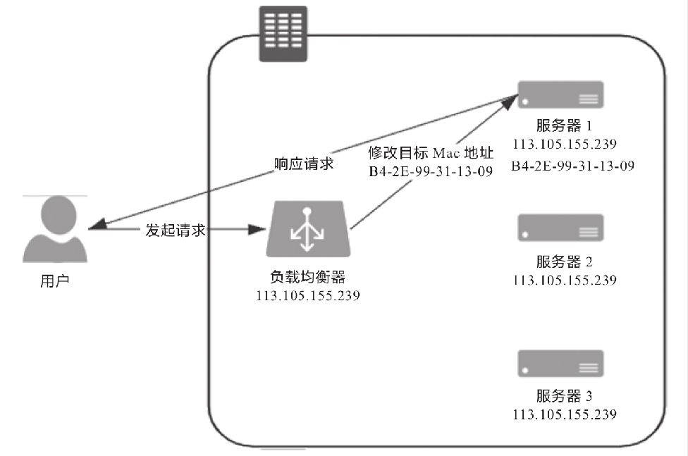
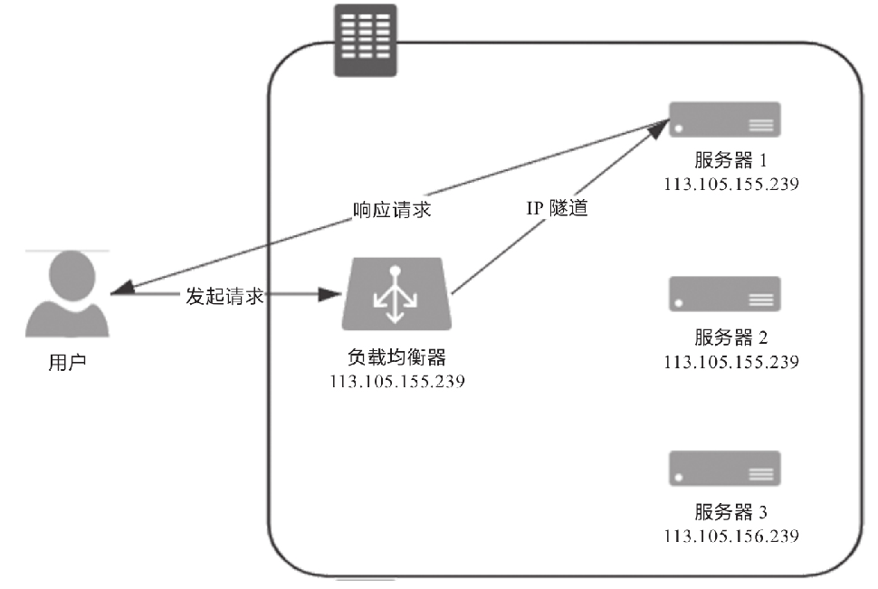
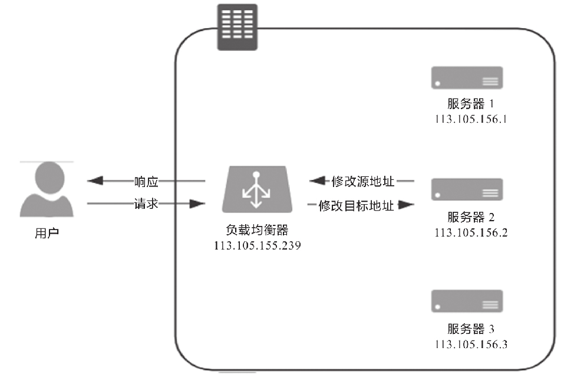
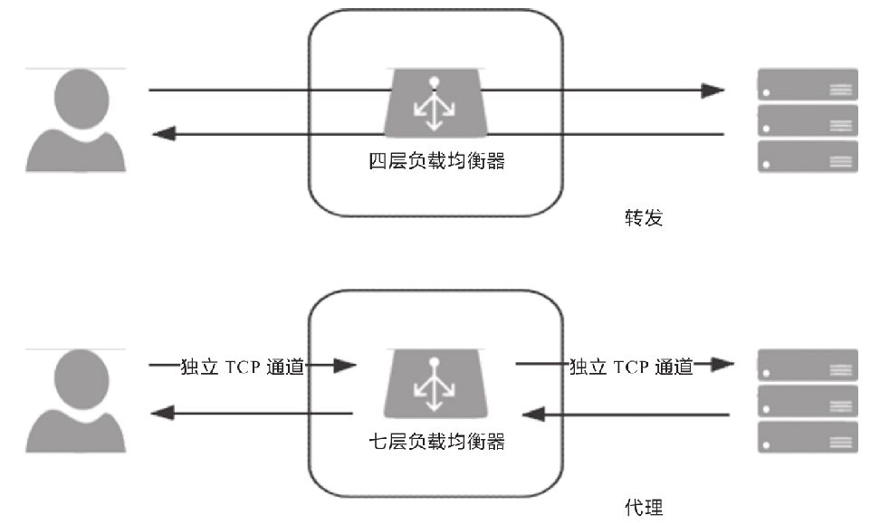

# 负载均衡
在互联网时代的早期，网站流量还相对较小，业务也相对简单，单台服务器便可满足访问需要，但时至今日，互联网应用也好，企业级应用也好，一般实际用于生产的系统，几乎都离不开集群部署。信息系统不论是单体架构多副本还是微服务架构，不论是为了实现高可用还是为了获得高性能，都需要利用多台机器来扩展服务能力，希望用户的请求不管连接到哪台机器上，都能得到相同的处理。另一方面，如何构建和调度服务集群这件事，又必须对用户保持足够的透明，即使请求背后是由一千台、一万台机器来共同响应的，也无须用户关心，他们只需要记住一个域名地址即可。调度后方的多台机器，以统一的接口对外提供服务，承担此职责的技术组件被称为“负载均衡”（Load Balancing）。

真正大型系统的负载均衡过程往往是多级的。譬如，在各地建有多个机房，或机房有不同网络链路入口的大型互联网站，会从DNS解析开始，通过“域名”→“CNAME”→“负载调度服务”→“就近的数据中心入口”的路径，先将来访地用户根据IP地址（或者其他条件）分配到一个合适的数据中心中，然后才到各式负载均衡。在DNS层面的负载均衡与前面介绍的DNS智能线路、内容分发网络等在工作原理上是类似的，差别只是数据中心能提供的不只是缓存，而是全方位的服务能力。由于这种方式此前已经详细讲解过，后续我们所讨论的“负载均衡”就只聚焦于网络请求进入数据中心入口之后的其他级次的负载均衡。

无论在网关内部建立了多少级的负载均衡，从形式上来说都可以分为两种：四层负载均衡和七层负载均衡。在详细介绍它们是什么以及如何工作之前，我们先来建立两个总体的、概念性的印象。
- 四层负载均衡的优势是性能高，七层负载均衡的优势是功能强。
- 做多级混合负载均衡，通常应是低层负载均衡在前，高层负载均衡在后。

我们所说的“四层”“七层”指的是经典的OSI七层模型中的第四层传输层和第七层应用层。下表是维基百科上对OSI七层模型的介绍，这部分属于网络基础知识，这里就不多解释了。后面我们会多次使用到这张表，如你对网络知识并不是特别了解，可自行查阅相关资料。

|#|层|数据单元|功能|
|:---:|:---:|:---:|---|
|七|应用层(Application Layer)|数据(Data)|为应用软件提供服务的接口，用于与其他软件之间的通信。典型协议有HTTP、HTTPS、FTP、Telnet、SSH、SMTP、POP3等|
|六|表达层(Presentation Layer)|数据(Data)|把数据转换为能与接收者的系统格式兼容并适合传输的格式|
|五|会话层(Session Layer)|数据(Data)|负责在数据传输中设置和维护计算机网络中两台计算机之间的通信连接|
|四|传输层(Transport Layer)|数据段(Segment)|把传输表头加至数据以形成数据包。传输表头包含所使用的协议等发送信息。典型协议有FTP、UDP、RDP、SCTP、FCP等|
|三|网络层(Network Layer)|数据包(Packet)|提供数据的传输路径选择和转发功能，将网络表头附加至数据段后以形成报文（即数据包）。典型协议有IPv4/IPv6、IGMP、ICMP、EGP、RIP等|
|二|数据链路层(Data Link Layer)|数据帧(Frame)|负责点对点的网络寻址、错误侦测和纠错。当表头和表尾被附加至数据包后，就形成了数据帧（Frame）。典型协议有Wi-Fi(802.11)、Ethernet(802.3)、PPP等|
|一|物理层(Physaical Layer)|比特流(Bit)|在局域网上传送数据帧，负责管理电脑通信设备和网络媒体之间的互通。包括针脚、电压、线缆规范、集线器、中继器、网卡、主机接口卡等|

现在所说的“四层负载均衡”其实是多种均衡器工作模式的统称，“四层”是说这些工作模式的共同特点是维持同一个TCP连接，而不是说它只工作在第四层。
事实上，这些模式主要都工作在第二层（数据链路层，改写MAC地址）和第三层（网络层，改写IP地址）上，单纯只处理第四层（传输层，可以改写TCP、UDP等协议的内容和端口）的数据无法做到负载均衡的转发，因为OSI的下三层是媒体层（Media Layer），上四层是主机层（Host Layer），既然流量都已经到达目标主机上了，也就谈不上什么流量转发，最多只能做代理。但出于习惯和方便，现在几乎所有的资料都把它们统称为四层负载均衡，笔者也同样称呼它为四层负载均衡，如果读者在某些资料上看见“二层负载均衡”“三层负载均衡”的表述，应该了解这是在描述它们工作的具体层次，与这里说的“四层负载均衡”并不是同一类意思。下面笔者将介绍几种常见的四层负载均衡的工作模式。

## 数据链路层负载均衡
- 数据链路层负载均衡
  
## 网络层负载均衡
- IP隧道模式的负载均衡
  
- NAT模式的负载均衡
  
## 应用层负载均衡
- 转发与代理
  
## 应用层负载均衡
负载均衡的两大职责是“选择谁来处理用户请求”和“将用户请求转发过去”。前面我们仅介绍了后者，即请求的转发或代理过程。前者是指均衡器所采取的均衡策略，由于这一块涉及的均衡算法太多，这里介绍一些常见的均衡策略。
- 轮询均衡（Round Robin）：每一次来自网络的请求轮流分配给内部的服务器，从1至N然后重新开始。此种均衡算法适合于服务器集群中的所有服务器都有相同的软硬件配置并且平均服务请求相对均衡的情况。
- 权重轮询均衡（Weighted Round Robin）：根据服务器的不同处理能力，给每个服务器分配不同的权值，使其能够接受相应权值数的服务请求。譬如：设置服务器A的权值为1，B的权值为3，C的权值为6，则服务器A、B、C将分别接收到10%、30%、60%的服务请求。此种均衡算法能确保高性能的服务器得到更多的使用率，避免低性能的服务器负载过重。
- 随机均衡（Random）：把来自客户端的请求随机分配给内部的多个服务器，在数据量足够大的场景下能达到相对均衡的分布。
- 权重随机均衡（Weighted Random）：此种均衡算法类似于权重轮询算法，不过在分配处理请求时是随机选择的过程。
- 一致性哈希均衡（Consistency Hash）：将请求中的某些数据（可以是MAC、IP地址，也可以是更上层协议中的某些参数信息）作为特征值来计算需要落在的节点，算法一般会保证同一个特征值每次都一定落在相同的服务器上。这里的一致性是指保证当服务集群某个真实服务器出现故障时，只影响该服务器的哈希值，而不会导致整个服务器集群的哈希键值重新分布。
- 响应速度均衡（Response Time）：负载均衡设备对内部各服务器发出一个探测请求（例如Ping），然后根据内部各服务器对探测请求的最快响应时间来决定哪一台服务器响应客户端的服务请求。此种均衡算法能较好地反映服务器的当前运行状态，但最快响应时间仅仅指的是负载均衡设备与服务器之间的最快响应时间，而不是客户端与服务器之间的最快响应时间。
- 最少连接数均衡（Least Connection）：客户端的每一次请求服务在服务器停留的时间可能会有较大差异，随着工作时间增加，如果采用简单的轮询或随机均衡算法，每一台服务器上的连接进程可能会产生极大的不平衡，并不能达到真正的负载均衡。最少连接数均衡算法会对内部需负载的每一台服务器有一个数据记录，记录当前该服务器正在处理的连接数量，当有新的服务连接请求时，将把当前请求分配给连接数最少的服务器，使均衡更加符合实际情况，使负载更加均衡。此种均衡策略适合长时处理的请求服务，如FTP传输。

从实现角度来看，负载均衡器的实现分为“软件均衡器”和“硬件均衡器”两类。在软件均衡器方面，又分为直接建设在操作系统内核的均衡器和应用程序形式的均衡器两种。前者的代表是LVS（Linux Virtual Server），后者的代表有Nginx、HAProxy、KeepAlived等。前者性能会更好，因为无须在内核空间和应用空间中来回复制数据包；而后者的优势是选择广泛，使用方便，功能不受限于内核版本。

在硬件均衡器方面，往往会直接采用应用专用集成电路（Application Specific Integrated Circuit，ASIC）来实现，有专用处理芯片的支持，避免操作系统层面的损耗，以达到最高的性能。这类均衡器的代表就是著名的F5和A10公司的负载均衡产品。
