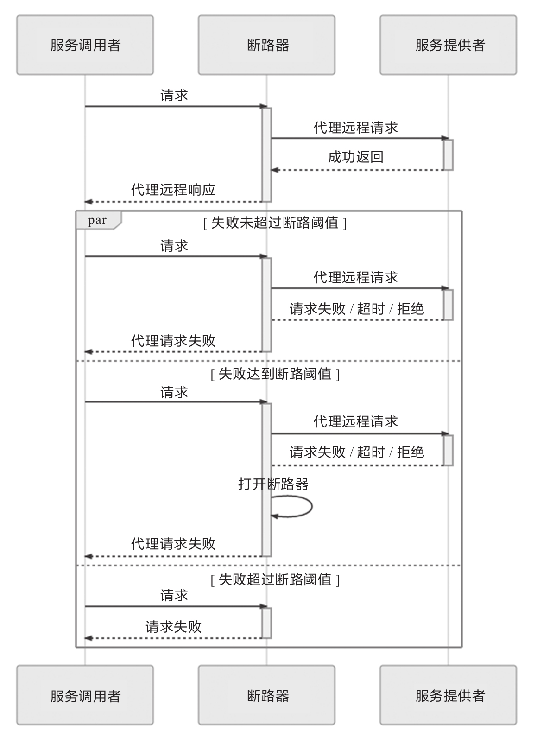
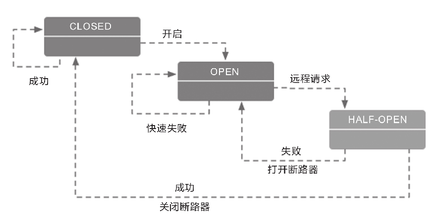

# 流量治理
容错性设计（Design for Failure）是微服务的另一个核心原则，也是笔者书中反复强调的开发观念转变。不过，即使已经有一定的心理准备，大多数首次将微服务架构引入实际生产系统的开发者，在服务发现、网关路由等支持下，踏出了服务化的第一步以后，很可能仍会经历一段阵痛期，随着拆分出的服务越来越多，随之而来会面临以下两个问题的困扰。
- 由于某一个服务的崩溃，导致所有用到这个服务的其他服务都无法正常工作，一个点的错误经过层层传递，最终波及调用链上与此有关的所有服务，这便是雪崩效应。如何防止雪崩效应便是微服务架构容错性设计原则的具体实践，否则服务化程度越高，整个系统反而越不稳定。
- 服务虽然没有崩溃，但由于处理能力有限，面临超过预期的突发请求时，大部分请求直至超时都无法完成处理。这种现象产生的后果与交通堵塞类似，如果一开始没有得到及时的治理，后面就需要很长时间才能使全部服务都恢复正常。
## 服务容错
Martin Fowler与James Lewis提出的“微服务的九个核心特征”是构建微服务系统的指导性原则，但不是技术规范，没有严格的约束力。在实际构建系统时，其中多数特征可能会有或多或少的妥协，譬如分散治理、数据去中心化、轻量级通信机制、演进式设计，等等。但也有一些特征是不能妥协的，其中的典型就是今天我们讨论的主题：容错性设计。

容错性设计不能妥协的原因是分布式系统的不可靠性。一个大的服务集群中，程序可能崩溃、节点可能宕机、网络可能中断，这些“意外情况”其实全部都在“意料之中”。原本信息系统设计成分布式架构的主要动力之一就是为了提升系统的可用性，最低限度也必须保证将原有系统重构为分布式架构之后，可用性不下降才行。如果服务集群中出现任何一点差错都能让系统面临“千里之堤溃于蚁穴”的风险，那分布式恐怕就没有机会成为一种可用的系统架构形式了。
### 容错策略
|容错策略|策略方案|优点|缺点|应用场景|
|:---:|---|---|---|---|
|故障转移|高可用的服务集群中，多数的服务——尤其是那些经常被其他服务所依赖的关键路径上的服务，均会部署多个副本。这些副本可能部署在不同的节点（避免节点宕机）、网络交换机（避免网络分区）甚至可用区（避免整个地区发生灾害或电力、骨干网故障）中。故障转移是指如果调用的服务器出现故障，系统不会立即向调用者返回失败结果，而是自动切换到其他服务副本，尝试通过其他副本返回成功调用的结果，从而保证整体的高可用性。|系统自动处理，调用者对失败的信息不可见|增加调用时间，额外的资源开销|调用幂等服务；对调用时间不敏感的场景|
|快速失败|还有另外一些业务场景是不允许做故障转移的，因为故障转移策略能够实施的前提是服务具备幂等性。对于非幂等的服务，重复调用就可能产生脏数据，而脏数据带来的麻烦远大于单纯的某次服务调用失败，此时就应该以快速失败作为首选的容错策略。譬如，在支付场景中，需要调用银行的扣款接口，如果该接口返回的结果是网络异常，程序很难判断到底是扣款指令发送给银行时出现的网络异常，还是银行扣款后返回结果给服务时出现的网络异常。为了避免重复扣款，此时最恰当可行的方案就是尽快让服务报错，坚决避免重试，尽快抛出异常，由调用者自行处理。|调用者有对失败的完全控制权；不依赖服务的幂等性|调用者必须正确处理失败逻辑，如果只是一味的对外抛异常，会导致雪崩|调用非幂等服务；超时阈值较低的场景|
|安全失败|在一个调用链路中的服务通常也有主路和旁路之分，换句话说，并不是每个服务都是不可或缺的，有部分服务失败了也不影响核心业务的正确性。譬如开发基于Spring管理的应用程序时，通过扩展点、事件或者AOP注入的逻辑往往就属于旁路逻辑，典型的有审计、日志、调试信息，等等。属于旁路逻辑的另一个显著特征是后续处理不会依赖其返回值，或者它的返回值是什么都不会影响后续处理的结果，譬如只是将返回值记录到数据库，而不使用它参与最终结果的运算。对这类逻辑，一种理想的容错策略是即使旁路逻辑实际调用失败了，也当作正确的来返回，如果需要返回值的话，系统就自动返回一个符合要求的数据类型的对应零值，然后自动记录一条服务调用出错的日志备查即可，这种策略被称为安全失败策略。|不影响逐鹿逻辑|只适用于旁路调用|调用链中的旁路服务|
|沉默失败|如果大量的请求需要等到超时或者长时间处理后才宣告失败，很容易由于某个远程服务的请求堆积而消耗大量的线程、内存、网络等资源，进而影响到整个系统的稳定。面对这种情况，一种合理的失败策略是当请求失败后，就默认服务提供者一定时间内无法再对外提供服务，不再向它分配请求流量，将错误隔离开来，避免对系统其他部分产生影响，此即为沉默失败策略。|控制错误不影响全局|出错的地方将有一段时间不可用|频繁超时的服务|
|故障恢复|故障恢复一般不单独存在，而是作为其他容错策略的补充措施。一般在微服务管理框架中，如果设置容错策略为故障恢复的话，通常默认会采用快速失败加上故障恢复的策略组合。故障恢复是指当服务调用出错之后，将该次调用失败的信息存入一个消息队列中，然后由系统自动开始异步重试调用。|调用失败后自动重试，不影响主路逻辑|重试的任务可能会产生堆积，重试仍可能失败|调用链中的旁路服务；对实时性要求不高的主路逻辑也可以使用|
|并行调用|并行调用策略很符合人们日常对一些重要环节进行的“双重保险”或者“多重保险”的处理思路，它是指一开始就同时向多个服务副本发起调用，只要有其中任何一个返回成功，那调用便宣告成功，这是一种在关键场景中使用更高的执行成本换取执行时间和成功概率的策略。|尽可能在最短的时间能获得最高的成功率|额外消耗服务器资源，大部分调用可能都是无用功|资源充足且对失败容忍度低的场景|
|广播调用|广播调用与并行调用是相对应的，都是同时发起多个调用，但并行调用是任何一个调用结果返回成功便宣告成功，广播调用则要求所有的请求全部成功，这次调用才算成功，任何一个服务提供者出现异常都算调用失败。广播调用通常用于实现“刷新分布式缓存”这类的操作。|支持同时对批量的服务提供者发起调用|资源消耗大，失败率高|只使用与批量操作场景|
### 容错设计模式
为了实现各式各样的容错策略，开发人员总结出了一些被实践证明是有效的服务容错设计模式，譬如微服务中常见的断路器模式、舱壁隔离模式，重试模式，等等，以及将在下一节介绍的流量控制模式，如滑动时间窗模式、漏桶模式、令牌桶模式，等等。
#### 断路器模式
断路器模式是微服务架构中最基础的容错设计模式，以Hystrix这种服务治理工具为例，人们往往忽略了它的服务隔离、请求合并、请求缓存等其他服务治理职能，直接将它称为微服务断路器或者熔断器。这个设计模式最早由技术作家Michael Nygard在Release It!一书中提出，后又因Martin Fowler的“Circuit Breaker”一文而广为人知。

断路器的基本思路很简单，就是通过代理（断路器对象）来一对一（一个远程服务对应一个断路器对象）地接管服务调用者的远程请求。断路器会持续监控并统计服务返回的成功、失败、超时、拒绝等各种结果，当出现故障（失败、超时、拒绝）的次数达到断路器的阈值时，它的状态就自动变为“OPEN”，后续此断路器代理的远程访问都将直接返回调用失败，而不会发出真正的远程服务请求。通过断路器对远程服务的熔断，避免因持续的失败或拒绝而消耗资源，以及因持续的超时而堆积请求，最终达到避免雪崩效应的目的。由此可见，断路器本质是一种快速失败策略的实现方式，它的工作过程可以通过下图来表示。

从调用序列来看，断路器就是一种有限状态机。断路器模式就是根据自身状态变化自动调整代理请求策略的过程，一般要设置以下三种状态。
- CLOSED：表示断路器关闭，此时的远程请求会真正发送给服务提供者。断路器刚刚建立时默认处于这种状态，此后将持续监视远程请求的数量和执行结果，决定是否进入OPEN状态。
- OPEN：表示断路器开启，此时不会进行远程请求，直接向服务调用者返回调用失败的信息，以实现快速失败策略。
- HALF OPEN：这是一种中间状态。断路器必须带有自动的故障恢复能力，当进入OPEN状态一段时间以后，将“自动”（一般是由下一次请求而不是计时器触发的，所以这里的自动带引号）切换到HALF OPEN状态。在该状态下，断路器会放行一次远程调用，然后根据这次调用的结果，转换为CLOSED或者OPEN状态，以实现断路器的弹性恢复。

>**服务熔断和服务降级之间的联系与差别**：断路器的作用是自动进行服务熔断，这是一种快速失败的容错策略的实现方法。在快速失败策略明确反馈了故障信息给上游服务以后，上游服务必须能够主动处理调用失败的后果，而不是坐视故障扩散。这里的“处理”指的是一种典型的服务降级逻辑，降级逻辑可以包括，但不应该仅限于把异常信息抛到用户界面，而应该尽力通过其他路径解决问题，譬如把原本要处理的业务记录下来，留待以后重新处理是最低限度的通用降级逻辑。举个例子：你女朋友有事想召唤你，打你手机没人接，响了几声气冲冲地挂断后（快速失败），又打了你另外三个不同朋友的手机号（故障转移），都还是没能找到你（重试超过阈值）。这时候她生气地在微信上给你留言“三分钟不回电话就分手”，以此来与你取得联系。在这个不太“吉利”的故事里，女朋友给你留言这个行为便是服务降级逻辑。

#### 舱壁隔离模式
介绍了服务熔断和服务降级，我们再来看看另一个微服务治理中常见的概念：服务隔离。舱壁隔离模式是常用的实现服务隔离的设计模式。“舱壁”这个词来自造船业的舶来品，它原本的意思是设计舰船时，要在每个区域设计独立的水密舱室，一旦某个舱室进水，也只是影响这个舱室中的货物，而不至于让整艘舰船沉没。这种思想很符合容错策略中的失败静默策略。

前面在介绍断路器时已经多次提到，调用外部服务的故障大致可以分为“失败”（如400 Bad Request、500 Internal Server Error等错误）、“拒绝”（如401 Unauthorized、403 Forbidden等错误）以及“超时”（如408 Request Timeout、504 Gateway Timeout等错误）三大类，其中“超时”引起的故障更容易给调用者带来全局性的风险。这是由于目前主流的网络访问大多是基于TPR并发模型（Thread per Request）来实现的，只要请求一直不结束（无论是以成功结束还是以失败结束），就要一直占用着某个线程不能释放。而线程是典型的整个系统的全局性资源，尤其是在Java这类将线程映射为操作系统内核线程来实现的语言环境中，为了不让某一个远程服务的局部失败演变成全局失败，就必须设置某种止损方案，这便是服务隔离的意义。

使用局部的线程池来控制服务的最大连接数有许多好处，当服务出问题时可以隔离影响，当服务恢复后可以通过清理局部线程池，瞬间恢复该服务的调用，而如果是Tomcat的全局线程池被占满，再恢复就会十分麻烦。但是，局部线程池有一个显著的弱点，它额外增加了CPU的开销，因为每个独立的线程池都要进行排队、调度和下文切换工作。根据Netflix官方给出的数据，一旦启用Hystrix线程池来进行服务隔离，大概会为每次服务调用增加约3～10ms的延时，如果调用链中有20次远程服务调用，那每次请求就要多付出60～200ms的代价来换取服务隔离的安全保障。

为应对这种情况，还有一种更轻量的控制服务最大连接数的办法：信号量机制（Semaphore）。如果不考虑清理线程池、客户端主动中断线程这些额外的功能，仅仅是为了控制一个服务并发调用的最大次数，可以只为每个远程服务维护一个线程安全的计数器，并不需要建立局部线程池。具体做法是当服务开始调用时计数器加1，服务返回结果后计数器减1，一旦计数器超过设置的阈值就立即开始限流，在回落到阈值范围之前都不再允许请求。由于不需要承担线程的排队、调度、切换工作，所以单纯维护一个作为计数器的信号量的性能损耗，相对于局部线程池来说几乎可以忽略不计。

以上介绍的是从微观、服务调用的角度应用舱壁隔离设计模式，舱壁隔离模式还可以在更高层、更宏观的场景中使用，不是按调用线程，而是按功能、按子系统、按用户类型等条件来隔离资源。譬如，根据用户等级、用户是否为VIP、用户来访的地域等各种因素，将请求分流到独立的服务实例去，这样即使某一个实例完全崩溃了，也只是影响到其中某一部分的用户，以尽可能控制波及范围。一般来说，我们会选择在服务调用端或者边车代理上实现服务层面的隔离，在DNS或者网关处实现系统层面的隔离。
#### 重试模式
这里以重试模式来介绍故障转移和故障恢复这两种容错策略的主流实现方案。

故障转移和故障恢复策略都需要对服务进行重复调用，差别是这些重复调用可能是同步的，也可能是后台异步进行；可能会重复调用同一个服务，也可能会调用到服务的其他副本。无论具体是通过怎样的方式调用、调用的服务实例是否相同，都可以归结为重试设计模式的应用范畴。重试模式适合解决系统中的瞬时故障，简单地说就是有可能自己恢复（Resilient，称为自愈，也叫作回弹性）的临时性失灵，如网络抖动、服务的临时过载（典型的如返回了503 Bad Gateway错误）这些都属于瞬时故障。重试模式实现并不困难，即使完全不考虑框架的支持，靠程序员自己编写十几行代码也能够完成。在实践中，重试模式面临的风险反而大多来源于太过简单而导致的滥用。我们判断是否应该且是否能够对一个服务进行重试时，应同时满足以下几个前提条件。
- 仅在主路逻辑的关键服务上进行同步的重试，而非关键的服务，一般不把重试作为首选容错方案，尤其不该进行同步的重试。
- 仅对由瞬时故障导致的失败进行重试。尽管很难精确判定一个故障是否属于可自愈的瞬时故障，但从HTTP的状态码上至少可以获得一些初步的结论。譬如，当发出的请求收到了401 Unauthorized响应，说明服务本身是可用的，只是你没有权限调用，这时候再去重试就没有任何意义。功能完善的服务治理工具会提供具体的重试策略配置（如Envoy的Retry Policy），可以根据包括HTTP响应码在内的各种具体条件来设置不同的重试参数。
- 仅对具备幂等性的服务进行重试。如果服务调用者和提供者不属于同一个团队，那服务是否幂等其实也是一个难以精确判断的问题，但仍可以找到一些总体上通用的原则。譬如，RESTful服务中的POST请求是非幂等的，而GET、HEAD、OPTIONS、TRACE由于不会改变资源状态，所以应该被设计成幂等的；PUT请求一般也是幂等的，因为n个PUT请求会覆盖相同的资源n–1次；DELETE也可看作是幂等的，同一个资源首次删除会得到200 OK响应，此后应该得到204 No Content响应。这些都是HTTP协议中定义的通用的指导原则，虽然对于具体服务如何实现并无强制约束力，但我们自己在建设系统时，遵循业界惯例本身就是一种良好的习惯。

重试必须有明确的终止条件，常用的终止条件有两种。
- 超时终止：并不限于重试，所有调用远程服务都应该有超时机制以避免无限期的等待。这里只是强调重试模式更加应该配合超时机制来使用，否则重试对系统很可能是有害的，笔者已经在前面介绍故障转移策略时举过具体的例子，这里就不重复了。
- 次数终止：重试必须要有一定限度，不能无限制地做下去，通常最多只重试2～5次。重试不仅会给调用者带来负担，对于服务提供者也同样是负担，所以应避免将重试次数设得太大。此外，如果服务提供者返回的响应头中带有Retry-After，即使它没有强制约束力，我们也应该充分尊重服务端的要求，做个“有礼貌”的调用者。

由于重试模式可以在网络链路的多个环节中去实现，譬如客户端发起调用时自动重试、网关中自动重试、负载均衡器中自动重试，等等，而且现在的微服务框架都足够便捷，只许设置一两个开关参数就可以开启对某个服务甚至全部服务的重试机制。所以，对于没有太多经验的程序员，有可能根本意识不到其中会带来多大的负担。这里举个具体例子：一套基于Netflix OSS建设的微服务系统，如果同时在Zuul、Feign和Ribbon上都打开了重试功能，且不考虑重试被超时终止的话，那总重试次数就相当于它们的重试次数的乘积。假设它们都重试4次，且Ribbon可以转移4个服务副本来计算，理论上最多会产生高达4×4×4×4=256次调用请求。

熔断、隔离、重试、降级、超时等概念都是建立具有韧性的微服务系统所必需的保障措施。目前，这些措施的正确运作主要还是依靠开发人员对服务逻辑的了解，以及运维人员的经验去静态调整配置参数和阈值。但是面对能够自动扩缩（Auto Scale）的大型分布式系统，静态的配置越来越难以起到良好的效果，这就需要系统不仅要有能力自动根据服务负载来调整服务器的数量规模，还要有能力根据服务调用的统计结果，或者启发式搜索的结果来自动变更容错策略和参数。当然，这方面研究现在还处于各大厂商在内部分头摸索的初级阶段，是服务治理的未来重要发展方向之一。
## 流量控制
### 流量统计指标
### 限流设计模式
### 分布式限流
