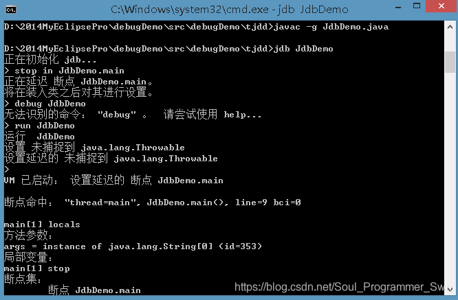

>The Java debugging system is a complete set of tools and interfaces for debugging virtual machines. Through the API provided by JDPA, developers can easily and flexibly build Java debugging tools.
## JPDA composition module
1. JVMTI (Java Virtual Machine Tool Interface)
2. JDWP (Java Debugging Line Protocol)
3. JDI (Java Debugging Interface)

### JVMTI
JVMTI defines the debugging services that a virtual machine should provide, including debugging information (such as stack information), debugging behavior (such as setting a breakpoint by the client), and notification (such as notifying the client when a breakpoint is reached). This interface is provided and implemented by the virtual machine implementer and integrated into the virtual machine.
### JDWP
The Java Debugging Line Protocol is a communication and interaction protocol developed for Java debugging, which defines the format of information transfer between the debugger and the debugged program. JDWP provides a detailed and complete definition of request commands, response data, and error codes, ensuring smooth communication between JVMTI and JDI between the debugger and the debugged program. It should be noted that JDWP itself does not include the implementation of the transport layer, and JDWP only includes the definition of interaction with the transport layer.

### JDI
The Java debugging interface is the highest level interface among the three modules, implemented by the Java language. JDI provides developers with several interfaces that not only format JDWP data, but also provide optimization services such as queues and caching for JDWP data transmission. Through it, developers can remotely control the running of debugged programs on backend virtual machines. Our general debugger also constructs a set of user-friendly tools through the JDI interface, achieving the goal of ease of use.


## How does JPDA operate?
There are several important concepts in the debugging process of JPDA: debugger, debugee, and communicator. The details are as follows:
1. Debuggee: It runs on the Java Virtual Machine we want to debug. It can monitor the information of the current virtual machine through the JVMTI standard interface.
2. Debugger: defines the debugging interfaces that users can use, through which users can send debugging commands to the debugged virtual machine, while the debugger accepts and displays debugging results.
3. Commuter: Encapsulates debugging commands and results between the debugger and the debugee into JDWP protocol packets for transmission.

## JDB Debugging - Local Debugging
>This article does not explain remote debugging for development tools such as IDEA, MyEllipse, etc

JDB is a debugging tool based on text and command line.



1. Modify the Java startup script to open the remote debugging port
    ```shell
    JAVA_OPTS="$JAVA_OPTS -Xdebug -Xrunjdwp:transport=dt_socket,address=8787,server=y,suspend=n"
    ```
2. Program running
3. Attach the jdb to the program and run the following script on the machine where the program is located
    ```shell
      $JAVA_HOME/bin/jdb -attach 127.0.0.1:8000
    ```
4. Specify breakpoints, run


### JDB Debugging - Common Commands
```
run [Class [Parameter] - Start executing the main class of the application
stop in <Class ID>< Method>[(Parameter Type,...)] - Set breakpoints in the method
stop at <Class ID>:<Line>- Set breakpoints in the line
locals -Output all local variables in the current stack frame
clear <Class ID>< Method>[(Parameter Type,...)] - Clear breakpoints in the method
clear <Class ID>:<Row>- Clear breakpoints in rows
clear -List Breakpoints
print <Expression>- Output the value of the expression
catch [uncaught|caught|all] <Class ID>|<Class Pattern>- Interrupt on specified exception
ignore [uncaught|caught|all] <Class ID>|<Class Pattern>-- Cancel 'catch' for the specified exception
watch [access|all] <Class ID>< Field Name>- Monitor Access/Modification to Fields
unwatch [access|all] <Class ID>< Field Name>- Stop monitoring access/modification of fields
step -Execute Current Line
step up -Execute to the current method and return to its calling program
stepi -Execute to the current method and return to its calling program
next -Skip one line (across calls)
cont -Continue execution from breakpoint
dump -View object information
list [line number|method] -Output Source Code
use（or sourcepath） [Source File Path] - Display or change the source path
```


