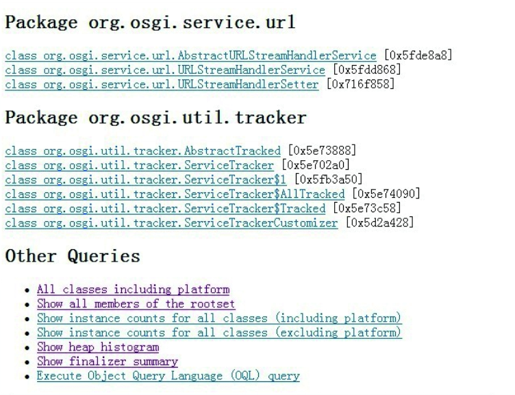

# Java 基础故障处理工具
## jps:虚拟机进程状况工具
- JDK的很多小工具的名字都参考了UNIX命令的命名方式，jps（JVM Process Status Tool）是其中的典型。除了名字像UNIX的ps命令之外，它的功能也和ps命令类似：可以列出正在运行的虚拟机进程，并显示虚拟机执行主类（Main Class，main()函数所在的类）名称以及这些进程的本地虚拟机唯一ID（LVMID，Local Virtual Machine Identifier）。虽然功能比较单一，但它绝对是使用频率最高的JDK命令行工具，因为其他的JDK工具大多需要输入它查询到的LVMID来确定要监控的是哪一个虚拟机进程。对于本地虚拟机进程来说，LVMID与操作系统的进程ID（PID，Process Identifier）是一致的，使用Windows的任务管理器或者UNIX的ps命令也可以查询到虚拟机进程的LVMID，但如果同时启动了多个虚拟机进程，无法根据进程名称定位时，那就必须依赖jps命令显示主类的功能才能区分了。
- jps命令格式：
    ```
    jps [options] [hostid]
    ```
- jps执行样例：
    ```
    jps -l
    2388 D:\Develop\glassfish\bin\..\modules\admin-cli.jar
    2764 com.sun.enterprise.glassfish.bootstrap.ASMain
    3788 sun.tools.jps.J
    ```

- jps还可以通过RMI协议查询开启了RMI服务的远程虚拟机进程状态，参数hostid为RMI注册表中注册的主机名。
  
  | 选项 | 作用 |
  | :---: | --- |
  | -q | 只输出LIMITED，省略主类名称 |
  | -m | 输出虚拟机启动时传递给主类main()函数的参数 |
  | -l | 输出主类的全名，如果进程执行的是Jar包，则输出Jar路径 |
  | -v | 输出虚拟机启动时的JVM参数 |
## jstat:虚拟机统计信息监视工具
- jstat（JVM Statistics Monitoring Tool）是用于监视虚拟机各种运行状态信息的命令行工具。它可以显示本地或者远程[插图]虚拟机进程中的类加载、内存、垃圾收集、即时编译等运行时数据，在没有GUI图形界面、只提供了纯文本控制台环境的服务器上，它将是运行期定位虚拟机性能问题的常用工具。
- jstat命令格式为：
    ```
    jstat [ option vmid [ interval[s/ms] [count] ] ]
    ```
- 对于命令格式中的VMID与LVMID需要特别说明一下：如果是本地虚拟机进程，VMID与LVMID是一致的；如果是远程虚拟机进程，那VMID的格式应当是：
    ```
    [protocol:][//]lvmid[ @hostname[:port]/servername ]
    ```
- 参数interval和count代表查询间隔和次数，如果省略这2个参数，说明只查询一次。假设需要每250毫秒查询一次进程2764垃圾收集状况，一共查询20次，那命令应当是：
    ```
    jstat -gc 2746 250 20
    ```
- jstat执行样例
    ```
    jstat -gcutil 2764
    S0      S1      E       O        P        YGC    YGCT     FGC    FGCT     GCT
    0.00    0.00    6.20    41.42    47.20    16     0.105    3      0.472    0.577
    ```
## jinfo:Java 配置信息工具
- jinfo（Configuration Info for Java）的作用是实时查看和调整虚拟机各项参数。使用jps命令的-v参数可以查看虚拟机启动时显式指定的参数列表，但如果想知道未被显式指定的参数的系统默认值，除了去找资料外，就只能使用jinfo的-flag选项进行查询了（如果只限于JDK 6或以上版本的话，使用java-XX：+PrintFlagsFinal查看参数默认值也是一个很好的选择）。jinfo还可以使用-sysprops选项把虚拟机进程的System.getProperties()的内容打印出来。这个命令在JDK 5时期已经随着Linux版的JDK发布，当时只提供了信息查询的功能，JDK 6之后，jinfo在Windows和Linux平台都有提供，并且加入了在运行期修改部分参数值的能力（可以使用-flag[+|-]name或者-flag name=value在运行期修改一部分运行期可写的虚拟机参数值）。在JDK 6中，jinfo对于Windows平台功能仍然有较大限制，只提供了最基本的-flag选项。
- jinfo命令格式：
    ```
    jinfo [option] pid
    ```
- 执行样例：查询CMSInitiatingOccupancyFraction参数值
    ```
    jinfo -flag CMSInitiatingOccupancyFraction 1444
    -XX:CMSInitiatingOccupancyFraction=85
    ```
- 查询结果表明：这台服务器的新生代Eden区（E，表示Eden）使用了6.2%的空间，2个Survivor区（S0、S1，表示Survivor0、Survivor1）里面都是空的，老年代（O，表示Old）和永久代（P，表示Permanent）则分别使用了41.42%和47.20%的空间。程序运行以来共发生Minor GC（YGC，表示Young GC）16次，总耗时0.105秒；发生Full GC（FGC，表示Full GC）3次，总耗时（FGCT，表示Full GC Time）为0.472秒；所有GC总耗时（GCT，表示GC Time）为0.577秒。
- 使用jstat工具在纯文本状态下监视虚拟机状态的变化，在用户体验上也许不如后文将会提到的JMC、VisualVM等可视化的监视工具直接以图表展现那样直观，但在实际生产环境中不一定可以使用图形界面，而且多数服务器管理员也都已经习惯了在文本控制台工作，直接在控制台中使用jstat命令依然是一种常用的监控方式。
## jmap:Java 内存映像工具
- jmap（Memory Map for Java）命令用于生成堆转储快照（一般称为heapdump或dump文件）。如果不使用jmap命令，要想获取Java堆转储快照也还有一些比较“暴力”的手段：譬如在第2章中用过的-XX：+HeapDumpOnOutOfMemoryError参数，可以让虚拟机在内存溢出异常出现之后自动生成堆转储快照文件，通过-XX：+HeapDumpOnCtrlBreak参数则可以使用[Ctrl]+[Break]键让虚拟机生成堆转储快照文件，又或者在Linux系统下通过Kill-3命令发送进程退出信号“恐吓”一下虚拟机，也能顺利拿到堆转储快照。
- jmap的作用并不仅仅是为了获取堆转储快照，它还可以查询finalize执行队列、Java堆和方法区的详细信息，如空间使用率、当前用的是哪种收集器等。
- 和jinfo命令一样，jmap有部分功能在Windows平台下是受限的，除了生成堆转储快照的-dump选项和用于查看每个类的实例、空间占用统计的-histo选项在所有操作系统中都可以使用之外，其余选项都只能在Linux/Solaris中使用。
- jmap命令格式：
    ```
    jmap [option] vmid
    ```
- option选项的合法值与具体含义
  
  |选项|作用|
  |---|---|
  |-dump|生成Java堆存储快照|
  |-finalizerinfo|显示在F-Queue中等待Finalize线程执行finalize方法的对象。只在Linux/Solaris平台下有效|
  |-heap|显示Java堆详细信息。只在Linux/Solaris平台下有效|
  |-histo|显示堆中对象统计信息|
  |-permstat|以ClassLoader为统计口径显示永久代内存状态。只在Linux/Solaris平台下有效|
  |-F|当虚拟机进程对-dump没有响应时，可以用该参数强制生成快照。只在Linux/Solaris平台下有效|

- 使用jmap生成dump文件
    ```
    jmap -dump:format=b,file=eclipse.bin 3500
    Dumping heap to C:\Users\IcyFenix\eclipse.bin ...
    Heap dump file created
    ```

## jhat:Java 虚拟机堆转储快照分析工具
- JDK提供jhat（JVM Heap Analysis Tool）命令与jmap搭配使用，来分析jmap生成的堆转储快照。jhat内置了一个微型的HTTP/Web服务器，生成堆转储快照的分析结果后，可以在浏览器中查看。不过实事求是地说，在实际工作中，除非手上真的没有别的工具可用，否则多数人是不会直接使用jhat命令来分析堆转储快照文件的，主要原因有两个方面。一是一般不会在部署应用程序的服务器上直接分析堆转储快照，即使可以这样做，也会尽量将堆转储快照文件复制到其他机器[插图]上进行分析，因为分析工作是一个耗时而且极为耗费硬件资源的过程，既然都要在其他机器上进行，就没有必要再受命令行工具的限制了。另外一个原因是jhat的分析功能相对来说比较简陋，后文将会介绍到的VisualVM，以及专业用于分析堆转储快照文件的Eclipse Memory Analyzer、IBM HeapAnalyzer[插图]等工具，都能实现比jhat更强大专业的分析功能。代码清单4-3演示了使用jhat分析上一节采用jmap生成的Eclipse IDE的内存快照文件。
- 使用jhat分析dump文件
    ```
    jhat eclipse.bin
    Reading from eclipse.bin...
    Dump file created Fri Nov 19 22:07:21 CST 2010
    Snapshot read, resolving...
    Resolving 1225951 objects...
    Chasing references, expect 245 dots....
    Eliminating duplicate references...
    Snapshot resolved.
    Started HTTP server on port 7000
    Server is ready.
    ```

- 屏幕显示“Server is ready.”的提示后，用户在浏览器中输入http://localhost:7000/可以看到分析结果。
- 分析结果默认以包为单位进行分组显示，分析内存泄漏问题主要会使用到其中的“HeapHistogram”（与jmap-histo功能一样）与OQL页签的功能，前者可以找到内存中总容量最大的对象，后者是标准的对象查询语言，使用类似SQL的语法对内存中的对象进行查询统计。

  

## jstack:Java 堆栈跟踪工具
- jstack（Stack Trace for Java）命令用于生成虚拟机当前时刻的线程快照（一般称为threaddump或者javacore文件）。线程快照就是当前虚拟机内每一条线程正在执行的方法堆栈的集合，生成线程快照的目的通常是定位线程出现长时间停顿的原因，如线程间死锁、死循环、请求外部资源导致的长时间挂起等，都是导致线程长时间停顿的常见原因。线程出现停顿时通过jstack来查看各个线程的调用堆栈，就可以获知没有响应的线程到底在后台做些什么事情，或者等待着什么资源。
- jstack命令格式：
  ```
  jstack [option] vmid
  ```
- option选项的合法值与具体含义。
  
  |选项|作用|
  |---|---|
  |-F|当正常输出的请求不被影响时，强制输出线程堆栈|
  |-l|除堆栈外，显示关于锁的附加信息|
  |-m|如果调用到本地方法栈的话，可以显示C/C++的堆栈|

- 实操参看[jstack线程分析](./jstack.md)
  
