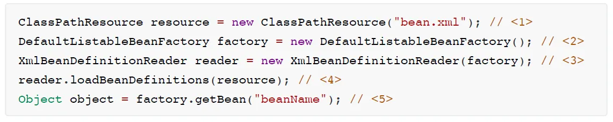
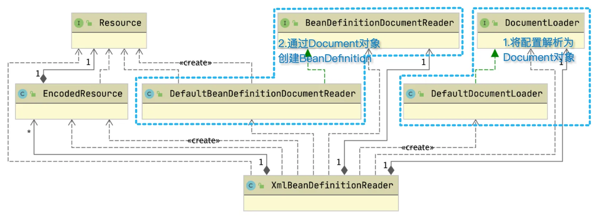
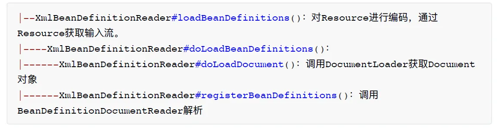
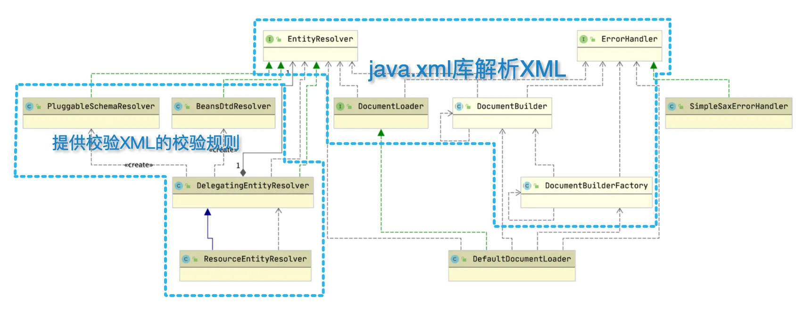
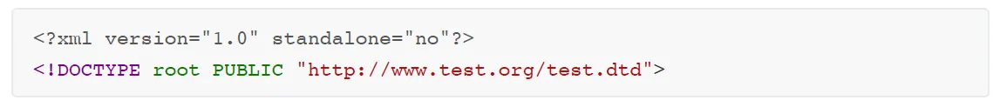
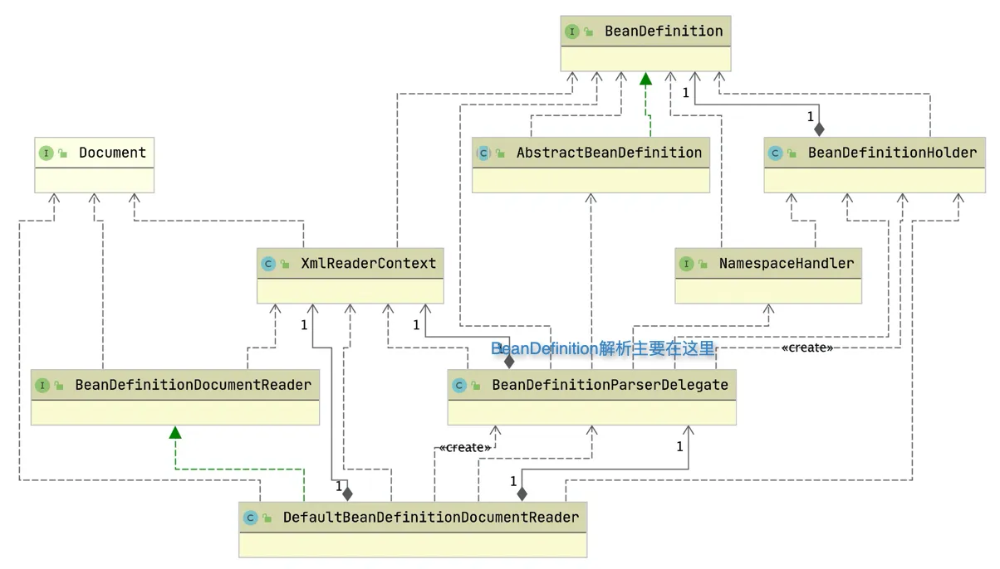
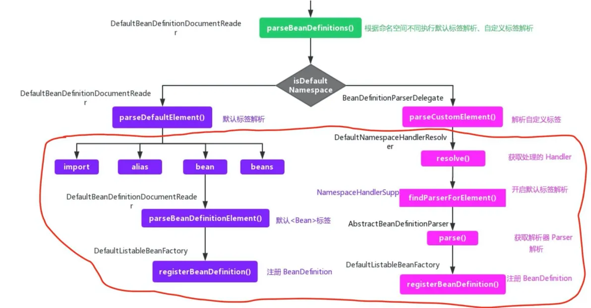

# Spring IOC

## 什么是IOC
我们常说Java程序员需要对象，⾃⼰new⼀个就⾏了，但实际没那么简单。举个例⼦，如果我找对象，我希望对⽅⻓得好看、⼼地善良，这就产⽣了两个条件：

条件1：⻓得好看

条件2：⼼地善良

什么样的姑娘满⾜这两个条件并且能看上我呢？我不知到，我得去接触，然后了解，最后再确定是不是彼此合拍，这个过程需要花⼤量时间与精⼒。这时候，如果有万能的神存在就好了。

我说：神啊，请告诉我哪位姑娘满⾜条件并且能看上我？神：没有我：什么？难道世界上没有⻓得好看⼼地善良的姑娘？神：不是，没⼈能看上你。

你看！有或者没有，很快就能确定，不需要我⾃⼰劳⼼费神的寻觅。

回到Java编程，随着程序的复杂度提⾼，我们new⼀个对象也需要满⾜各种条件，这是⼀个繁琐的⼯作。这时候，IOC容器就扮演了神的⻆⾊，它来帮你管理对象，你要做的就是告诉它你需要什么对象，它则返回这个对象，或者告诉你没有这样的对象。

## 编程式使⽤IOC容器
百度⼀下编程式使⽤IOC容器，很⼤概率看到这样的代码：

这个过程，就是我们⼿动创建IOC容器并获取对象的⽅法：
1. 通过⽂件名bean.xml创建ClassPathResource资源对象 。
2. 创建IOC容器的实现类之⼀DefaultListableBeanFactory。
3. 创建⼀个资源解析器，准备解析bean.xml中的配置。
4. 通过loadBeanDefinitions⽅法将配置解析为BeanDefinition。
5. 通过IOC容器getBean⽅法获取Bean，这⾥的Bean是基于步骤4产⽣的BeanDefinition创建的。

我们接下来主要了解第4步，配置⽂件是如何被解析为BeanDefinition的。

## 加载BeanDefinition源码
以XmlBeanDefinitionReader 的loadBeanDefinitions 为⼊⼝，通过DocumentLoader将Resource 解析为Document 对象，再调⽤BeanDefinitionDocumentReader 创建BeanDefinition 。


### 01将配置解析为Document对象
我们有bean.xml⽂件，要获取Document ，这不是javax.xml 库⾃带的功能吗？事实确实如此，Spring也是直接通过javax.xml 库解析，但还做了些额外的操作，接下来我们⼀起看看。

以DefaultDocumentLoader 的loadDocument 为⼊⼝，最终执⾏解析⼯作的是java.xml 库的DocumentBuilder 对象，Spring实现了EntityResolver 和ErrorHandler 供DocumentBuilder 使
⽤，它们的作⽤是什么呢？

**EntityResolver的作⽤**
我们经常会看到xml⽂件开头有这样的内容：

以上内容的作⽤就是告诉解析器，我要使⽤test.dtd ⽂件对xml进⾏校验。解析器默认通过⽹络下载test.dtd ⽂件，这个下载过程可能会有错误，从⽽导致程序报错。EntityResolver 的作⽤是程序通过实现该接⼝提供⼀个寻找校验⽂件的⽅法，可以将⽂件存放到本地，这样就避免了通过⽹络下载导致的错误。

XML有两种验证机制DTD和XSD，细节我们不在此讨论，针对两种机制，Spring提供了以下两个类：
BeansDtdResolver：针对DTD验证，返回dtd⽂件
PluggableSchemaResolver：针对XSD验证，返回xsd⽂件

ErrorHandler
ErrorHandler 的实现类SimpleSaxErrorHandler 很简单，就是在解析异常的时候打印⽇志或抛出异
常。

### 02创建BeanDefinition
将bean.xml解析成Document 之后，spring通过BeanDefinitionParserDelegate 将Document 解析
为BeanDefinition


Spring 有两种 Bean 声明⽅式：
配置⽂件式： 
```xml
<bean id="studentService" class="org.springframework.core.StudentService" /> 
```
⾃定义注解⽅式： 
```xml
<tx:annotation-driven> 
```

对应的时序图如下：

最终，我们的BeanDefinition会注册到DefaultListableBeanFactory容器中。

总结下来，BeanDefinition解析过程其实也很直观：bean.xml -> Document -> BeanDefinition，这么⼀想是不是我们也能写⼀个简单的过程呢？
