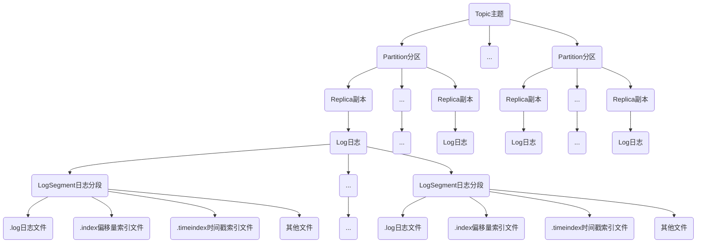

# Kafka
## 主题与分区
### 主题管理

### 分区管理
- 优先副本的选举
  - 通过一定的方式促使优先副本选举为leader副本，以此来促进集群的负载均衡，这一行为也可以称为“分区平衡”。
- 分区重分配
  - 当集群中新增broker节点时，只有新创建的主题分区才有可能被分配到这个节点上，而之前的主题分区并不会自动分配到新加入的节点中，因为在它们被创建时还没有这个新节点，这样新节点的负载和原先节点的负载之间严重不均衡。
  - 为了解决上述问题，需要让分区副本再次进行合理的分配，也就是所谓的分区重分配。Kafka提供了kafka-reassign-partitions.sh 脚本来执行分区重分配的工作，它可以在集群扩容、broker节点失效的场景下对分区进行迁移。
  >还需要注意的是，如果要将某个broker下线，那么在执行分区重分配动作之前最好先关闭或重启broker。这样这个broker就不再是任何分区的leader节点了，它的分区就可以被分配给集群中的其他broker。这样可以减少broker间的流量复制，以此提升重分配的性能，以及减少对集群的影响。
- 复制限流
  - 副本间的复制限流有两种实现方式：
    - kafka-config.sh脚本
    - kafka-reassign-partitions.sh脚本
- 修改副本因子
  - kafka-reassign-partition.sh脚本亦可修改副本因子
## 注意点
#### 目前Kafka只支持增加分区数而不支持减少分区数
**为什么不支持减少分区？**
按照Kafka现有的代码逻辑，此功能完全可以实现，不过也会使代码的复杂度急剧增大。实现此功能需要考虑的因素很多，比如删除的分区中的消息该如何处理？如果随着分区一起消失则消息的可靠性得不到保障；如果需要保留则又需要考虑如何保留。直接存储到现有分区的尾部，消息的时间戳就不会递增，如此对于Spark、Flink这类需要消息时间戳（事件时间）的组件将会受到影响；如果分散插入现有的分区，那么在消息量很大的时候，内部的数据复制会占用很大的资源，而且在复制期间，此主题的可用性又如何得到保障？与此同时，顺序性问题、事务性问题，以及分区和副本的状态机切换问题都是不得不面对的。反观这个功能的收益点却是很低的，如果真的需要实现此类功能，则完全可以重新创建一个分区数较小的主题，然后将现有主题中的消息按照既定的逻辑复制过去即可。
#### 脚本相关
- kafka-topics.sh：
  脚本中的 zookeeper、partitions、replication-factor和topic这4个参数分别代表ZooKeeper连接地址、分区数、副本因子和主题名称。
  >kafka-topics.sh脚本在创建主题时还会检测是否包含“.”或“_”字符。为什么要检测这两个字符呢？因为在Kafka的内部做埋点时会根据主题的名称来命名metrics的名称，并且会将点号“.”改成下画线“_”。
  主题的命名同样不推荐（虽然可以这样做）使用双下画线“__”开头，因为以双下画线开头的主题一般看作Kafka的内部主题，比如__consumer_offsets和__transaction_state。主题的名称必须由大小写字母、数字、点号“.”、连接线“-”、下画线“_”组成，不能为空，不能只有点号“.”，也不能只有双点号“..”，且长度不能超过249。
- kafka-perferred-replica-election.sh
  脚本中还提供了path-to-json-file参数来小批量地对部分分区执行优先副本的选举操作。通过path-to-json-file参数来指定一个JSON文件，这个JSON文件里保存需要执行优先副本选举的分区清单。
- kafka-reassign-partitions.sh
  脚本的3个步骤：
  1. 首先创建需要一个包含主题清单的JSON文件
  2. 其次根据主题清单和 broker 节点清单生成一份重分配方案
  3. 最后根据这份方案执行具体的重分配动作
### 如何选择何时的分区数
#### 性能测试工具
- 用于生产者性能测试：kafka-producer-perf-test.sh
- 用于消费者性能测试：kafka-consumer-perf-test.sh
#### 分区越多吞吐越高？
答案是否定的。随着分区数的增加，相应的吞吐量也会有所增长。一旦分区数超过了某个阈值之后，整体的吞吐量也是不升反降的，同样说明了分区数越多并不会使吞吐量一直增长。
#### 分区数的上限
- 过多分区，日志中会提示“java.io.IOException：Too many open files”，这是一种常见的Linux系统错误，通常意味着文件描述符不足，它一般发生在创建线程、创建 Socket、打开文件这些场景下。
  - 如何避免这种异常情况？
    - uplimit -n 65535
    - 也可以在/etc/security/limits.conf文件中设置
  >对于一个高并发、高性能的应用来说，1024 或 4096 的文件描述符限制未免太少，可以适当调大这个参数。比如使用 ulimit-n 65535 命令将上限提高到65535，这样足以应对大多数的应用情况，再高也完全没有必要了。

  >limits.conf文件修改之后需要重启才能生效。limits.conf文件与ulimit命令的区别在于前者是针对所有用户的，而且在任何shell中都是生效的，即与shell无关，而后者只是针对特定用户的当前shell的设定。在修改最大文件打开数时，最好使用limits.conf文件来修改，通过这个文件，可以定义用户、资源类型、软硬限制等。也可以通过在/etc/profile文件中添加ulimit的设置语句来使全局生效。

#### 脚本相关
- 用于生产者性能测试：kafka-producer-perf-test.sh
- 用于消费者性能测试：kafka-consumer-perf-test.sh
## 日志存储
>日志关系及结构，参见开篇 [主题管理](#主题管理)

### 文件目录布局
- 日志写入
  向Log 中追加消息时是顺序写入的，只有最后一个 LogSegment 才能执行写入操作，在此之前所有的 LogSegment 都不能写入数据。为了方便描述，我们将最后一个 LogSegment 称为“activeSegment”，即表示当前活跃的日志分段。随着消息的不断写入，当activeSegment满足一定的条件时，就需要创建新的activeSegment，之后追加的消息将写入新的activeSegment。
  为了便于消息的检索，每个LogSegment中的日志文件（以“.log”为文件后缀）都有对应的两个索引文件：偏移量索引文件（以“.index”为文件后缀）和时间戳索引文件（以“.timeindex”为文件后缀）。每个 LogSegment 都有一个基准偏移量 baseOffset，用来表示当前 LogSegment中第一条消息的offset。偏移量是一个64位的长整型数，日志文件和两个索引文件都是根据基准偏移量（baseOffset）命名的，名称固定为20位数字，没有达到的位数则用0填充。比如第一个LogSegment的基准偏移量为0，对应的日志文件为00000000000000000000.log。
  >每个LogSegment中不只包含“.log”“.index”“.timeindex”这3种文件，还可能包含“.deleted”“.cleaned”“.swap”等临时文件，以及可能的“.snapshot”“.txnindex”“leader-epoch-checkpoint”等文件。

### 日志索引
Kafka 中的索引文件以稀疏索引（sparse index）的方式构造消息的索引，它并不保证每个消息在索引文件中都有对应的索引项。

每当写入一定量（由 broker 端参数 log.index.interval.bytes指定，默认值为4096，即4KB）的消息时，偏移量索引文件和时间戳索引文件分别增加一个偏移量索引项和时间戳索引项，增大或减小log.index.interval.bytes的值，对应地可以增加或缩小索引项的密度。

- **索引查询**
  - 稀疏索引通过MappedByteBuffer将索引文件映射到内存中，以加快索引的查询速度。
  - 偏移量索引文件中的偏移量是单调递增的，查询指定偏移量时，使用二分查找法来快速定位偏移量的位置，如果指定的偏移量不在索引文件中，则会返回小于指定偏移量的最大偏移量。
  - 时间戳索引文件中的时间戳也保持严格的单调递增，查询指定时间戳时，也根据二分查找法来查找不大于该时间戳的最大偏移量，至于要找到对应的物理文件位置还需要根据偏移量索引文件来进行再次定位。
  >稀疏索引的方式是在磁盘空间、内存空间、查找时间等多方面之间的一个折中。

- **索引文件切分，日志分段文件切分包含以下几个条件，满足其一即可**
  - 当前日志分段文件的大小超过了 broker 端参数 log.segment.bytes 配置的值。log.segment.bytes参数的默认值为1073741824，即1GB。
  - 当前日志分段中消息的最大时间戳与当前系统的时间戳的差值大于 log.roll.ms或log.roll.hours参数配置的值。如果同时配置了log.roll.ms和log.roll.hours参数，那么log.roll.ms的优先级高。默认情况下，只配置了log.roll.hours参数，其值为168，即7天。
  - 偏移量索引文件或时间戳索引文件的大小达到broker端参数log.index.size.max.bytes配置的值。log.index.size.max.bytes的默认值为10485760，即10MB。
  - 追加的消息的偏移量与当前日志分段的偏移量之间的差值大于Integer.MAX_VALUE，即要追加的消息的偏移量不能转变为相对偏移量（offset-baseOffset＞Integer.MAX_VALUE）。
>对非当前活跃的日志分段而言，其对应的索引文件内容已经固定而不需要再写入索引项，所以会被设定为只读。而对当前活跃的日志分段（activeSegment）而言，索引文件还会追加更多的索引项，所以被设定为可读写。

>在索引文件切分的时候，Kafka 会关闭当前正在写入的索引文件并置为只读模式，同时以可读写的模式创建新的索引文件，索引文件的大小由broker端参数log.index.size.max.bytes 配置。

>Kafka 在创建索引文件的时候会为其预分配log.index.size.max.bytes 大小的空间，注意这一点与日志分段文件不同，只有当索引文件进行切分的时候，Kafka 才会把该索引文件裁剪到实际的数据大小。也就是说，与当前活跃的日志分段对应的索引文件的大小固定为 log.index.size.max.bytes，而其余日志分段对应的索引文件的大小为实际的占用空间。

### 日志清理
- 2种清理策略
  - 日志删除（Log Retention）：按照一定的保留策略直接删除不符合条件的日志分段。
  - 日志压缩（Log Compaction）：针对每个消息的key进行整合，对于有相同key的不同value

- 配置
  >通过broker端参数log.cleanup.policy来设置日志清理策略
  - 日志删除：“delete”，默认值为“delete”
  - 日志压缩：“compact”
  >可以同时支持日志删除和日志压缩两种策略

  >日志清理的粒度可以控制到主题级别，比如与log.cleanup.policy 对应的主题级别的参数为 cleanup.policy

#### 基于时间
- 日志删除任务会检查当前日志文件中是否有保留时间超过设定的阈值（retentionMs）来寻找可删除的日志分段文件集合（deletableSegments）
- retentionMs可以通过broker端参数log.retention.hours、log.retention.minutes和log.retention.ms来配置，其中 log.retention.ms的优先级最高，log.retention.minutes 次之，log.retention.hours最低。默认情况下只配置了log.retention.hours参数，其值为168，故默认情况下日志分段文件的保留时间为7天。
- 删除步骤：
  - 删除日志分段时，首先会从Log对象中所维护日志分段的跳跃表中移除待删除的日志分段，以保证没有线程对这些日志分段进行读取操作。
  - 然后将日志分段所对应的所有文件添加上“.deleted”的后缀（当然也包括对应的索引文件）。
  - 最后交由一个以“delete-file”命名的延迟任务来删除这些以“.deleted”为后缀的文件，这个任务的延迟执行时间可以通过file.delete.delay.ms参数来调配，此参数的默认值为60000，即1分钟。
#### 基于日志大小
- 日志删除任务会检查当前日志的大小是否超过设定的阈值（retentionSize）来寻找可删除的日志分段的文件集合（deletableSegments）
- retentionSize可以通过broker端参数log.retention.bytes来配置，默认值为-1，表示无穷大。注意log.retention.bytes配置的是Log中所有日志文件的总大小，而不是单个日志分段（确切地说应该为.log日志文件）的大小。单个日志分段的大小由 broker 端参数 log.segment.bytes 来限制，默认值为1073741824，即1GB。
- 删除步骤：
  - 首先计算日志文件的总大小size和retentionSize的差值diff，即计算需要删除的日志总大小。
  - 然后从日志文件中的第一个日志分段开始进行查找可删除的日志分段的文件集合 deletableSegments。
  - 查找出 deletableSegments 之后就执行删除操作，这个删除操作和基于时间的保留策略的删除操作相同。
#### 基于日志起始偏移量
- 基于日志起始偏移量的保留策略的判断依据是某日志分段的下一个日志分段的起始偏移量baseOffset是否小于等于logStartOffset，若是，则可以删除此日志分段
- Log Compaction对于有相同key的不同value值，只保留最后一个版本。如果应用只关心key对应的最新value值，则可以开启Kafka的日志清理功能，Kafka会定期将相同key的消息进行合并，只保留最新的value值。
- Log Compaction执行前后，日志分段中的每条消息的偏移量和写入时的偏移量保持一致。LogCompaction会生成新的日志分段文件，日志分段中每条消息的物理位置会重新按照新文件来组织。Log Compaction执行过后的偏移量不再是连续的，不过这并不影响日志的查询。
- Kafka中的Log Compaction可以类比于Redis中的RDB的持久化模式。
>如果 Kafka 的日志保存策略是日志删除（Log Deletion），那么系统势必要一股脑地读取Kafka中的所有数据来进行恢复，如果日志保存策略是 Log Compaction，那么可以减少数据的加载量进而加快系统的恢复速度。Log Compaction在某些应用场景下可以简化技术栈，提高系统整体的质量。

### 磁盘存储
Kafka 依赖于文件系统（更底层地来说就是磁盘）来存储和缓存消息。
>操作系统可以针对线性读写做深层次的优化，比如预读（read-ahead，提前将一个比较大的磁盘块读入内存）和后写（write-behind，将很多小的逻辑写操作合并起来组成一个大的物理写操作）技术。顺序写盘的速度不仅比随机写盘的速度快，而且也比随机写内存的速度快。

Kafka 在设计时采用了文件追加的方式来写入消息，即只能在日志文件的尾部追加新的消息，并且也不允许修改已写入的消息，这种方式属于典型的顺序写盘的操作，所以就算 Kafka使用磁盘作为存储介质，它所能承载的吞吐量也不容小觑。
#### 页缓存
#### 磁盘I/O流程
#### 零拷贝
