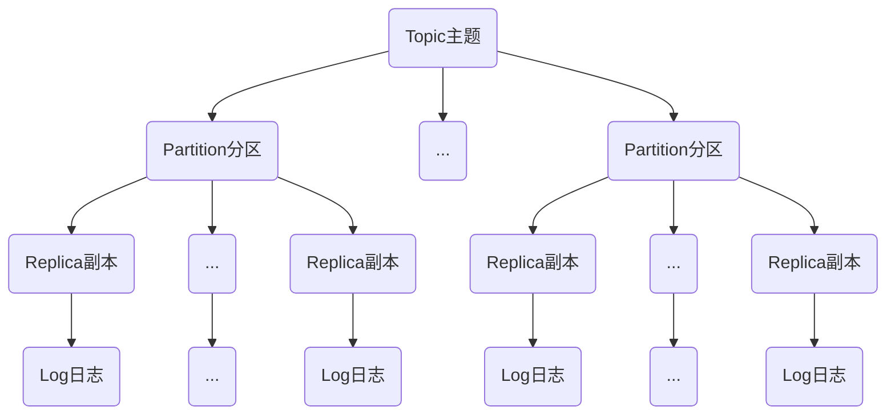

# Kafka
## 主题与分区
### 主题管理

### 分区管理
- 优先副本的选举
    - 通过一定的方式促使优先副本选举为leader副本，以此来促进集群的负载均衡，这一行为也可以称为“分区平衡”。
- 分区重分配
    - 当集群中新增broker节点时，只有新创建的主题分区才有可能被分配到这个节点上，而之前的主题分区并不会自动分配到新加入的节点中，因为在它们被创建时还没有这个新节点，这样新节点的负载和原先节点的负载之间严重不均衡。
    - 为了解决上述问题，需要让分区副本再次进行合理的分配，也就是所谓的分区重分配。Kafka提供了kafka-reassign-partitions.sh 脚本来执行分区重分配的工作，它可以在集群扩容、broker节点失效的场景下对分区进行迁移。
  >还需要注意的是，如果要将某个broker下线，那么在执行分区重分配动作之前最好先关闭或重启broker。这样这个broker就不再是任何分区的leader节点了，它的分区就可以被分配给集群中的其他broker。这样可以减少broker间的流量复制，以此提升重分配的性能，以及减少对集群的影响。
- 复制限流
    - 副本间的复制限流有两种实现方式：
        - kafka-config.sh脚本
        - kafka-reassign-partitions.sh脚本
- 修改副本因子
    - kafka-reassign-partition.sh脚本亦可修改副本因子
## 注意点
#### 目前Kafka只支持增加分区数而不支持减少分区数
**为什么不支持减少分区？**
按照Kafka现有的代码逻辑，此功能完全可以实现，不过也会使代码的复杂度急剧增大。实现此功能需要考虑的因素很多，比如删除的分区中的消息该如何处理？如果随着分区一起消失则消息的可靠性得不到保障；如果需要保留则又需要考虑如何保留。直接存储到现有分区的尾部，消息的时间戳就不会递增，如此对于Spark、Flink这类需要消息时间戳（事件时间）的组件将会受到影响；如果分散插入现有的分区，那么在消息量很大的时候，内部的数据复制会占用很大的资源，而且在复制期间，此主题的可用性又如何得到保障？与此同时，顺序性问题、事务性问题，以及分区和副本的状态机切换问题都是不得不面对的。反观这个功能的收益点却是很低的，如果真的需要实现此类功能，则完全可以重新创建一个分区数较小的主题，然后将现有主题中的消息按照既定的逻辑复制过去即可。
#### 脚本相关
- kafka-topics.sh：
  脚本中的 zookeeper、partitions、replication-factor和topic这4个参数分别代表ZooKeeper连接地址、分区数、副本因子和主题名称。
  >kafka-topics.sh脚本在创建主题时还会检测是否包含“.”或“_”字符。为什么要检测这两个字符呢？因为在Kafka的内部做埋点时会根据主题的名称来命名metrics的名称，并且会将点号“.”改成下画线“_”。
  主题的命名同样不推荐（虽然可以这样做）使用双下画线“__”开头，因为以双下画线开头的主题一般看作Kafka的内部主题，比如__consumer_offsets和__transaction_state。主题的名称必须由大小写字母、数字、点号“.”、连接线“-”、下画线“_”组成，不能为空，不能只有点号“.”，也不能只有双点号“..”，且长度不能超过249。
- kafka-perferred-replica-election.sh
  脚本中还提供了path-to-json-file参数来小批量地对部分分区执行优先副本的选举操作。通过path-to-json-file参数来指定一个JSON文件，这个JSON文件里保存需要执行优先副本选举的分区清单。
- kafka-reassign-partitions.sh
  脚本的3个步骤：
    1. 首先创建需要一个包含主题清单的JSON文件
    2. 其次根据主题清单和 broker 节点清单生成一份重分配方案
    3. 最后根据这份方案执行具体的重分配动作
### 如何选择何时的分区数
#### 性能测试工具
- 用于生产者性能测试：kafka-producer-perf-test.sh
- 用于消费者性能测试：kafka-consumer-perf-test.sh
#### 分区越多吞吐越高？
答案是否定的。随着分区数的增加，相应的吞吐量也会有所增长。一旦分区数超过了某个阈值之后，整体的吞吐量也是不升反降的，同样说明了分区数越多并不会使吞吐量一直增长。
#### 分区数的上限
- 过多分区，日志中会提示“java.io.IOException：Too many open files”，这是一种常见的Linux系统错误，通常意味着文件描述符不足，它一般发生在创建线程、创建 Socket、打开文件这些场景下。
    - 如何避免这种异常情况？
        - uplimit -n 65535
        - 也可以在/etc/security/limits.conf文件中设置
  >对于一个高并发、高性能的应用来说，1024 或 4096 的文件描述符限制未免太少，可以适当调大这个参数。比如使用 ulimit-n 65535 命令将上限提高到65535，这样足以应对大多数的应用情况，再高也完全没有必要了。

  >limits.conf文件修改之后需要重启才能生效。limits.conf文件与ulimit命令的区别在于前者是针对所有用户的，而且在任何shell中都是生效的，即与shell无关，而后者只是针对特定用户的当前shell的设定。在修改最大文件打开数时，最好使用limits.conf文件来修改，通过这个文件，可以定义用户、资源类型、软硬限制等。也可以通过在/etc/profile文件中添加ulimit的设置语句来使全局生效。

#### 脚本相关
- 用于生产者性能测试：kafka-producer-perf-test.sh
- 用于消费者性能测试：kafka-consumer-perf-test.sh
## 日志存储
