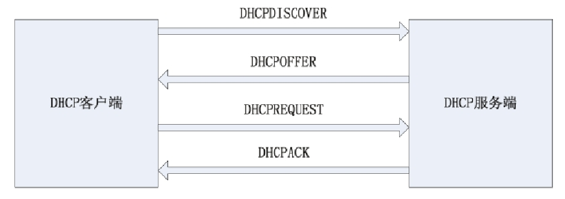

# Linux 动态主机配置协议 DHCP
如果管理的计算机有几十台，那么初始化服务器配置IP地址、网关和子网掩码等参数是一个繁琐耗时的过程。如果网络结构要更改，需要重新初始化网络参数，使用动态主机配置协议DHCP（Dynamic Host Configuration Protocol）则可以避免此问题，客户端可以从DHCP服务端检索相关信息并完成相关网络配置，在系统重启后依然可以工作。尤其在移动办公领域，只要区域内有一台DHCP服务器，用户就可以在办公室之间自由活动而不必担心网络参数配置的问题。DHCP提供一种动态指定IP地址和相关网络配置参数的机制。DHCP基于C/S模式，主要用于大型网络。本节主要介绍DHCP的工作原理及DHCP服务端与DHCP客户端的部署过程。
## DHCP的工作原理
动态主机配置协议（DHCP）用来自动给客户端分配TCP/IP信息的网络协议，如IP地址、网关、子网掩码等信息。每个DHCP客户端通过广播连接到区域内的DHCP服务器，该服务器会响应请求，返回包括IP地址、网关和其他网络配置信息。DHCP的请求过程如图所示。

客户端请求IP地址和配置参数的过程有以下几个步骤：
1. 客户端需要寻求网络IP地址和其他网络参数，然后向网络中广播，客户端发出的请求名称为DHCPDISCOVER。如果广播网络中有可以分配IP地址的服务器，服务器会返回相应应答，告诉客户端可以分配，服务器返回包的名称为DHCPOFFER，包内包含可用的IP地址和参数。
2. 如果客户在发出DHCPOFFER包后一段时间内没有接收到响应，会重新发送请求，如果广播区域内有多于一台的DHCP服务器，由客户端决定使用哪个。
3. 当客户端选定了某个目标服务器后，会广播DHCPREQUEST包，用以通知选定的DHCP服务器和未选定的DHCP服务器。
4. 服务端收到DHCPREQUEST后会检查收到的包，如果包内的地址和所提供的地址一致，证明现在客户端接收的是自己提供的地址，如果不是，则说明自己提供的地址未被采纳。如果被选定的服务器在接收到DHCPREQUEST包以后，因为某些原因可能不能向客户端提供这个IP地址或参数，可以向客户端发送DHCPNAK包。
5. 客户端在收到包后，检查内部的IP地址和租用时间，如果发现有问题，则发包拒绝这个地址，然后重新发送DHCPDISCOVER包。如果无问题，就接受这个配置参数。
