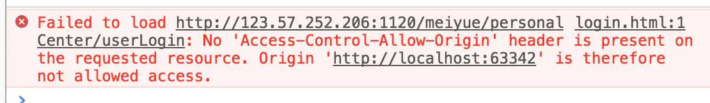
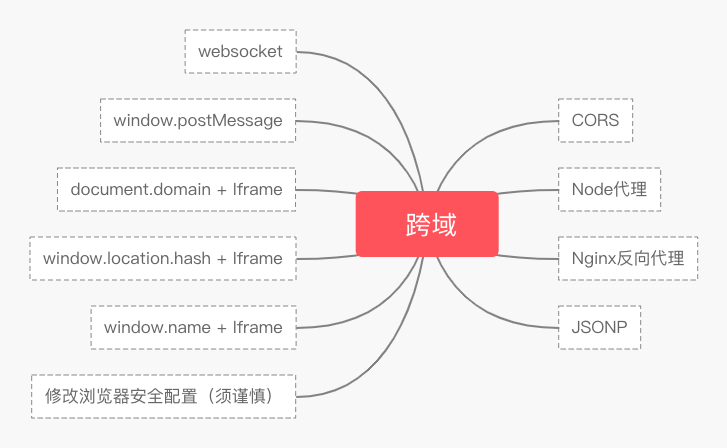

# 跨域

## 为什么会跨域
- 定义
    - 同源策略是一个重要的安全策略，它用于限制一个origin的文档或者它加载的脚本如
      何能与另一个源的资源进行交互。它能帮助阻隔恶意文档，减少可能被攻击的媒介。
- 目的
    - 为了保证用户信息的安全，防止恶意的网站窃取数据。
- 同源的定义
    -  协议相同；域名相同；端口相同
- 限制
    -  Cookie、LocalStorage 和 IndexDB 无法读取；DOM 无法获得；AJAX 请求不能发送。
## 跨域示例
- http://www.waltersun.cn/home/index.html
    - 协议：http://，
    - 域名：www.waltersun.cn 
    - 端口：80（默认端口）

|url|结果|原因|
|---|---|---|
|http://www.waltersun.cn/other/index.html|成功|域名、协议、端口均相同|
|https://ww.waltersun.cn/home/index.html|失败|协议|
|http://ww.waltersun.cn:8080/home/index.html|失败|端口|
|http://ww.waltersun.com/home/index.html|失败|域名|
## 跨域解决方案

