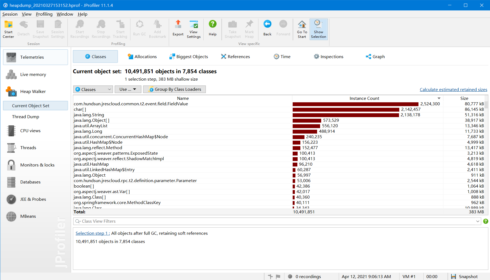
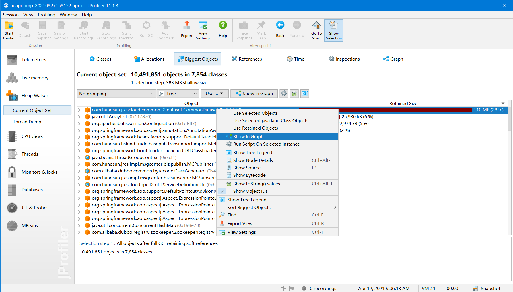
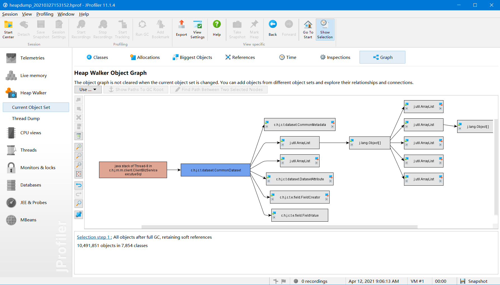

# JProfiler 分析dump文件（.hprof）
>使用方式有很多种，这里介绍本人常用的使用方式
1. 用jprofiler打开文件
   
2. 进入到 Biggest Objects 页面，右击占用内存大的且可能是导致溢出的对象，选择 show in graph
   
3. 在 Graph 页面，可以找到可能出现问题的类和对象中的而具体数据
   
4. 至此，接近真相已经很近了，结合代码分析，80%的问题应该都能得到解决。
