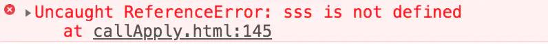
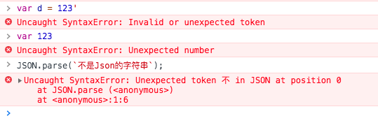
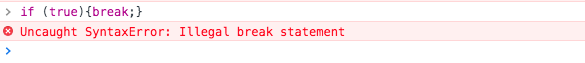
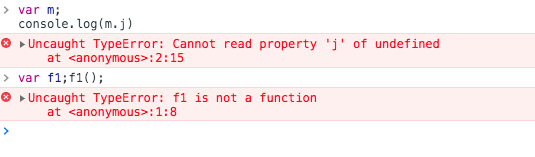
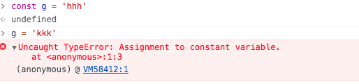
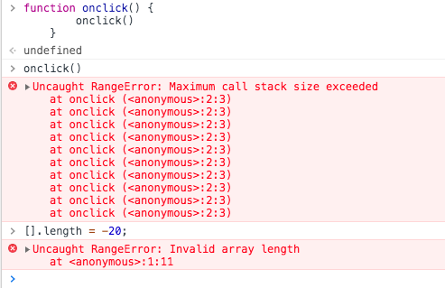

# 常见Error类型
- ReferenceError（引用错误）
- SyntaxError（语法错误）
- TypeError（类型错误）
- RangeError（范围错误）
- URLError（URIError，URL错误）
- EvalError（EvalError eval()函数执行错误）
## ReferenceError（引用错误）
对象代表当一个不存在的变量被引用时发生的错误。

在作用域中找不到，引用了不存在的变量而发生了错误。

console.log(sss);

# SyntaxError（语法错误）
代表尝试解析语法上不合法的代码的错误。

当Javascript语言解析代码时,Javascript引擎发现了不符合语法规范的tokens或token顺序时抛出SyntaxError。

# TypeError（类型错误）
用来表示值的类型非预期类型时发生的错误。

当传入函数的操作数或参数的类型并非操作符或函数所预期的类型时，将抛出一个TypeError类型错误

# RangeError（范围错误）
标明一个错误，当一个值不在其所允许的范围或者集合中。

超出有效范围时发生的错误。

# 类型转换
- == 弱相等
    - [] != []
    - {} != {}
- undefined == null undefined === null
>注意：弱相等判断过程中的 隐式类型转换
