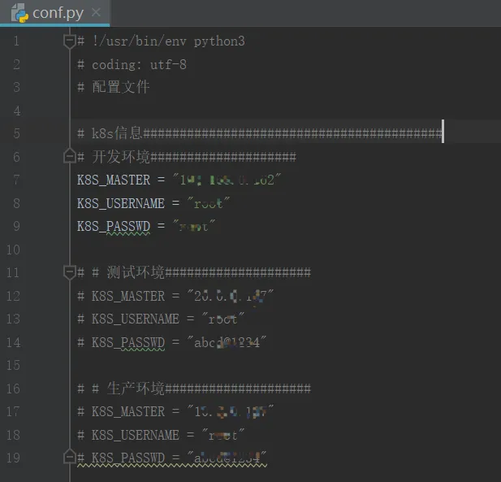
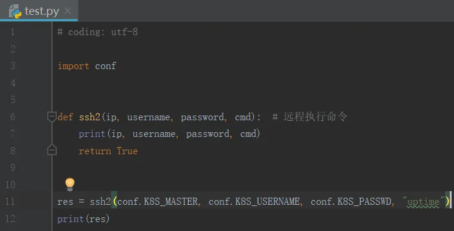
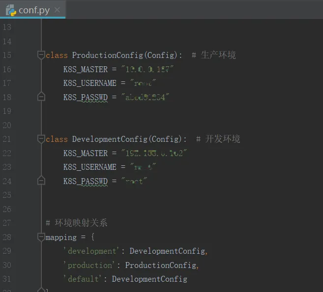
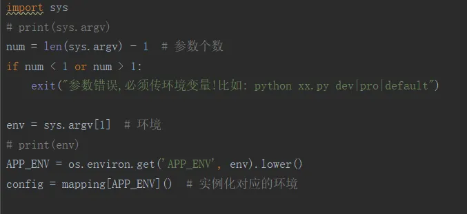

# Python多环境配置管理
实际工程开发中常常会对开发、测试和生产等不同环境配置不同的数据库、应用程序的环境，传统方式可以通过添加不同环境的配置文件达到部署时的动态切换的效果。这种方法不太灵活，且当配置项过多或不同环境有公有配置项时，容易修改出错。
## 以往技术做法
1. 先新建一个配置文件，分别包含开发、测试和生产环境的配置项。当前是用到哪个环境，把对应环境的配置项打开，其他先注释掉

2. 引入配置项模块，然后直接调用即可

3. 当用到其他环境配置项时，把对应环境配置项取消注释即可
## 现在技术做法
现有技术是脚本执行切换，通过命令行方式来指定配置环境、敏感信息（账户信息等），具体如下：
1. 定义配置环境，并设置环境映射关系

2. 根据脚本参数，来决定用哪个环境配置

3. 执行命令行 python xx.py default 
## 现有技术优势/拟解决的技术点
1. 通过修改命令行单个参数来选择配置文件，更简单快捷
2. 敏感信息写入命令行中，不会暴露在代码里，更安全
3. 命令行可以放到批处理文件中，按需自动执行
4. 适用于持续集成
## 现有技术推出的目的
本方法致力于提高测试、运维、业务人员的工作效率，取代了原有的繁琐配置方法，在为客户的自动化测试实施的过程中效果显著。
该方法适可采用各种编程语言（Python、Java）实现，不仅适用于多环境配置频繁切换的情况，还适用于配置自定义参数、变量的情况。
