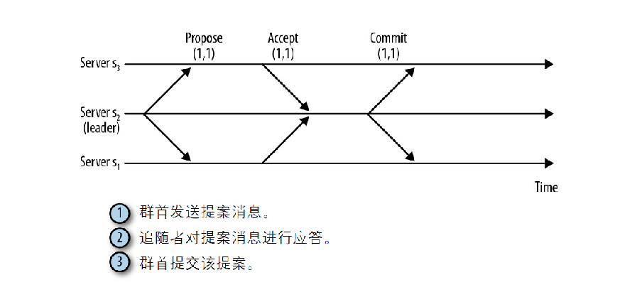
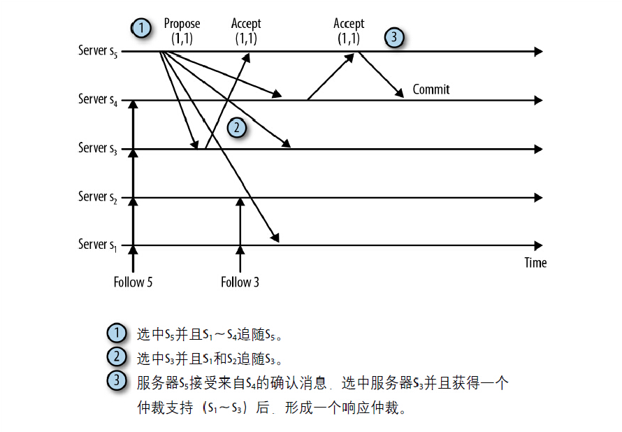

# ZooKeeper ZAB
在接收到一个写请求操作后，追随者会将请求转发给群首，群首将探索性地执行该请求，并将执行结果以事务的方式对状态更新进行广播。一个事务中包含服务器需要执行变更的确切操作，当事务提交时，服务器就会将这些变更反馈到数据树上，其中数据树为ZooKeeper用于保存状态信息的数据结构（请参考DataTree类）。

之后我们需要面对的问题便是服务器如何确认一个事务是否已经提交，由此引入了我们所采用的协议：Zab：ZooKeeper原子广播协议（ZooKeeper Atomic Broadcast protocol）。假设现在我们有一个活动的群首服务器，并拥有仲裁数量的追随者支持该群首的管理权，通过该协议提交一个事务非常简单，类似于一个两阶段提交。
1. 群首向所有追随者发送一个PROPOSAL消息p。
2. 当一个追随者接收到消息p后，会响应群首一个ACK消息，通知群首其已接受该提案（proposal）。
3. 当收到仲裁数量的服务器发送的确认消息后（该仲裁数包括群首自己），群首就会发送消息通知追随者进行提交（COMMIT）操作。

在应答提案消息之前，追随者还需要执行一些检查操作。追随者将会检查所发送的提案消息是否属于其所追随的群首，并确认群首所广播的提案消息和提交事务消失的顺序正确。

Zab保障了以下几个重要属性：
- 如果群首按顺序广播了事务T和事务T，那么每个服务器在提交T？事务前保证事务T已经提交完成。
- 如果某个服务器按照事务T、事务T的顺序提交事务，所有其他服务器也必然会在提交事务T前提交事务T。

第一个属性保证事务在服务器之间的传送顺序的一致，而第二个竖向地保证服务器不会跳过任何事务。假设事务为状态变更操作，每个状态变更操作又依赖前一个状态变更操作的结果，如果跳过事务就会导致结果的不一致性，而两阶段提交保证了事务的顺序。Zab在仲裁数量服务器中记录了事务，集群中仲裁数量的服务器需要在群首提交事务前对事务达成一致，而且追随者也会在硬盘中记录事务的确认信息。

事务在某些服务器上可能会终结，而其他服务器上却不会，因为在写入事务到存储中时，服务器也可能发生崩溃。无论何时，只要仲裁条件达成并选举了一个新的群首，ZooKeeper都可以将所有服务器的状态更新到最新。

但是，ZooKeeper自始至终并不总是有一个活动的群首，因为群首服务器也可能崩溃，或短时间地失去连接，此时，其他服务器需要选举一个新的群首以保证系统整体仍然可用。其中时间戳（epoch）的概念代表了管理权随时间的变化情况，一个时间戳表示了某个服务器行使管理权的这段时间，在一个时间戳内，群首会广播提案消息，并根据计数器（counter）识别每一个消息。我们知道zxid的第一个元素为时间戳信息，因此每个zxid可以很容易地与事务被创建时间戳相关联。

时间戳的值在每次新群首选举发生的时候便会增加。同一个服务器成为群首后可能持有不同的时间戳信息，但从协议的角度出发，一个服务器行使管理权时，如果持有不同的时间戳，该服务器就会被认为是不同的群首。如果服务器s成为群首并且持有的时间戳为4，而当前已经建立的群首的时间戳为6，集群中的追随者会追随时间戳为6的群首s，处理群首在时间戳6之后的消息。当然，追随者在恢复阶段也会接收时间戳4到时间戳6之间的提案消息，之后才会开始处理时间戳为6之后的消息，而实际上这些提案消息是以时间戳6的消息来发送的。

在仲裁模式下，记录已接收的提案消息非常关键，这样可以确保所有的服务器最终提交了被某个或多个服务已经提交完成的事务，即使群首在此时发生了故障。完美检测群首（或任何服务器）是否发生故障是非常困难的，虽然不是不可能，但在很多设置的情况下，都可能发生对一个群首是否发生故障的错误判断。

实现这个广播协议所遇到最多的困难在于群首并发存在情况的出现，这种情况并不一定是脑裂场景。多个并发的群首可能会导致服务器提交事务的顺序发生错误，或者直接跳过了某些事务。为了阻止系统中同时出现两个服务器自认为自己是群首的情况是非常困难的，时间问题或消息丢失都可能导致这种情况，因此广播协议并不能基于以上假设。为了解决这个问题，Zab协议提供了以下保障：
- 一个被选举的群首确保在提交完所有之前的时间戳内需要提交的事务，之后才开始广播新的事务。
- m在任何时间点，都不会出现两个被仲裁支持的群首。

为了实现第一个需求，群首并不会马上处于活动状态，直到确保仲裁数量的服务器认可这个群首新的时间戳值。一个时间戳的最初状态必须包含所有的之前已经提交的事务，或者某些已经被其他服务器接受，但尚未提交完成的事务。这一点非常重要，在群首进行时间戳e的任何新的提案前，必须保证自时间戳开始值到时间戳e－1内的所有提案被提交。如果一个提案消息处于时间戳e'＜e，在群首处理时间戳e的第一个提案消息前没有提交之前的这个提案，那么旧的提案将永远不会被提交。

对于第二个需求有些棘手，因为我们并不能完全阻止两个群首独立地运行。假如一个群首l管理并广播事务，在此时，仲裁数量的服务器Q判断群首l已经退出，并开始选举了一个新的群首l'，我们假设在仲裁机构Q放弃群首l时有一个事务T正在广播，而且仲裁机构Q的一个严格的子集记录了这个事务T，在群首l'被选举完成后，在仲裁机构Q之外服务器也记录了这个事务T，为事务T形成一个仲裁数量，在这种情况下，事务T在群首l'被选举后会进行提交。不用担心这种情况，这并不是个bug，Zab协议保证T作为事务的一部分被群首l'提交，确保群首l'的仲裁数量的支持者中至少有一个追随者确认了该事务T，其中的关键点在于群首l'和l在同一时刻并未获得足够的仲裁数量的支持者。

下图说明了这一场景，在图中，群首l为服务器s5，l'为服务器s3，仲裁机构由s1到s3组成，事务T的zxid为（1，1）。在收到第二个确认消息之后，服务器s5成功向服务器s4发送了提交消息来通知提交事务。其他服务器因追随服务器s3忽略了服务器s5的消息，注意服务器s3所了解的xzid为（1，1），因此它知道获得管理权后的事务点。

之前我们提到Zab保证新群首l'不会缺失（1，1），现在我们来看看其中的细节。在新群首l'生效前，它必须学习旧的仲裁数量服务器之前接受的所有提议，并且保证这些服务器不会继续接受来自旧群首的提议。此时，如果群首l还能继续提交提议，比如（1，1），这条提议必须已经被一个以上的认可了新群首的仲裁数量服务器所接受。我们知道仲裁数量必须在一台以上的服务器之上有所重叠，这样群首l'用来提交的仲裁数量和新群首l使用的仲裁数量必定在一台以上的服务器上是一致的。因此，l'将（1，1）加入自身的状态并传播给其跟随者。

在群首选举时，我们选择zxid最大的服务器作为群首。这使得ZooKeeper不需要将提议从追随者传到群首，而只需要将状态从群首传播到追随者。假设有一个追随者接受了一条群首没有接受的提议。群首必须确保在和其他追随者同步之前已经收到并接受了这条提议。但是，如果我们选择zxid最大的服务器，我们将可以完完全全跳过这一步，可以直接发送更新到追随者。

在时间戳发生转换时，Zookeeper使用两种不同的方式来更新追随者来优化这个过程。如果追随者滞后于群首不多，群首只需要发送缺失的事务点。因为追随者按照严格的顺序接收事务点，这些缺失的事务点永远是最近的。这种更新在代码中被称之为DIFF。如果追随者滞后很久，ZooKeeper将发送在代码中被称为SNAP的完整快照。因为发送完整的快照会增大系统恢复的延时，发送缺失的事务点是更优的选择。可是当追随者滞后太远的情况下，我们只能选择发送完整快照。

群首发送给追随者的DIFF对应于已经存在于事务日志中的提议，而SNAP对应于群首拥有的最新有效快照。我们将稍后在本章中讨论这两种保存在磁盘上的文件。
