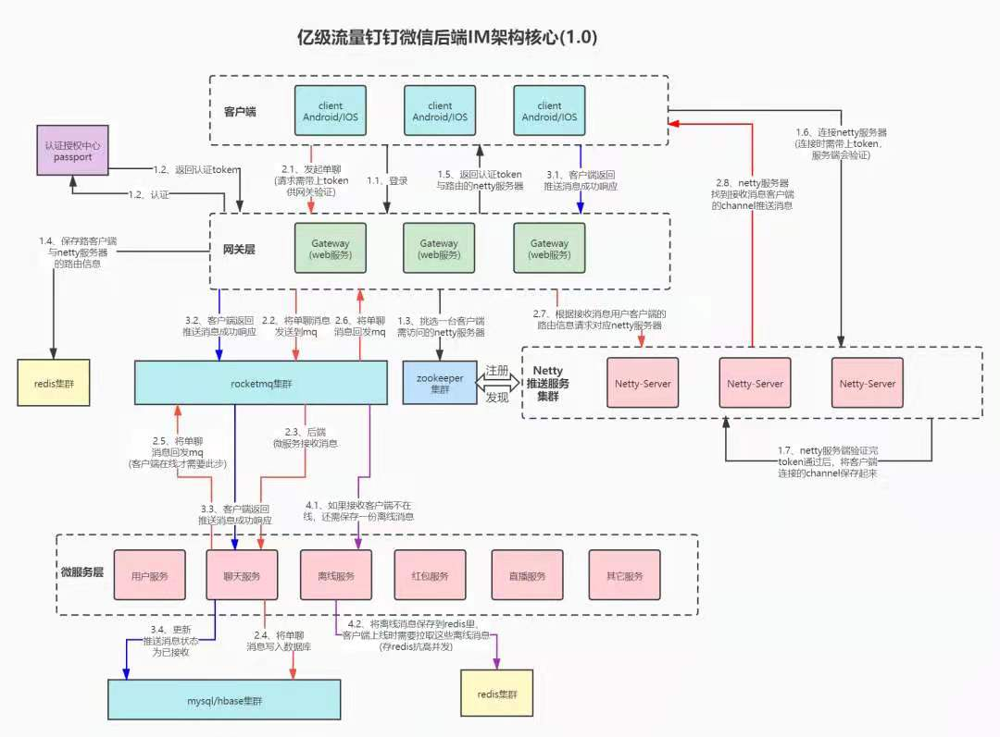

# 架构设计
- 领域驱动设计（推荐阅读书目：《领域驱动设计》埃里克·埃文斯）
- 凤凰架构（推荐阅读书目：《凤凰架构：构建可靠的大型分布式系统》周志明，[网页博客](https://icyfenix.cn/)）
    - 演进中的架构
    - 架构师的视角
    - 分布式的基石
    - 不可变基础设施
    - 技术方法论
- OSGI：OSGi（Open Service Gateway Initiative，直译为“开放服务网关”）实际上是一个由OSGi联盟（OSGi Alliance）发起的以Java为技术平台的动态模块化规范。
- 面向对象设计模式
    - 六大设计原则
        - 单一职责原则
        - 里氏替换原则
        - 依赖导致原则
        - 接口隔离原则
        - 迪米特法则
        - 开闭原则
    - 设计模式分类
        - 创建型
        - 结构型
        - 行为型
- 安全设计
- 幂等设计
- 数据库设计
- 多线程设计架构模式
    - 监控任务的生命周期
    - Single Thread Execution设计模式
    - 读写锁分离设计模式
    - 不可变对象设计模式
    - Future设计模式
    - Guarded Suspention设计模式
    - 线程上下文设计模式
    - Balking设计模式
    - Latch设计模式
    - Thread-Per-Message设计模式
    - Two Phase Termination设计模式
    - Worker-Thread设计模式
    - Active Objects设计模式
    - Event Bus设计模式
    - Event Driven设计模式
- 分布式架构设计
    >结合个人开发经验总结
    - Spring Cloud 系列 
        - 注册中心：eureka（AP型，高可用、分区容错）
        - 网关：gateway
        - 数据链路：zipkin
        - UI交互层：vue
        - 核心代码框架：spring boot
        - 中间件
        - 数据库
    - Dubbo 系列 
        - 注册中心：zookeeper（CP型，一致性、分区容错）
        - 网关：nginx + lua
        - 数据链路：zipkin
        - UI交互层：vue
        - 核心代码框架：spring boot
        - 中间件
        - 数据库
- 亿级流量架构参考
  
