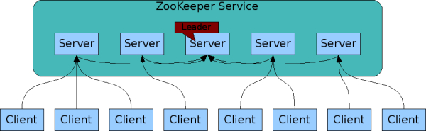
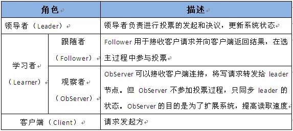
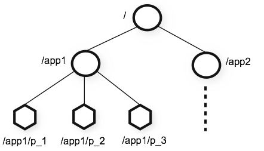

# zookeeper
## zookeeper基础介绍
### zookeeper的来源
有雅虎开发，后捐献给了Apache组织。
在Hadoop生态系统中，许多项目的Logo都采用了动物，比如 Hadoop 和 Hive 采用了大象的形象，HBase 采用了海豚的形象，而从字面上来看 ZooKeeper 表示动物园管理员，所以大家可以理解为 ZooKeeper就是对这些动物（项目组件）进行一些管理工作的。

对于单机环境多线程的竞态资源协调方法，我们一般通过线程锁来协调对共享数据的访问以保证状态的一致性。 但是分布式环境如何进行协调呢？于是，Google创造了Chubby，而ZooKeeper则是对于Chubby的一个开源实现。 
 ZooKeeper是一种为分布式应用所设计的高可用、高性能且一致的开源协调服务，它提供了一项基本服务：分布式锁服务。由于ZooKeeper的开源特性，后来我们的开发者在分布式锁的基础上，摸索了出了其他的使用方法：配置维护、组服务、分布式消息队列、分布式通知/协调等。它被设计为易于编程，使用文件系统目录树作为数据模型。

### zookeeper的五大特性
- 顺序一致性
    - 客户端的更新顺序与他们发送的顺序相一致
- 原子性
    - 更新操作要么全部成功，要么全部失败
- 单一视图
    - 无论客户端连接到哪一个服务器，都可以看到相同的zookeeper视图
- 可靠性
    - 一旦一个更新操作被应用，那么在客户端再次更新它之前，其值将不会改变
- 实时性
    - 在特定的一段时间内，系统的任何变更都将被客户端检测到
### zookeeper的使用场景
- 配置管理
    - 分布式系统，很多服务部署在不同的服务器上，都有自己的一套配置，逐台更新配置非常麻烦。使用zk统一管理，各服务监听zk配置节点变化，一旦变化所有服务都会得到zk通知，然后从leader获取新配置，并完成更新。
- 命名服务（服务注册与发现）
    - 服务提供方将自己的服务名、ip等注册到zk，服务调用方监听zk注册节点，获得最新的服务提供方地址，进行调用。
- 分布式锁服务
    - 保持独占：单进程（抢注临时节点，谁创建成功，谁获得锁）
    - 控制时序：加锁排队（创建有序临时节点，按顺序获得锁）
- 集群管理
    - 是否有机器加入或退出
    - 选举leader
### zookeeper系统模型

### zookeeper角色

### zookeeper数据模型
#### 数据结构——Znode
- 数据结构——Znode
    
    - 每个Znode兼具文件和目录两种特点
        
        - 像文件一样维护着数据、原信息、ACL、时间戳等数据结构
        - 像目录一样可以作为路径标识的一部分
    - 每个Znode有3各部分组成：
        - stat：此为信息状态，描述Znode的版本，权限等信息
        - data：与该Znode关联的数据
        - children：该Znode下的子节点
    - zk规定节点Znode的数据大小不能超过1M，但实际上我们在Znode上的数据量应尽可能的小，因为数据量过大会导致zk性能明显下降
- Znode节点类型
    - 临时节点-ephemeral：
        - 该节点的生命周期依赖于创建他们的会话。一旦会话（Session）结束，临时节点将被自动删除，当然也可以手动删除。
        - 虽然每个临时节点会绑定到一个客户端会话，但他们对所有客户端还是可见的。
        - **临时节点不允许拥有子节点**
    - 持久节点-persistent:
        - 该节点生命周期不依赖于会话
        - 只有客户端显示执行删除操作的时候，他们才能被删除
    - 顺序节点-sequential：
        - 顺序节点可以是持久的，也可以是临时的
        - 当一个新Znode被创建为一个顺序节点，zk通过将10位的序列号附加到原始名称来设置Znode路径
#### 原语——定义在Znode上的一组操作
- 在zookeeper中提供了9种基本操作：
    - create:创建一个Znode节点，父节点必须存在
    - delete:删除一个Znode节点，下面不能有子节点
    - exists:判断一个Znode是否存在，存在时返回元数据
    - getACL:获取Znode的ACL（访问控制列表）
    - setACL:设置Znode的ACL（访问控制列表）
    - getChildren:获取Znode的所有子节点的列表
    - getData:获取子节点的相关数据
    - setData:设置子节点的相关数据
    - sync:使client当前连着的zookeeper服务器和zookeeper的leader节点同步一下数据
#### zookeeper的访问权限控制
- zookeeper的访问权限控制，使用ACL（Access Control List）模式来实现：
    - ACL权限控制，使用“schema:permission”来标识，主要涵盖上方面：
        - 权限模式：鉴权策略，包括world、IP、auth、digest四种
        - 授权对象：权限赋予的用户或者一个实体（授权对象）
        - 权限：CDRWA(create,delete,read,write,admin)（权限类型）
>zookeeper的权限控制是基于每一个Znode节点的，需要对每个节点设置权限

>每个Znode支持设置多种权限控制方案和多个权限

>子节点不会继承父节点权限，客户端无权访问某节点，但可能可以访问它的子节点
#### 通知——Watcher机制，用于对分布式应用发送消息
- zookeeper可以为所有读操作设置watch，这些读操作包括：exists()、getChildren()及getData()
- watch事件是一次性的触发器，当watch对象状态发生改变时，将会触发此对象所对应的watch事件
- watch事件将被异步地发送给客户端，并且zookeeper为watch机制提供了有序的一致性保证。理论上客户端接收watch事件的时间要快于其看到watch对象状态变化的时间。
- zookeeper所管理的watch可以分为两类：
    - 数据watch（data watches）:getData和exists负责设置数据watch
    - 孩子watch（child watches）:getChildren负责设置孩子watch
## zookeeper日常使用
### 文件目录结构
- bin:
    - 一些主要的运行命令
- conf:
    - 存放配置文件，其中需要修改的是zoo.cfg，运行zk之前必须配置.cfg。文件中有一个默认的zoo——sample.cfg文件。
- contrib:
    - 附加的一些功能
- dist-maven:
    - mvn编译后的目录
- docs:
    - 文档
- lib:
    - 需要依赖的jar包
- recipes:
    - 案例demo的代码
- src:
    - 源码
### 配置参数
- tickTime:Client-Server通信心跳时间
    - zookeeper服务器之间或客户端与服务器之间维持心跳的时间间隔，也就是每个tickTime时间就会发送一个心跳。单位毫秒，默认2000毫秒
- initLimit:Leader-Follower初始通信时限
    - 集群中的follower服务器（F）与leader服务器（L）之间初始连接能容忍的最多心跳数（tickTime的数量）
- syncLimit:Leader-Follower同步通信时限
    - 进群中follower服务器与leader服务器之间的请求和响应最多能容忍的心跳数
- dataDir:数据文件目录
    - 该属性对应的目录是用来存放myid信息跟一些版本，内存数据快照日志，跟服务器唯一的ID信息等
- clientPort:客户端连接端口
- maxClientCnxns:允许连接的客户端数据
    - 0位不限制，通过IP来区分不同客户端
- dataDir:存放事务日志的路径
- autopurge.snapRetainCount:自动清理保留快照日志的文件数量
- autopurge.purgeInterval:自动清理使劲间隔，单位小时
### 集群配置
- 集群配置格式：service.N=YYYY:A:B
    - N：代表服务器编号（也就是myid里的值）
    - YYYY：代表服务器地址
    - A：代表Follow跟Leader通信的端口，简称服务端内部通信端口（默认2888）
    - B：代表选举端口（默认3888）
- Observer模式配置：service.id=host:port:port:observer
### 高可用
- 设计
    - zookeeper本身的设计是强一致性的，重点在于数据的同步和一致，而并非是数据高可用性的
- 高可用
    - zookeeper系统中只要集群中存在超过一半的节点能正常工作，那么整个集群就能正常对外服务（这里的节点指非observer节点）
- zookeeper选主过程速度很慢
    - zookeeper选主过程通常耗时30~120s，期间由于没有master，所以整个集群是不可用的。对于网络里偶尔出现的，比如半秒一秒的网络隔离，zookeeper会由于选主过程把不可用的回见放大几十倍。
- 容灾
    - zookeeper的高可用在部署上是很有考量的，zookeeper集群在部署上可以做到机房容灾（3机房），但是做不到异地容灾（异地之间网络比较复杂，容易出现集群重新选主，导致整个集群不可用，而选主时间又很长）。另外，为了提升集群的扩展性和稳定性，可以引入observer节点，提升读性能，保护leader和follow节点。
### 双机房集群部署
- 双机房集群部署推荐
    - 机房A：
        - leader
        - follower
        - follower
    - 机房B：
        - observer
        - observer
        - observer
### 监控命令
>zookeeper3.4.6以后，支持某些特性的四字命令字母与其交互。这些大多是查询命令，用来获取zookeeper的当前状态以及相关信息。用户在客户端通过teInet或nc向zookeeper提-交相应的命令。

|命令|示例|描述|
|---|---|---|
|conf|echo conf \| nc localhost 2181|（New in 3.3.0）输出相关服务配置的详细信息。比如端口、zk数据及日志配置路径、最大连接数、session超时时间、serverId等|
|cons|echo cons \| nc localhost 2181|（New in 3.3.0）列出所有连接到这台服务器的客户端连接/会话的详细信息。包括“接收/发送”的包数量、session id、操作延迟、最后的操作执行信息。|
|srvr|echo srvr \| nc localhost 2181|（New in 3.3.0）输出服务器的详细信息。zk版本、接收/发送包数量、连接数、模式（leader/follower）、节点总数。|
|stat|echo stat \| nc localhost 2181|输出服务器的详细信息：接收/发送包数量、连接数、模式（leader/follower）、节点总数、延迟。所有客户端的列表|
