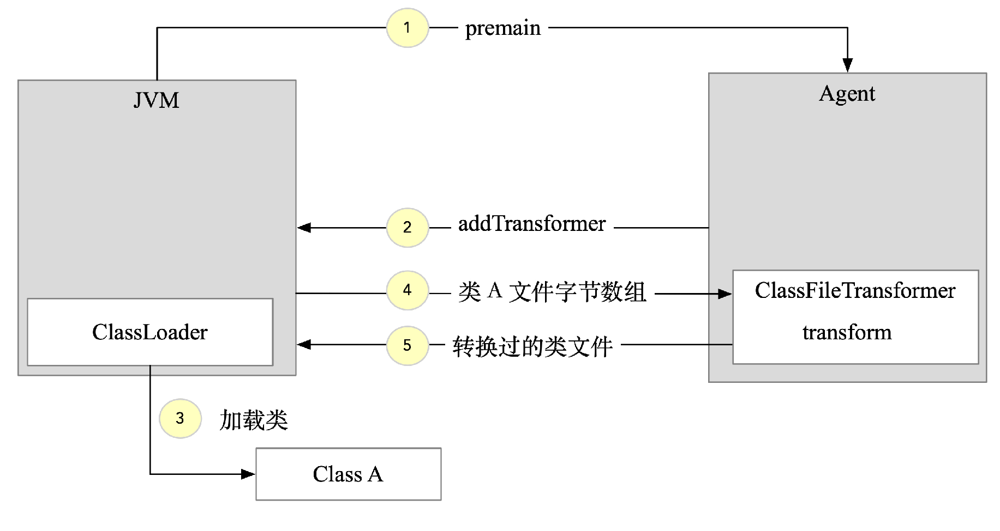
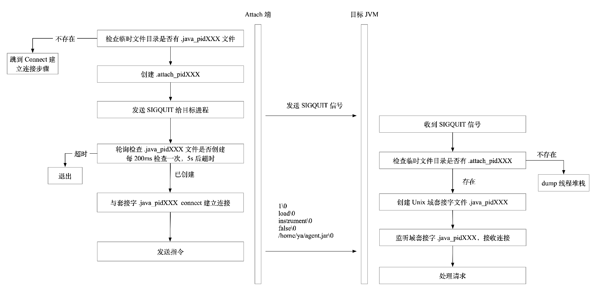

# Java Instrumentation 原理
日常工作中用到的很多工具其实都是基于Instrumentation来实现的，比如下面这些：
- APM产品：Pinpoint、SkyWalking、newrelic等
- 热部署工具：Intellij idea的HotSwap、Jrebel等
- Java诊断工具：Arthas等
## Instrumentation 简介
JDK从1.5版本开始引入了java.lang.instrument包，开发者可以更方便的实现字节码增强。其核心功能由java.lang.instrument.Instrumentation提供，这个接口的方法提供了注册类文件转换器、获取所有已加载的类等功能，允许我们在对已加载和未加载的类进行修改，实现AOP、性能监控等功能。

Instrumentation接口的常用方法如下所示。
```java
void addTransformer(ClassFileTransformer transformer, boolean canRetransform);

void retransformClasses(Class<?>... classes) throws UnmodifiableClassException;

Class[] getAllLoadedClasses()

boolean isRetransformClassesSupported();
```
它的addTransformer方法给Instrumentation注册一个类型为ClassFileTransformer的类文件转换器。ClassFileTransformer接口只有一个transform方法，接口定义如下所示。
```java
public interface ClassFileTransformer {
    byte[] transform(
    ClassLoader loader,
    String className,
    Class<?> classBeingRedefined,
    ProtectionDomain protectionDomain,
    byte[] classfileBuffer
    ) throws IllegalClassFormatException;
}
```
其中className参数表示当前加载类的类名，classfileBuffer参数是待加载类文件的字节数组。调用addTransformer注册transformer以后，后续所有JVM加载类都会被它的transform方法拦截，这个方法接收原类文件的字节数组，在这个方法中可以做任意的类文件改写，最后返回转换过的字节数组，由JVM加载这个修改过的类文件。如果transform方法返回null，表示不对此类做处理，如果返回值不为null，JVM会用返回的字节数组替换原来类的字节数组。

Instrumentation接口的retransformClasses方法对JVM已经加载的类重新触发类加载。getAllLoadedClasses方法用于获取当前JVM加载的所有类对象。isRetransform-ClassesSupported方法返回一个boolean值表示当前JVM配置是否支持类重新转换的特性。

Instrumentation有两种使用方式：
- 第一种方式是在JVM启动的时候添加一个Agent的jar包
- 第二种方式是在JVM运行以后在任意时刻通过Attach API远程加载Agent的jar包

## Instrumentation 与 -javaagent 启动参数
Instrumentation的第一种使用方式是通过JVM的启动参数-javaagent来启动，一个典型的使用方式如下所示。
```java
java -javaagent:myagent.jar MyMain
```
为了能让JVM识别到Agent的入口类，需要在jar包的MANIFEST.MF文件中指定Premain-Class等信息，一个典型的生成好的MANIFEST.MF内容如下所示。
```java
Premain-Class: me.geek01.javaagent.AgentMain
Agent-Class: me.geek01.javaagent.AgentMain
Can-Redefine-Classes: true
Can-Retransform-Classes: true
```
其中AgentMain类有一个静态的premain方法，JVM在类加载时会先执行AgentMain类的premain方法，再执行Java程序本身的main方法，这就是premain名字的来源。在premain方法中可以对class文件进行修改。这种机制可以认为是虚拟机级别的AOP，无须对原有应用做任何修改就可以实现类的动态修改和增强。

premain方法签名如下所示。
```java
public static void premain(String agentArgument, Instrumentation instrumentation) throws Exception
```
第一个参数agentArgument是agent的启动参数，可以在JVM启动时指定。以下面的启动方式为例，它的agentArgument的值为"appId：agent-demo，agentType：singleJar"。
```java
java -javaagent:<jarfile>=appId:agent-demo,agentType:singleJar test.jar
```
第二个参数instrumentation是java.lang.instrument.Instrumentation的实例，可以通过addTransformer方法设置一个ClassFileTransformer。

静态Instrumentation的处理过程如下，JVM启动后会执行Agent jar中的premain方法，在premain中可以调用Instrumentation对象的addTransformer方法注册ClassFile-Transformer。当JVM加载类时会将类文件的字节数组传递给transformer的transform方法，在transform方法中可以对类文件进行解析和修改，随后JVM就可以加载转换后的类文件。整个过程如图所示。



## JVM Attach API 介绍
在JDK5中，开发者只能在JVM启动时指定一个javaagent，在premain中操作字节码，这种Instrumentation方式仅限于main方法执行前，存在很大的局限性。从JDK6开始引入了动态Attach Agent的方案，可以在JVM启动后任意时刻通过Attach API远程加载Agent的jar包，比如大名鼎鼎的arthas工具就是基于Attach API实现的。

加载Agent的jar包只是Attach API的功能之一，我们常用jstack、jps、jmap工具都是利用Attach API来实现的。

## JVM Attach API 底层原理
JVM Attach API的实现主要基于信号和UNIX域套接字
### 信号
信号是某事件发生时对进程的通知机制，也被称为“软件中断”。信号可以看作一种非常轻量级的进程间通信，信号由一个进程发送给另外一个进程，只不过是经由内核作为一个中间人转发，信号最初的目的是用来指定杀死进程的不同方式。

每个信号都有一个名字，以“SIG”开头，最熟知的信号应该是SIGINT，我们在终端执行某个应用程序的过程中按下Ctrl+C一般会终止正在执行的进程，这是因为按下Ctrl+C会发送SIGINT信号给目标程序。每个信号都有一个唯一的数字标识，从1开始，常见的信号量列表如表所示。

|信号名|编号|描述|
|---|---|---|
|SIGINT|2|键盘中断信号（Ctrl+C）|
|SIGQUIT|3|键盘退出信号|
|SIGKILL|9|“必杀信号”（sure kill），应用程序无法忽略或捕获，总会被杀死|
|SIGTERM|15|终止信号|

在Linux中，一个前台进程可以使用Ctrl+C进行终止，对于后台进程需要使用kill加进程号的方式来终止，kill命令是通过发送信号给目标进程来实现终止进程的功能。默认情况下，kill命令发送的是编号为15的SIGTERM信号，这个信号可以被进程捕获，选择忽略或正常退出。目标进程如果没有自定义处理这个信号就会被终止。对于那些忽略SIGTERM信号的进程，可以指定编号为9的SIGKILL信号强行杀死进程，SIGKILL信号不能被忽略也不能被捕获和自定义处理。

### UNIX域套接字（UNIX Domain Socket）
使用TCP和UDP进行socket通信是一种广为人知的socket使用方式，除了这种方式以外还有一种称为UNIX域套接字的方式，可以实现同一主机上的进程间通信。虽然使用127.0.01环回地址也可以通过网络实现同一主机的进程间通信，但UNIX域套接字更可靠、效率更高。Docker守护进程（Docker daemon）使用了UNIX域套接字，容器中的进程可以通过它与Docker守护进程进行通信。MySQL同样提供了域套接字进行访问的方式。

在UNIX世界，一切皆文件，UNIX域套接字也是一个文件，下面是在某文件夹下执行ls-l命令的输出结果。
```shell
ls -l
srwxrwxr-x. 1 ya ya        0 9月   8 00:26 tmp.sock
drwxr-xr-x. 5 ya ya    4096 11月  29 09:18 tmp
-rw-r--r--. 1 ya ya   14919 10月  31 2017  test1.png
```
ls-l命令输出的第一个字符表示文件的类型，“s”表示这是一个UNIX域套接字，“d”表示这个是一个文件夹，“-”表示这是一个普通文件。

两个进程通过读写这个文件就实现了进程间的信息传递。文件的拥有者和权限决定了谁可以读写这个套接字。

UNIX域套接字与普通套接字的对比和区别是什么？
- UNIX域套接字更加高效，它不用进行协议处理，不需要计算序列号，也不需要发送确认报文，只需要读写数据即可。
- UNIX域套接字是可靠的，不会丢失数据，普通套接字是为不可靠通信设计的。
- UNIX域套接字的代码可以非常简单地修改为普通套接字。

#### JVM Attach API的执行过程

