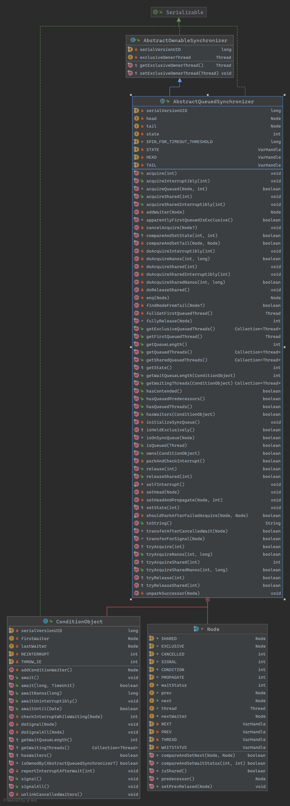
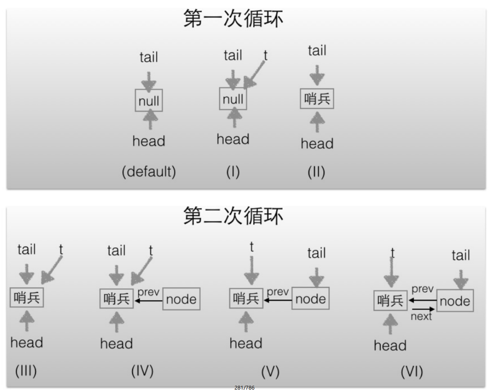

# 抽象同步队列AQS概述
>AQS是锁的底层支持
## AQS类图

由该图可以看到，AQS是一个FIFO的双向队列，其内部通过节点head和tail记录队首和队尾元素，队列元素的类型为Node。其中Node中的thread变量用来存放进入AQS队列里面的线程；Node节点内部的SHARED用来标记该线程是获取共享资源时被阻塞挂起后放入AQS队列的，EXCLUSIVE用来标记线程是获取独占资源时被挂起后放入AQS队列的；waitStatus记录当前线程等待状态，可以为CANCELLED（线程被取消了）、SIGNAL（线程需要被唤醒）、CONDITION（线程在条件队列里面等待）、PROPAGATE（释放共享资源时需要通知其他节点）；prev记录当前节点的前驱节点，next记录当前节点的后继节点。

在AQS中维持了一个单一的状态信息state，可以通过getState、setState、compareAndSetState函数修改其值。对于ReentrantLock的实现来说，state可以用来表示当前线程获取锁的可重入次数；对于读写锁ReentrantReadWriteLock来说，state的高16位表示读状态，也就是获取该读锁的次数，低16位表示获取到写锁的线程的可重入次数；对于semaphore来说，state用来表示当前可用信号的个数；对于CountDownlatch来说，state用来表示计数器当前的值。

AQS有个内部类ConditionObject，用来结合锁实现线程同步。ConditionObject可以直接访问AQS对象内部的变量，比如state状态值和AQS队列。ConditionObject是条件变量，每个条件变量对应一个条件队列（单向链表队列），其用来存放调用条件变量的await方法后被阻塞的线程，如类图所示，这个条件队列的头、尾元素分别为firstWaiter和lastWaiter。

对于AQS来说，线程同步的关键是对状态值state进行操作。根据state是否属于一个线程，操作state的方式分为独占方式和共享方式。在独占方式下获取和释放资源使用的方法为：void acquire（int arg）void acquireInterruptibly（int arg）boolean release（int arg）。

在共享方式下获取和释放资源的方法为：void acquireShared（int arg）void acquireSharedInterruptibly（int arg）boolean releaseShared（int arg）。

使用独占方式获取的资源是与具体线程绑定的，就是说如果一个线程获取到了资源，就会标记是这个线程获取到了，其他线程再尝试操作state获取资源时会发现当前该资源不是自己持有的，就会在获取失败后被阻塞。比如独占锁ReentrantLock的实现，当一个线程获取了ReentrantLock的锁后，在AQS内部会首先使用CAS操作把state状态值从0变为1，然后设置当前锁的持有者为当前线程，当该线程再次获取锁时发现它就是锁的持有者，则会把状态值从1变为2，也就是设置可重入次数，而当另外一个线程获取锁时发现自己并不是该锁的持有者就会被放入AQS阻塞队列后挂起。

对应共享方式的资源与具体线程是不相关的，当多个线程去请求资源时通过CAS方式竞争获取资源，当一个线程获取到了资源后，另外一个线程再次去获取时如果当前资源还能满足它的需要，则当前线程只需要使用CAS方式进行获取即可。比如Semaphore信号量，当一个线程通过acquire（）方法获取信号量时，会首先看当前信号量个数是否满足需要，不满足则把当前线程放入阻塞队列，如果满足则通过自旋CAS获取信号量。

在独占方式下，获取与释放资源的流程如下：
1. 当一个线程调用acquire（int arg）方法获取独占资源时，会首先使用tryAcquire方法尝试获取资源，具体是设置状态变量state的值，成功则直接返回，失败则将当前线程封装为类型为Node.EXCLUSIVE的Node节点后插入到AQS阻塞队列的尾部，并调用LockSupport.park（this）方法挂起自己。
   
2. 当一个线程调用release（int arg）方法时会尝试使用tryRelease操作释放资源，这里是设置状态变量state的值，然后调用LockSupport.unpark（thread）方法激活AQS队列里面被阻塞的一个线程（thread）。被激活的线程则使用tryAcquire尝试，看当前状态变量state的值是否能满足自己的需要，满足则该线程被激活，然后继续向下运行，否则还是会被放入AQS队列并被挂起。

需要注意的是，AQS类并没有提供可用的tryAcquire和tryRelease方法，正如AQS是锁阻塞和同步器的基础框架一样，tryAcquire和tryRelease需要由具体的子类来实现。子类在实现tryAcquire和tryRelease时要根据具体场景使用CAS算法尝试修改state状态值，成功则返回true，否则返回false。子类还需要定义，在调用acquire和release方法时state状态值的增减代表什么含义。

比如继承自AQS实现的独占锁ReentrantLock，定义当status为0时表示锁空闲，为1时表示锁已经被占用。在重写tryAcquire时，在内部需要使用CAS算法查看当前state是否为0，如果为0则使用CAS设置为1，并设置当前锁的持有者为当前线程，而后返回true，如果CAS失败则返回false。

比如继承自AQS实现的独占锁在实现tryRelease时，在内部需要使用CAS算法把当前state的值从1修改为0，并设置当前锁的持有者为null，然后返回true，如果CAS失败则返回false。

在共享方式下，获取与释放资源的流程如下：
1. 当线程调用acquireShared（int arg）获取共享资源时，会首先使用tryAcquireShared尝试获取资源，具体是设置状态变量state的值，成功则直接返回，失败则将当前线程封装为类型为Node.SHARED的Node节点后插入到AQS阻塞队列的尾部，并使用LockSupport.park（this）方法挂起自己。
2. 当一个线程调用releaseShared（int arg）时会尝试使用tryReleaseShared操作释放资源，这里是设置状态变量state的值，然后使用LockSupport.unpark（thread）激活AQS队列里面被阻塞的一个线程（thread）。被激活的线程则使用tryReleaseShared查看当前状态变量state的值是否能满足自己的需要，满足则该线程被激活，然后继续向下运行，否则还是会被放入AQS队列并被挂起。

同样需要注意的是，AQS类并没有提供可用的tryAcquireShared和tryReleaseShared方法，正如AQS是锁阻塞和同步器的基础框架一样，tryAcquireShared和tryReleaseShared需要由具体的子类来实现。子类在实现tryAcquireShared和tryReleaseShared时要根据具体场景使用CAS算法尝试修改state状态值，成功则返回true，否则返回false。

比如继承自AQS实现的读写锁ReentrantReadWriteLock里面的读锁在重写tryAcquireShared时，首先查看写锁是否被其他线程持有，如果是则直接返回false，否则使用CAS递增state的高16位（在ReentrantReadWriteLock中，state的高16位为获取读锁的次数）。

比如继承自AQS实现的读写锁ReentrantReadWriteLock里面的读锁在重写tryReleaseShared时，在内部需要使用CAS算法把当前state值的高16位减1，然后返回true，如果CAS失败则返回false。

基于AQS实现的锁除了需要重写上面介绍的方法外，还需要重写isHeldExclusively方法，来判断锁是被当前线程独占还是被共享。

另外，也许你会好奇，独占方式下的void acquire（int arg）和void acquireInterruptibly（int arg），与共享方式下的void acquireShared（int arg）和void acquireSharedInterruptibly（int arg），这两套函数中都有一个带有Interruptibly关键字的函数，那么带这个关键字和不带有什么区别呢？我们来讲讲。

其实不带Interruptibly关键字的方法的意思是不对中断进行响应，也就是线程在调用不带Interruptibly关键字的方法获取资源时或者获取资源失败被挂起时，其他线程中断了该线程，那么该线程不会因为被中断而抛出异常，它还是继续获取资源或者被挂起，也就是说不对中断进行响应，忽略中断。

而带Interruptibly关键字的方法要对中断进行响应，也就是线程在调用带Interruptibly关键字的方法获取资源时或者获取资源失败被挂起时，其他线程中断了该线程，那么该线程会抛出InterruptedException异常而返回。

最后，我们来看看如何维护AQS提供的队列，主要看入队操作。
- 入队操作：当一个线程获取锁失败后该线程会被转换为Node节点，然后就会使用enq（final Node node）方法将该节点插入到AQS的阻塞队列。
  
    
