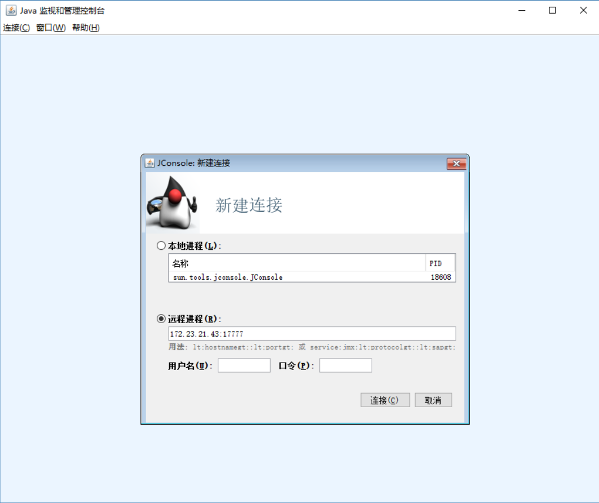
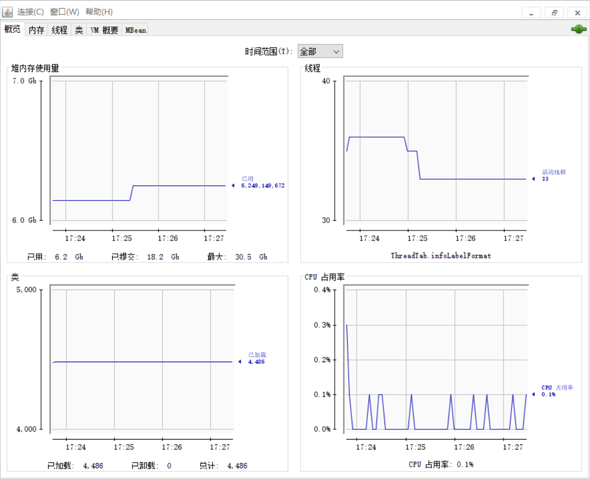

在服务器端配置文件添加参数

设置jconsole监控端口号

-Dcom.sun.management.jmxremote.port=17777

内网代码调试一般不需要用户和口令验证，下面量参数设为false
-Dcom.sun.management.jmxremote.authenticate=false
-Dcom.sun.management.jmxremote.ssl=false

设置本主机名，即服务器ip
-Djava.rmi.server.hostname=172.23.21.43

启动项目后，win+R打开命令行，输入jconsole，输入ip:port即可连接。

如果第一次连接失败，点击Insecure重连就好了

