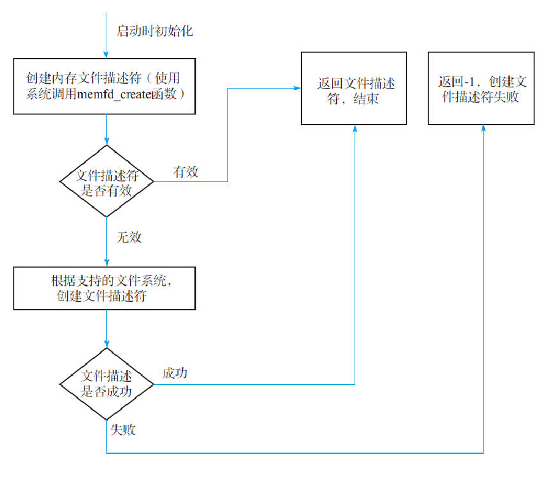
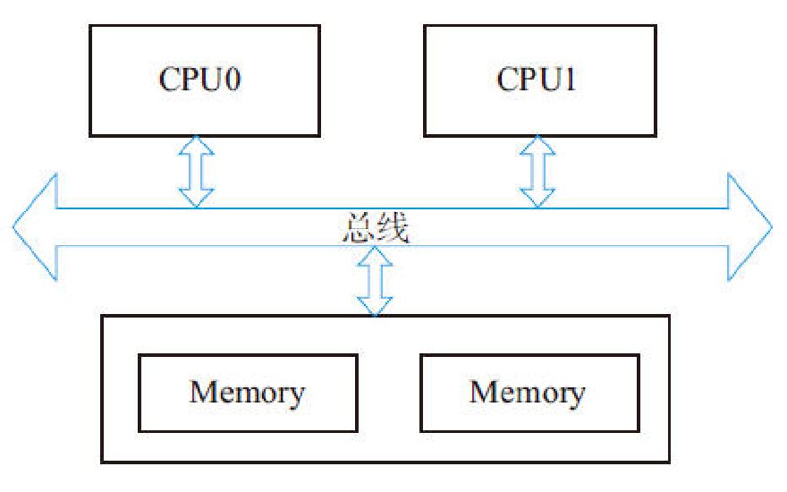
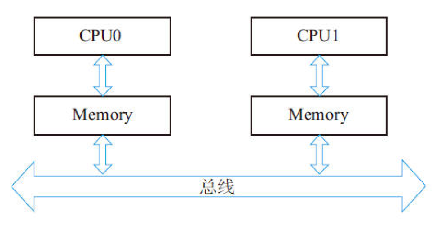
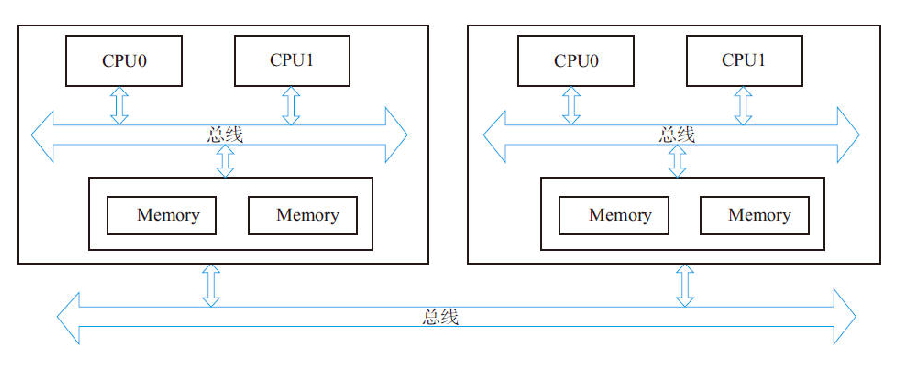
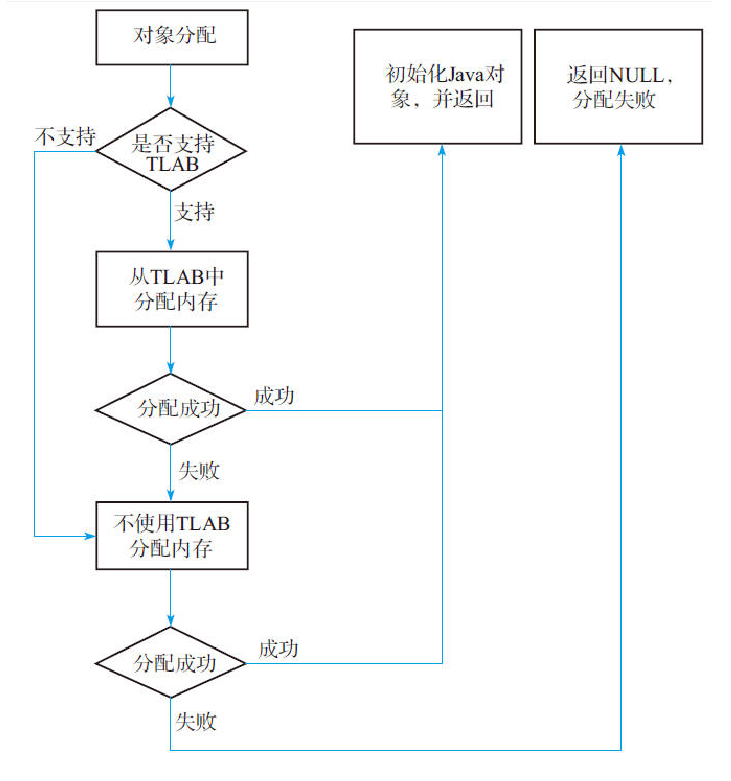
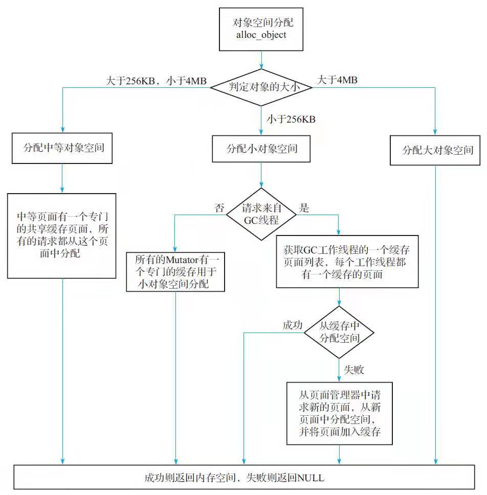
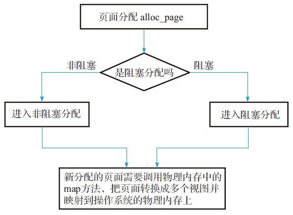
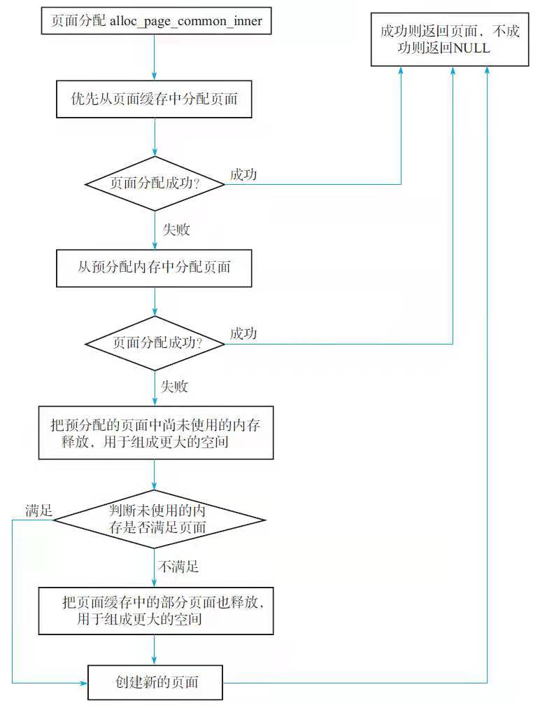

# Java ZGC
>ZGC 目前只支持64位 Linux 系统，内存管理做多支持4TB

ZGC 解决 G1存在的不足：
- 停顿时间过长
- 内存利用率不高
- 支持的内存空间有限

ZGC作为新一代的垃圾回收器，在设计之初就定义了三大目标：
- 支持TB级内存
- 停顿时间控制在10ms之内
- 对程序吞吐量影响小于15%。
>实际上目前ZGC已经满足设计之初定义的目标，最大支持4TB堆空间，依据实际测试的情况来看，停顿时间通常都在10ms以下，并且垃圾回收所引起的暂停时间并不会随着内存的增大而延长。
## ZGC 内存管理
ZGC为了支持太字节（TB）级内存，设计了基于页面（page）的分页管理（类似于G1的分区Region）；为了能够快速地进行并发标记和并发移动，对内存空间重新进行了划分，这就是ZGC中新引入的Color Pointers；同时ZGC为了能更加高效地管理内存，设计了物理内存和虚拟内存两级内存管理。
### 操作系统地址管理
虚拟内存是伴随着操作系统和硬件的发展出现的。虚拟地址是操作系统根据CPU的寻址能力，支持访问的虚拟空间，比如前些年大家使用的32位操作系统，对应的虚拟地址空间为0~232，即0~4GB，而我们计算机的物理内存可能只有512MB，所以涉及物理内存和虚拟内存的映射。虚拟内存的发展解决了很多问题，也带来了很多好处。具体可以参考其他文献。
这里我们稍微介绍一下虚拟内存和物理内存的映射机制。上面提到虚拟内存和物理内存大小并不匹配，所以需要一个额外的机制把两者关联起来。当程序试图访问一个虚拟内存页面时，这个请求会通过操作系统来访问真正的内存。首先到页面表中查询该页是否已映射到物理页框中，并记录在页表中。如果已记录，则会通过内存管理单元（Memory Management Unit，MMU）把页码转换成页框码（frame），并加上虚拟地址提供的页内偏移量形成物理地址后去访问物理内存；如果未记录，则意味着该虚拟内存页面还没有被载入内存，这时MMU就会通知操作系统发生了一个页面访问错误（也称为缺页故障（page fault）），接下来系统会启动所谓的“请页”机制，即调用相应的系统操作函数，判断该虚拟地址是否为有效地址。如果是有效的地址，就从虚拟内存中将该地址指向的页面读入内存中的一个空闲页框中，并在页表中添加相对应的表项，最后处理器将从发生页面错误的地方重新开始运行；如果是无效的地址，则表明进程在试图访问一个不存在的虚拟地址，此时操作系统将终止此次访问。当然，也存在这样的情况：在请页成功之后，内存中已经没有空闲物理页框了，这时，系统必须启动所谓的“交换”机制，即调用相应的内核操作函数，在物理页框中寻找一个当前不再使用或者近期可能不会用到的页面所占据的页框。找到后，就把其中的页移出，以装载新的页面。对移出页面根据两种情况来处理：如果该页未被修改过，则删除它；如果该页曾经被修改过，则系统必须将该页写回辅存。
### ZGC内存管理
ZGC为了能高效、灵活地管理内存，实现了两级内存管理：虚拟内存和物理内存，并且实现了物理内存和虚拟内存的映射关系。这和操作系统中虚拟地址和物理地址设计思路基本一致。ZGC主要的改进点就是重新定义了虚拟内存和物理内存的映射关系。

ZGC空间设计：
- Marked0（虚拟内存，4~8TB）
- Marked1（虚拟内存，8~12TB）
- Remapped（虚拟内存，12~16TB）

三个虚拟空间映射到同一物理空间，同一时间点仅有一个空间有效（原因：利用虚拟空间换时间；这3个空间的切换是由垃圾回收的不同阶段触发的）

应用程序可见并使用的虚拟地址为0~4TB，经ZGC转化，真正使用的虚拟地址为[4TB~8TB)、[8TB~12TB)和[16TB~20TB)，操作系统管理的虚拟地址也是[4TB~8TB)、[8TB~12TB)和[16TB~20TB)。应用程序可见的虚拟地址[0~4TB)和物理内存直接的关联由ZGC来管理。
#### 多视图内存映射
前面我们提到MMU负责映射虚拟地址和物理地址，操作系统主要负责维护页表（page table），页表维护了虚拟地址和物理地址的映射关系。实际上现在的系统还支持多个虚拟地址同时映射到一个物理地址上，多个虚拟地址可以认为它们是彼此之间的别名。当我们操作其中一个虚拟地址，例如存储数据时，所有的虚拟地址都应该能访问到最新的数据。
>这一特性在某些场景中特别有用，例如可以利用这一特性在两个虚拟地址之间复制大量的数据。
#### ZGC 多视图映射
ZGC 多视图映射步骤大致如下：

- 创建并打开一个文件描述符，这个文件描述符可以是内存文件描述符，也可以是普通文件描述符（最好是内存文件描述符，其性能更高）。创建并打开文件描述的动作是在JVM启动时完成的。
- 在分配内存的时候，新分配的虚拟地址转化成3个映射视图（Marked0、Marked1和Remapped）中的虚拟地址，再使用mmap映射到这个文件描述符上。
#### 页面设计
为了细粒度地控制内存的分配，和G1一样，ZGC将内存划分成小的分区，在ZGC中称为页面（page）。ZGC支持3种页面，分别为小页面、中页面和大页面。其中小页面指的是2MB的页面空间，中页面指32MB的页面空间，大页面指受操作系统控制的大页。我们先回顾一下操作系统所支持的大页。

标准大页（huge page）是Linux Kernel 2.6引入的，目的是通过使用大页内存来取代传统的4KB内存页面，以适应越来越大的系统内存，让操作系统可以支持现代硬件架构的大页面容量功能。它有两种大小：2MB和1GB。2MB页块大小适合用于吉字节级的内存，1GB页块大小适合用于太字节级别的内存；2MB是默认的大页尺寸。在ZGC中还支持透明大页（Transparent Huge Pages，THP），这是RHEL 6开始引入的一个功能，在Linux 6上THP是默认启用的。由于设置大页比较麻烦，很难手动管理，而且通常需要对代码进行重大的更改才能有效地使用，因此RHEL 6中开始引入了THP，它是一个抽象层，能够自动创建、管理和使用传统大页。关于如何使用大页可以参考官网，这里不再介绍。
>注意 ZGC中的页面和操作系统中的页面并没有直接的关系。ZGC中的页面是ZGC为了管理内存进行的抽象，操作系统中的页面是管理物理内存的单位。由于物理内存页面的大小受操作系统的管理，通常来说物理内存页面大小比较固定，例如为4KB、2MB等（依赖于操作系统以及操作系统是否开启大页），所以操作系统中的页面一般比ZGC的页面小，换句话说，一个ZGC的页面可能由几个不连续的操作系统页面组成。

在ZGC中，不同对象的大小会使用不同的页面类型。在进行垃圾回收时，ZGC对于不同页面回收的策略也不同。简单地说，小页面优先回收；中页面和大页面则尽量不回收。
#### 对NUMA的支持
ZGC为了实现更高效的内存访问，在进行内存分配时实现了对NUMA的支持。我们先看一下什么是NUMA，然后再介绍一下ZGC是如何支持NUMA的。

在过去，对于X86架构的计算机，内存控制器还没有整合进CPU，所有对内存的访问都需要通过北桥芯片来完成。X86系统中的所有内存都可以通过CPU进行同等访问。任何CPU访问任何内存的速度是一致的，不必考虑不同内存地址之间的差异，这称为“统一内存访问”（Uniform Memory Access，UMA）。

在UMA中，各处理器与内存单元通过互联总线进行连接，各个CPU之间没有主从关系。

之后的X86平台经历了一场从“拼频率”到“拼核心数”的转变，越来越多的核心被尽可能地塞进了同一块芯片上，各个核心对于内存带宽的争抢访问成为瓶颈，所以人们希望能够把CPU和内存集成在一个单元上（称为Socket），这就是非统一内存访问（Non-Uniform Memory Access，NUMA）。很明显，在NUMA下，CPU访问本地存储器的速度比访问非本地存储器快一些。

随着系统的演化，可以把多个CPU集成在一个节点（node）上，例如在下图中，一个节点上集成了两个处理器，它们优先访问本地的内存。

#### ZGC 中的物理内存管理
ZGC的物理地址并不是操作系统中的物理地址，从概念上它和虚拟地址更加类似，是为了管理应用程序物理地址的使用，如何理解这句话呢？ZGC中内存空间的分配是以页面为粒度（实际上最小粒度是2MB）的。ZGC为了减少对操作系统物理内存频繁的请求/释放，设计了自己的物理内存管理系统，ZGC中的物理内存实际上仅仅记录了操作系统物理内存的使用情况。

ZGC中物理内存管理的基本单位是段（segment），它包含start和end。在内存分配阶段每一个段都是2MB，也就是说ZGC在向操作系统请求物理内存的时候最小的粒度是2MB，对于超过2MB的内存空间会被划分成多个段。

由于ZGC的物理内存仅仅记录的是应用程序物理内存的使用情况，所以它完全可以设计成一个连续的地址结构，当向操作系统申请新的空间时，在物理空间后面追加空间的大小，当释放空间时，在物理空间的后面减去空间的大小。
#### ZGC 中的虚拟内存管理
ZGC的虚拟管理器ZVirtualMemoryManager中最主要的成员函数是alloc和free，其中alloc根据应用程序请求的大小来分配空间，这个空间用ZVirtualMemory来保存，在alloc中对于小页面ZGC会从虚拟空间的头部开始分配，对于中页面和大页面ZGC从虚拟空间的尾部开始分配。

这样设计的目的是方便对象的管理，小页面分配和释放的成本都不高，但是分配和释放中页面和大页面成本很高。

物理内存和虚拟内存都使用了ZMemoryManager进行真正的内存管理。它的成员函数主要有alloc_from_front（从头部分配）和alloc_from_back（从尾部分配）。再次强调一点，ZGC中物理内存的分配和虚拟内存的分配都是ZGC管理的内存分配，并不是分配操作系统的物理内存，只有当调用ZGC物理内存管理器中的map方法时，才会真正向操作系统请求内存。
#### ZGC 内存预分配
在ZGC启动时会预分配一部分内存，在初始化成功后这部分内存可以直接使用，加快程序执行的效率。如果在JVM启动时设置了xms，将使用xms指定的最小堆空间作为预分配空间，如果没有设置，则JVM会根据参数来推断预分配空间的大小。参数InitialHeapSize直接设置预分配内存的大小，该参数的默认值为0。如果用户没有设置该参数，JVM将根据另外一个参数InitialRAMPercentage推断出预分配内存的大小。InitialRAMPercentage的默认值是1.5625，它表示的是将物理内存的1/1.5625（64%）的大小作为预分配的空间。

ZGC的预分配处理会根据预分配空间的大小完成：物理内存的分配、虚拟内存的分配和操作系统物理内存的映射。
#### ZGC 对象分配管理
ZGC的实现类是ZCollectedHeap，它重载了一些关键的函数，主要有对象分配相关的函数、垃圾回收相关的函数以及其他相关的辅助函数。真正实现内存分配、回收、对象标记、转移动作是在ZHeap中。

##### ZGC 对象空间分配

##### ZGC 页面分配

1. 页面缓存分配
   
2. NUMA的使用

   NUMA的内存分配策略有localalloc、preferred、membind、interleave这4种。
   - localalloc：进程从当前节点上请求分配内存。
   - preferred：比较宽松地指定了一个推荐的节点来获取内存，如果被推荐的节点上没有足够内存，进程可以尝试别的节点分配。
   - membind：指定一个节点列表（包含了若干个节点），进程只能从节点列表中的节点上请求分配内存。
   - interleave：进程从指定的若干个节点上以轮询（Round Robin，RR）的方式循环地从节点上请求分配内存。
   
   ZGC使用了2种NUMA内存分配策略：
   - 新页面分配时采用的是interleave。
   - 当页面回收的时候，将按照操作系统的分配策略（不一定是interleave，可能是上述4种策略的任意一种）把地址对应的空间放入页面缓存中。
   
   为什么这样设计？在新页面分配的时候如果不是采用RR的方式，如采用绑定处理器的方法，可能会导致本地内存已经耗尽，而远端内存还有可用空间的情况，此时最容易发生的就是交换内存（swap）暴增，性能下降。所以在进行新页面分配时，采用interleave将是最好的选择。
   在进行页面回收时，可根据操作系统的分配策略找到访问这一块内存的效率最高的CPU，然后把这一空间放入缓存中，在下一次分配时则可以加速分配。
   >注意：对于中页面和大页面缓存，并不支持NUMA，最主要的原因是中页面和大页面所占用的空间都比较大，如果把这些空间放入处理器关联的本地内存，很容易导致其节点上内存不足。
3. 页面分配时阻塞机制的实现

   在阻塞分配请求中，进行新页面分配时，如果页面分配失败，则产生一个新的阻塞请求，并把请求加入请求列表的末尾处，然后开始启动垃圾回收。在垃圾回收的最后会释放空闲的页面，此时说明有可用的页面了，会检查是否有分配阻塞请求，如果有请求，则分配页面，并从请求列表中取第一个请求，然后把分配成功的页面放入请求的_result中。

   这是一个典型的等待/通知模型。等待的位置在新页面分配失败的地方，通知的位置在页面释放的地方。
## ZGC 线程
## ZGC 垃圾回收算法的设计 
## ZGC 垃圾回收算法的实现
## ZGC 日志解读
## ZGC 参数
