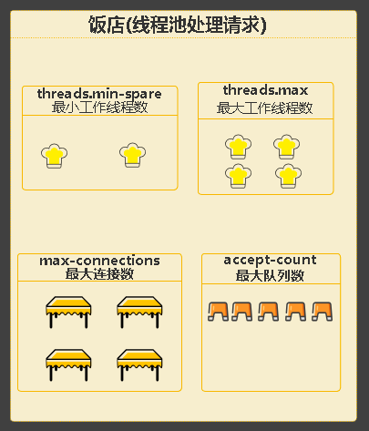

# SpringBoot可以同时处理多少请求？
> 我们都知道，SpringBoot默认的内嵌容器是Tomcat，也就是我们的程序实际上是运行在Tomcat里的。所以与其说SpringBoot可以处理多少请求，到不如说Tomcat可以处理多少请求。
>
>关于Tomcat的默认配置，都在spring-configuration-metadata.json文件中，对应的配置类则是org.springframework.boot.autoconfigure.web.ServerProperties。

## 线程池4大参数
可以关注下线程池的常用4大参数：
```json
{
  "name": "server.tomcat.threads.min-spare",
  "type": "java.lang.Integer",
  "description": "Minimum amount of worker threads.",
  "sourceType": "org.springframework.boot.autoconfigure.web.ServerProperties$Tomcat$Threads",
  "defaultValue": 10
},

{
  "name": "server.tomcat.max-threads",
  "type": "java.lang.Integer",
  "sourceType": "org.springframework.boot.autoconfigure.web.ServerProperties$Tomcat",
  "deprecated": true,
  "deprecation": {
    "replacement": "server.tomcat.threads.max"
  }
},
{
  "name": "server.tomcat.max-connections",
  "type": "java.lang.Integer",
  "description": "Maximum number of connections that the server accepts and processes at any given time. Once the limit has been reached, the operating system may still accept connections based on the \"acceptCount\" property.",
  "sourceType": "org.springframework.boot.autoconfigure.web.ServerProperties$Tomcat",
  "defaultValue": 8192
},

{
  "name": "server.tomcat.accept-count",
  "type": "java.lang.Integer",
  "description": "Maximum queue length for incoming connection requests when all possible request processing threads are in use.",
  "sourceType": "org.springframework.boot.autoconfigure.web.ServerProperties$Tomcat",
  "defaultValue": 100
},
```
- server.tomcat.threads.min-spare：最少的工作线程数，默认大小是10。
  - 对于绝大部分场景，将它设置的和最大线程数相等就可以了。
  - 将最小线程数设置的小于最大线程数的初衷是为了节省资源，因为每多创建一个线程都会耗费一定量的资源，尤其是线程栈所需要的资源。但是在一个系统中，针对硬件资源以及任务特点选定了最大线程数之后，就表示这个系统总是会利用这些线程的，那么还不如在一开始就让线程池把需要的线程准备好。然而，把最小线程数设置的小于最大线程数所带来的影响也是非常小的，一般都不会察觉到有什么不同。 
  
    在批处理程序中，最小线程数是否等于最大线程数并不重要。因为最后线程总是需要被创建出来的，所以程序的运行时间应该几乎相同。对于服务器程序而言，影响也不大，但是一般而言，线程池中的线程在“热身”阶段就应该被创建出来，所以这也是为什么建议将最小线程数设置的等于最大线程数的原因。
  
    在一些场景中，也需要要设置一个不同的最小线程数。比如当一个系统最大需要同时处理2000个任务，而平均任务数量只是20个情况下，就需要将最小线程数设置成20，而不是等于其最大线程数2000。此时如果还是将最小线程数设置的等于最大线程数的话，那么闲置线程(Idle Thread)占用的资源就比较可观了，尤其是当使用了ThreadLocal类型的变量时。
- server.tomcat.threads.max：最多的工作线程数，默认大小是200。 
  - 每一次HTTP请求到达Web服务，tomcat都会创建一个线程来处理该请求，那么最大线程数决定了Web服务容器可以同时处理多少个请求。maxThreads默认200，肯定建议增加。但是，增加线程是有成本的，更多的线程，不仅仅会带来更多的线程上下文切换成本，而且意味着带来更多的内存消耗。JVM中默认情况下在创建新线程时会分配大小为1M的线程栈，所以，更多的线程异味着需要更多的内存。线程数的经验值为：1核2g内存为200，线程数经验值200；4核8g内存，线程数经验值800。
- server.tomcat.max-connections：最大连接数，默认大小是8192。 
  - 官方文档的说明为：
  >   这个参数是指在同一时间，tomcat能够接受的最大连接数。对于Java的阻塞式BIO，默认值是maxthreads的值；如果在BIO模式使用定制的Executor执行器，默认值将是执行器中maxthreads的值。对于Java 新的NIO模式，maxConnections 默认值是10000。 
  > 
  >  对于windows上APR/native IO模式，maxConnections默认值为8192，这是出于性能原因，如果配置的值不是1024的倍数，maxConnections 的实际值将减少到1024的最大倍数。
  >
  >  **举个例子，如果你把 maxConnections 设置为 5000，Tomcat 在运行时会自动将其调整为 4096，因为它是 1024 的最大倍数（4 x 1024 = 4096）。可以这样理解：在 APR/native IO 模式下，Tomcat 为了保证性能，强制要求 maxConnections 的值必须是 1024 的倍数，如果你设置了非 1024 的倍数的值，Tomcat 会自动调整 maxConnections 的值为 1024 的最大倍数。**
  >
  >  如果设置为-1，则禁用maxconnections功能，表示不限制tomcat容器的连接数。
    maxConnections和accept-count的关系为：当连接数达到最大值maxConnections后，系统会继续接收连接，但不会超过acceptCount的值。
- server.tomcat.accept-count：等待队列的长度，默认大小是100。

  - 官方文档的说明为：
  > 当所有的请求处理线程都在使用时，所能接收的连接请求的队列的最大长度。当队列已满时，任何的连接请求都将被拒绝。accept-count的默认值为100。
  >
  >详细的来说：当调用HTTP请求数达到tomcat的最大线程数时，还有新的HTTP请求到来，这时tomcat会将该请求放在等待队列中，这个acceptCount就是指能够接受的最大等待数，默认100。如果等待队列也被放满了，这个时候再来新的请求就会被tomcat拒绝（connection refused）。
## 图解


min-spare、maxConnections、maxThreads、acceptCount关系之间，具体的关系如何呢？ 有不少的同学对于这个问题是云里雾里的，并且多次进行求助。这里用一个形象的比喻，通俗易懂的解释一下tomcat的最大线程数（maxThreads）、最大等待数（acceptCount）和最大连接数（maxConnections）三者之间的关系。

我们可以把tomcat比做一个火锅店，流程是取号、入座、叫服务员，可以做一下三个形象的类比：
1. acceptCount 最大等待数
可以类比为火锅店的排号处能够容纳排号的最大数量；排号的数量不是无限制的，火锅店的排号到了一定数据量之后，服务往往会说：已经客满。
2. maxConnections 最大连接数
可以类比为火锅店的大堂的餐桌数量，也就是可以就餐的桌数。如果所有的桌子都已经坐满，则表示餐厅已满，已经达到了服务的数量上线，不能再有顾客进入餐厅了。
3. maxThreads：最大线程数
可以类比为厨师的个数。每一个厨师，在同一时刻，只能给一张餐桌炒菜，就像极了JVM中的一条线程。

**整个就餐的流程，大致如下：**
1. 取号：如果maxConnections连接数没有满，就不需要取号，因为还有空余的餐桌，直接被大堂服务员领上餐桌，点菜就餐即可。如果 maxConnections 连接数满了，但是取号人数没有达到 acceptCount，则取号成功。如果取号人数已达到acceptCount，则拿号失败，会得到Tomcat的Connection refused connect 的回复信息。
2. 上桌：如果有餐桌空出来了，表示maxConnections连接数没有满，排队的人，可以进入大堂上桌就餐。
3. 就餐：就餐需要厨师炒菜。厨师的数量，比顾客的数量，肯定会少一些。一个厨师一定需要给多张餐桌炒菜，如果就餐的人越多，厨师也会忙不过来。这时候就可以增加厨师，一增加到上限maxThreads的值，如果还是不够，只能是拖慢每一张餐桌的上菜速度，这种情况，就是大家常见的“上一道菜吃光了，下一道菜还没有上”尴尬场景。

## 代码示例
在application.yml里配置一下这几个参数，因为默认的数量太大，不好测试，所以配小一点：
```yml
server:
  tomcat:
    threads:
      # 最少线程数
      min-spare: 10
      # 最多线程数
      max: 30
    # 最大连接数
    max-connections: 30
    # 最大等待数
    accept-count: 10
```
再来写一个简单的接口：
```java
 @GetMapping("/test")
     public String test(HttpServletRequest request) throws Exception {
          log.info("线程:{}", Thread.currentThread().getName());
          Thread.sleep(2000);
          return "success";
 }
```
## 怎么配置，才能使得自己的服务效率更高呢？
**首先，这和tomcat的使用的IO模式有关**

关于Java IO模式、以及IO处理的线程模型等基础的通信框架的知识，是Java程序员的重要、必备的内功，具体 这里不做过多的赘述。