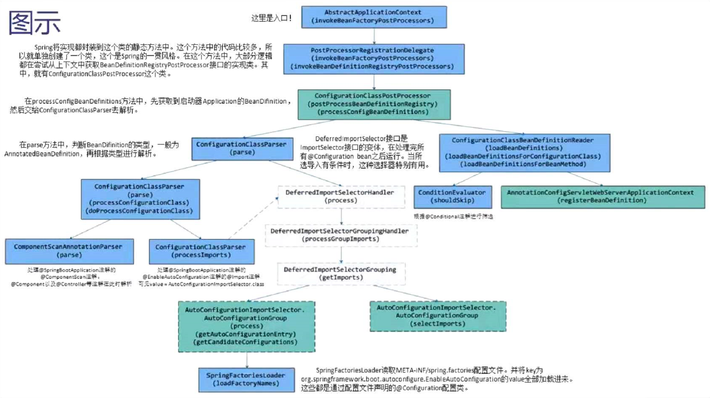

# Spring Boot启动流程简析
## Spring Boot的设计方向
- 可以穿件独立的Spring应用程序，可以创建可执行的jars
- 内嵌tomcat或jetty等Servlet容器
- 提供“入门”依赖项，以简化构建配置。尽可能自动配置Spring和第三方库
- 提供可用于生产的功能，例如指标、运行状况检查和外部化配置
## Spring Boot注解
>了解基本的启动注解
```java
@Target(ElementType.TYPE)
@Retention(RetentionPolicy.RUNTIME)
@Documented
@Inherited
@SpringBootConfiguration
@EnableAutoConfiguration
@ComponentScan(excludeFilters = { @Filter(type = FilterType.CUSTOM, classes = TypeExcludeFilter.class),
		@Filter(type = FilterType.CUSTOM, classes = AutoConfigurationExcludeFilter.class) })
public @interface SpringBootApplication {
    ...
```
>AnnotationUtil.java，该类会一级一级往上找
- @SpringBootApplication
    - @SpringBootConfiguration
        - @Configuration
            ```java
            @Target(ElementType.TYPE)
            @Retention(RetentionPolicy.RUNTIME)
            @Documented
            @Configuration
            public @interface SpringBootConfiguration {
                ...
            ```
    - @EnableAutoConfiguration
        - @Import(AutoConfigurationImportSelector.class)
        
                AutoConfigurationImportSelector是自动配置引入的选择器，它的任务是引入SpringBoot早已定义好的默认的一些Bean。包括SpringMVC涉及到的DispatcherServletAutoConfiguration和WebMVCAutoConfiguration（原本这些配置需要在bean.xml中手动配置）。——体现了Convention Over Configuration（约定优于配置）
            ```java
            @Target(ElementType.TYPE)
            @Retention(RetentionPolicy.RUNTIME)
            @Documented
            @Inherited
            @AutoConfigurationPackage
            @Import(AutoConfigurationImportSelector.class)
            public @interface EnableAutoConfiguration {
                ...
            ```
    - @ComponentScan(excludeFilters = { @Filter(type = FilterType.CUSTOM, classes = TypeExcludeFilter.class), @Filter(classes = AutoConfigurationExcludeFilter.class)}):
        - 第一个为用户自定义的指定类型排除过滤器
        - 第二个，当用户自定义了一个@Configuration配置类，并且在spring.factories配置文件中配置时，会被第二个过滤器排除
        ```java
        @Retention(RetentionPolicy.RUNTIME)
        @Target(ElementType.TYPE)
        @Documented
        @Repeatable(ComponentScans.class)
        public @interface ComponentScan {
            ...
        ```
## ApplicationContext
>了解Spring应用上下文接口
- 后面按顺序解读，主要需要关注SpringApplication.run()中的几个点：
    - createApplicationContext：创建应用上下文
    - prepareContext：向上下文注册一些bean
    - refreshContext：如果是tomcat，则调用AnnotationConfigServletWebServerApplicationContext的refreshContext()刷新上下文
        - 这一点在第三部分@Configuration注解中进行解读
- 启动类
```java
@SpringBootApplication
public class SpbtApplication {

    public static void main(String[] args) {
        SpringApplication.run(SpbtApplication.class, args);
    }

}
```
- SpringApplication.class构造方法
```java
@SuppressWarnings({ "unchecked", "rawtypes" })
	public SpringApplication(ResourceLoader resourceLoader, Class<?>... primarySources) {
		this.resourceLoader = resourceLoader;
		Assert.notNull(primarySources, "PrimarySources must not be null");
        
        /**
        *SpringApplication的run方法中的SpbtApplication.class传入这里
        */
		this.primarySources = new LinkedHashSet<>(Arrays.asList(primarySources));

		this.webApplicationType = WebApplicationType.deduceFromClasspath();
		setInitializers((Collection) getSpringFactoriesInstances(ApplicationContextInitializer.class));
		setListeners((Collection) getSpringFactoriesInstances(ApplicationListener.class));
		this.mainApplicationClass = deduceMainApplicationClass();
	}
```
- SpringApplication.class的run方法
```java
public ConfigurableApplicationContext run(String... args) {
    // 创建StopWatch对象，用于统计run方法启动时长
    StopWatch stopWatch = new StopWatch();
    // 启动统计
    stopWatch.start();
    ConfigurableApplicationContext context = null;
    Collection<SpringBootExceptionReporter> exceptionReporters = new ArrayList<>();
    // 配置headless 属性
    configureHeadlessProperty();
    // 获得SpringApplicationRunListener 数组
    // 该数组封装于SpringApplicationRunListeners对象的listeners中
    SpringApplicationRunListeners listeners = getRunListeners(args);
    // 启动监听，遍历SpringApplicationRunListener数组每个元素，并执行
    listeners.starting();
    try {
        // 创建ApplicationArguments对象
        ApplicationArguments applicationArguments = new DefaultApplicationArguments(
            args);
        // 加载属性配置，包括所有的配置属性（如：application.properties中和外部的属性配置）
        ConfigurableEnvironment environment = prepareEnvironment(listeners,
                applicationArguments);
        configureIgnoreBeanInfo(environment);
        // 打印Banner
        Banner printedBanner = printBanner(environment);
        // 创建容器
        context = createApplicationContext();
        // 异常报告器
        exceptionReporters = getSpringFactoriesInstances(
                SpringBootExceptionReporter.class,
                new Class[] { ConfigurableApplicationContext.class }, context);
        // 准备容器，组件对象之间进行关联
        prepareContext(context, environment, listeners, applicationArguments, printedBanner);
        // 初始化容器
        refreshContext(context);
        // 初始化操作之后执行，默认实现为空
        afterRefresh(context, applicationArguments);
        // 停止时长统计
        stopWatch.stop();
        // 打印启动日志
        if (this.logStartupInfo) {
            new StartupInfoLogger(this.mainApplicationClass)
                .logStarted(getApplicationLog(), stopWatch);
        }
        // 通知监听器：容器启动完成
        listeners.started(context);
        // 调用ApplicationRunner和CommandLineRunner的运行方法。
        callRunners(context, applicationArguments);
    } catch (Throwable ex) {
        // 异常处理
        handleRunFailure(context, ex, exceptionReporters, listeners);
        throw new IllegalStateException(ex);
    }
    try {
        // 通知监听器：容器正在运行
        listeners.running(context);
    } catch (Throwable ex) {
        // 异常处理
        handleRunFailure(context, ex, exceptionReporters, null);
        throw new IllegalStateException(ex);
    }
    return context;
}
```
- AnnotationConfigServletWebServerApplicationContext.class通过idea参看该类类图
    - 单看字段：最核心的是GenericApplicationContext.class的DefaultListableBeanFactory属性
        - 作为BeanFactory的默认实现，DefaultListableBeanFactory实现了接口所有方法（需要做一些拓展）。GenericApplicationContext借助DefaultListableBeanFactory间接实现了折现接口。因为BeanFactory在getBean之前必须获取BeanDefinition（bean的定义对象），所有后续主要关注beanDefinitionMap这个属性。
- SpringApplication.class的rprepareContext()
```java
private void prepareContext(ConfigurableApplicationContext context, ConfigurableEnvironment environment,
			SpringApplicationRunListeners listeners, ApplicationArguments applicationArguments, Banner printedBanner) {
		context.setEnvironment(environment);
		postProcessApplicationContext(context);
		applyInitializers(context);
		listeners.contextPrepared(context);
		if (this.logStartupInfo) {
			logStartupInfo(context.getParent() == null);
			logStartupProfileInfo(context);
		}
		// Add boot specific singleton beans
		ConfigurableListableBeanFactory beanFactory = context.getBeanFactory();
		beanFactory.registerSingleton("springApplicationArguments", applicationArguments);
		if (printedBanner != null) {
			beanFactory.registerSingleton("springBootBanner", printedBanner);
		}
		if (beanFactory instanceof DefaultListableBeanFactory) {
			((DefaultListableBeanFactory) beanFactory)
					.setAllowBeanDefinitionOverriding(this.allowBeanDefinitionOverriding);
		}
		if (this.lazyInitialization) {
			context.addBeanFactoryPostProcessor(new LazyInitializationBeanFactoryPostProcessor());
		}

        /**
        *load方法传入的sources就是启动类传入run()的SpbtApplication.class，load()对这个类进行解析并添加到应用上下文中
        */
		// Load the sources
		Set<Object> sources = getAllSources();
		Assert.notEmpty(sources, "Sources must not be empty");
		load(context, sources.toArray(new Object[0]));

		listeners.contextLoaded(context);
	}


    protected void load(ApplicationContext context, Object[] sources) {
		if (logger.isDebugEnabled()) {
			logger.debug("Loading source " + StringUtils.arrayToCommaDelimitedString(sources));
		}
		BeanDefinitionLoader loader = createBeanDefinitionLoader(getBeanDefinitionRegistry(context), sources);
		if (this.beanNameGenerator != null) {
			loader.setBeanNameGenerator(this.beanNameGenerator);
		}
		if (this.resourceLoader != null) {
			loader.setResourceLoader(this.resourceLoader);
		}
		if (this.environment != null) {
			loader.setEnvironment(this.environment);
		}
		loader.load();
	}
```
## @Configuration注解
>了解Spring Boot是如何处理@Configuration注解的
- refreshContext()中的refresh()，这个方法里就是主要的启动流程，该refresh()方法是AnnotationConfigServletWebServerApplicationContext继承的方法。如下是启动流程：
    - 准备上下文环境
    - 获取BeanFactory
    - 为BeanFactory设置属性
    - 交给子类去实现空方法
    - 调用BeanFactoryPostProcessor
        - invokeBeanFactoryPostProcessors()方法，正如方法名描述那样，是一个提供机会对BeanFactory进行一定的处理，这里一般都是注册BeanDefinition。
    - 注册BeanPostProcessors
    - 初始化Message资源
    - 初始化事件广播器
    - 交给子类去实现的空方法
    - 注册事件监听器
    - 初始化其他的单例Bean（非延迟加载的）
        - 这里通过遍历BeanDefinition对象，生成真正的实例。依赖注入等初始化操作也在这里进行。
    - 完成刷新过程，通知声明周期处理器lifecycleProcessor，同时发出ContextRefreshEvent通知finishRefresh().
```java
@Override
	public void refresh() throws BeansException, IllegalStateException {
		synchronized (this.startupShutdownMonitor) {
			// Prepare this context for refreshing.
			prepareRefresh();

			// Tell the subclass to refresh the internal bean factory.
			ConfigurableListableBeanFactory beanFactory = obtainFreshBeanFactory();

			// Prepare the bean factory for use in this context.
			prepareBeanFactory(beanFactory);

			try {
				// Allows post-processing of the bean factory in context subclasses.
				postProcessBeanFactory(beanFactory);

				// Invoke factory processors registered as beans in the context.
				invokeBeanFactoryPostProcessors(beanFactory);

				// Register bean processors that intercept bean creation.
				registerBeanPostProcessors(beanFactory);

				// Initialize message source for this context.
				initMessageSource();

				// Initialize event multicaster for this context.
				initApplicationEventMulticaster();

				// Initialize other special beans in specific context subclasses.
				onRefresh();

				// Check for listener beans and register them.
				registerListeners();

				// Instantiate all remaining (non-lazy-init) singletons.
				finishBeanFactoryInitialization(beanFactory);

				// Last step: publish corresponding event.
				finishRefresh();
			}

			catch (BeansException ex) {
				if (logger.isWarnEnabled()) {
					logger.warn("Exception encountered during context initialization - " +
							"cancelling refresh attempt: " + ex);
				}

				// Destroy already created singletons to avoid dangling resources.
				destroyBeans();

				// Reset 'active' flag.
				cancelRefresh(ex);

				// Propagate exception to caller.
				throw ex;
			}

			finally {
				// Reset common introspection caches in Spring's core, since we
				// might not ever need metadata for singleton beans anymore...
				resetCommonCaches();
			}
		}
	}
```

