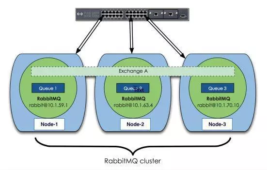
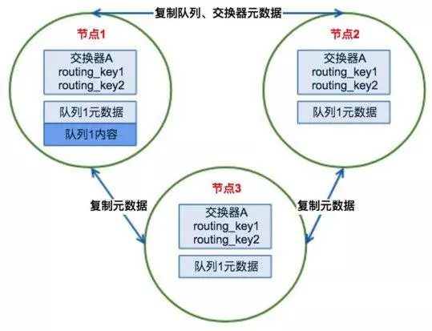
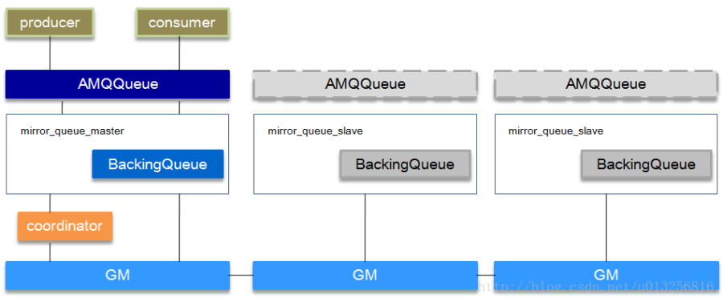
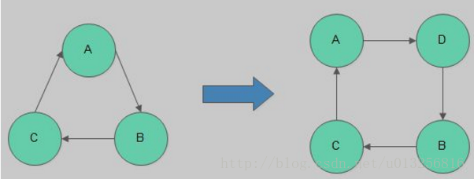

# RabbitMQ集群原理介绍
## RabbitMQ默认集群原理
RabbitMQ本身是基于Erlang编写，Erlang语言天生具备分布式特性（通过同步Erlang集群各节点的erlang.cookie来实现）。因此，RabbitMQ天然支持集群。集群是保证可靠性的一种方式，同时可以通过水平扩展以达到增加消息吞吐量能力的目的。
下图为集群的示例：

上面图中采用三个节点组成了一个RabbitMQ的集群，Exchange A（交换器）的元数据信息在所有节点上是一致的，而Queue（存放消息的队列）的完整数据则只会存在于它所创建的那个节点上。，其他节点只知道这个queue的metadata信息和一个指向queue的owner node的指针。

### RabbitMQ集群元数据的同步
RabbitMQ集群会始终同步四种类型的内部元数据：

队列元数据：队列名称和它的属性
交换器元数据：交换器名称、类型和属性
绑定元数据：一张简单的表格展示了如何将消息路由到队列
vhost元数据：为vhost内的队列、交换器和绑定提供命名空间和安全属性
因此，当用户访问其中任何一个RabbitMQ节点时，通过rabbitmqctl查询到的queue／user／exchange/vhost等信息都是相同的。

### 为何RabbitMQ集群仅采用元数据同步的方式
第一，存储空间。如果每个集群节点都拥有所有Queue的完全数据拷贝，那么每个节点的存储空间会非常大，集群的消息积压能力会非常弱（无法通过集群节点的扩容提高消息积压能力）；
第二，性能。消息的发布者需要将消息复制到每一个集群节点，对于持久化消息，网络和磁盘同步复制的开销都会明显增加。

### RabbitMQ集群发送/订阅消息的基本原理
RabbitMQ集群的工作原理图如下：

### 客户端直接连接队列所在节点
如果有一个消息生产者或者消息消费者通过amqp-client的客户端连接至节点1进行消息的发布或者订阅，那么此时的集群中的消息收发只与节点1相关。

### 客户端连接的是非队列数据所在节点
如果消息生产者所连接的是节点2或者节点3，此时队列1的完整数据不在该两个节点上，那么在发送消息过程中这两个节点主要起了一个路由转发作用，根据这两个节点上的元数据转发至节点1上，最终发送的消息还是会存储至节点1的队列1上。同样，如果消息消费者所连接的节点2或者节点3，那这两个节点也会作为路由节点起到转发作用，将会从节点1的队列1中拉取消息进行消费。

### 集群节点类型
#### 磁盘节点
将配置信息和元信息存储在磁盘上（单节点系统必须是磁盘节点，否则每次重启RabbitMQ之后所有的系统配置信息都会丢失）。

#### 内存节点
将配置信息和元信息存储在内存中。性能是优于磁盘节点的。
RabbitMQ要求集群中至少有一个磁盘节点，当节点加入和离开集群时，必须通知磁盘节点（如果集群中唯一的磁盘节点崩溃了，则不能进行创建队列、创建交换器、创建绑定、添加用户、更改权限、添加和删除集群节点）。总之如果唯一磁盘的磁盘节点崩溃，集群是可以保持运行的，但不能更改任何东西。因此建议在集群中设置两个磁盘节点，只要一个可以，就能正常操作。

### 总结
普通集群模式，并不保证队列的高可用性。尽管交换机、绑定这些可以复制到集群里的任何一个节点，但是队列内容不会复制。虽然该模式解决一项目组节点压力，但队列节点宕机直接导致该队列无法应用，只能等待重启。所以要想在队列节点宕机或故障也能正常应用，就要复制队列内容到集群里的每个节点，必须要创建镜像队列。

## RabbitMQ镜像队列原理
镜像队列是基于普通的集群模式的，然后再添加一些策略，所以还是得先配置普通集群，然后才能设置镜像队列。镜像队列存在于多个节点。要实现镜像模式，需要先搭建一个普通集群模式，在这个模式的基础上再配置镜像模式以实现高可用。

### 镜像队列的结构

镜像队列基本上就是一个特殊的BackingQueue，它内部包裹了一个普通的BackingQueue做本地消息持久化处理，在此基础上增加了将消息和ack复制到所有镜像的功能。所有对mirror_queue_master的操作，会通过可靠组播GM的方式同步到各slave节点。GM负责消息的广播，mirror_queue_slave负责回调处理，而master上的回调处理是由coordinator负责完成。mirror_queue_slave中包含了普通的BackingQueue进行消息的存储，master节点中BackingQueue包含在mirror_queue_master中由AMQQueue进行调用。
消息的发布（除了Basic.Publish之外）与消费都是通过master节点完成。master节点对消息进行处理的同时将消息的处理动作通过GM广播给所有的slave节点，slave节点的GM收到消息后，通过回调交由mirror_queue_slave进行实际的处理。
对于Basic.Publish，消息同时发送到master和所有slave上，如果此时master宕掉了，消息还发送slave上，这样当slave提升为master的时候消息也不会丢失。

### GM（Guarenteed Multicast）
GM模块实现的一种可靠的组播通讯协议，该协议能够保证组播消息的原子性，即保证组中活着的节点要么都收到消息要么都收不到。
它的实现大致如下：
将所有的节点形成一个循环链表，每个节点都会监控位于自己左右两边的节点，当有节点新增时，相邻的节点保证当前广播的消息会复制到新的节点上；当有节点失效时，相邻的节点会接管保证本次广播的消息会复制到所有的节点。在master节点和slave节点上的这些gm形成一个group，group（gm_group）的信息会记录在mnesia中。不同的镜像队列形成不同的group。消息从master节点对于的gm发出后，顺着链表依次传送到所有的节点，由于所有节点组成一个循环链表，master节点对应的gm最终会收到自己发送的消息，这个时候master节点就知道消息已经复制到所有的slave节点了。

### 新增节点
新节点的加入过程如下图所示：

每当一个节点加入或者重新加入（例如从网络分区中恢复过来）镜像队列，之前保存的队列内容会被清空。

### 节点的失效
如果某个slave失效了，系统处理做些记录外几乎啥都不做。master依旧是master，客户端不需要采取任何行动，或者被通知slave失效。 如果master失效了，那么slave中的一个必须被选中为master。被选中作为新的master的slave通常是最老的那个，因为最老的slave与前任master之间的同步状态应该是最好的。然而，需要注意的是，如果存在没有任何一个slave与master完全同步的情况，那么前任master中未被同步的消息将会丢失。

### 消息的同步
将新节点加入已存在的镜像队列是，默认情况下ha-sync-mode=manual，镜像队列中的消息不会主动同步到新节点，除非显式调用同步命令。当调用同步命令后，队列开始阻塞，无法对其进行操作，直到同步完毕。
当ha-sync-mode=automatic时，新加入节点时会默认同步已知的镜像队列。由于同步过程的限制，所以不建议在生产的消费队列中操作。

### 总结
镜像节点在集群中的其他节点拥有从队列拷贝，一旦主节点不可用，最老的从队列将被选举为新的主队列。但镜像队列不能作为负载均衡使用，因为每个操作在所有节点都要做一遍。该模式带来的副作用也很明显，除了降低系统性能外，如果镜像队列数量过多，加之大量的消息进入，集群内部的网络带宽将会被这种同步通讯大大消耗掉。所以在对可靠性要求较高的场合中适用。
