> 作者 | 杨朝坤(慕白)\
> 来源 | 阿里开发者公众号
## Fury：一个基于JIT动态编译的高性能多语言原生序列化框架
Fury是一个基于JIT动态编译的多语言原生序列化框架，支持Java/Python/Golang/C++等语言，提供全自动的对象多语言/跨语言序列化能力，以及相比于别的框架最高20~200倍的性能。

### 引言
过去十多年大数据和分布式系统蓬勃发展，序列化是其频繁使用的技术。当对象需要跨进程、跨语言、跨节点传输、持久化、状态读写时，都需要进行序列化，其性能和易用性影响着系统的运行效率和开发效率。

对于Java序列化，尽管Kryo[1]等框架提供了相比JDK序列化数倍的性能，对于高吞吐、低延迟、大规模数据传输场景，序列化仍然是整个系统的性能瓶颈。为了优化序列化的性能，分布式系统如Spark[2]、Flink[3]使用了专有行列存二进制格式如tungsten[4]和arrow[5]。这些格式减少了序列化开销，但增加了系统的复杂性，牺牲了编程的灵活性，同时也只覆盖了SQL等关系代数计算专有场景。对于通用分布式编程和跨进程通信，序列化性能始终是一个绕不过去的关键问题。

同时随着计算和应用场景的日益复杂化，系统已经从单一语言的编程范式发展到多语言融合编程，对象在语言之间传输的易用性影响着系统开发效率，进而影响业务的迭代效率。而已有的跨语言序列化框架protobuf/flatbuffer/msgpack等由于无法支持引用、不支持Zero-Copy、大量手写代码以及生成的类不符合面向对象设计[6]无法给类添加行为，导致在易用性、灵活性、动态性和性能上的不足，并不能满足通用跨语言编程需求。

基于此，我们开发了Fury，通过一套支持引用、类型嵌入的语言无关协议，以及JIT动态编译加速、缓存优化和Zero-Copy等技术，实现了任意对象像动态语言自动序列化一样跨语言自动序列化，消除了语言之间的编程边界，并提供相比于业界别的框架最高20~200倍的性能。


### Fury是什么
Fury是一个基于JIT的高性能多语言原生序列化框架，专注于提供极致的序列化性能和易用性：
- 支持主流编程语言如Java/Python/C++/Golang，其它语言可轻易扩展； 
- 多语言/跨语言自动序列化任意对象，无需创建IDL文件、手动编译schema生成代码以及将对象转换为中间格式； 
- 多语言/跨语言自动序列化共享引用和循环引用，用户只需要关心对象，不需要关心数据重复或者递归错误； 
- 基于JIT动态编译技术在运行时自动生成序列化代码优化性能，增加方法内联、代码缓存和死代码消除，减少虚方法调用/条件分支/Hash查找/元数据写入等，提供相比其它序列化框架20~200倍以上的性能； 
- Zero-Copy序列化支持，支持Out of band序列化协议，支持堆外内存读写； 
- 提供缓存友好的二进制随机访问行存格式，支持跳过序列化和部分序列化，并能和列存自动互转;

除了跨语言能力，Fury还具备以下能力：
- 无缝替代JDK/Kryo/Hessian等Java序列化框架，无需修改任何代码，同时提供相比Kryo 20倍以上的性能，相比Hessian100倍以上的性能，相比JDK自带序列化200倍以上的性能，可以大幅提升高性能场景RPC调用和对象持久化效率；
- 支持共享引用和循环引用的Golang序列化框架；
- 支持对象自动序列化的Golang序列化框架；
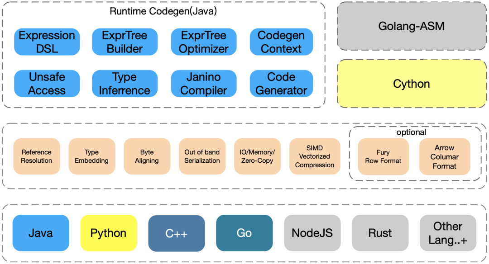 

目前Fury已经支持Java、Python、Golang以及C++。本文将首先简单介绍如何使用Fury，然后将Fury跟别的序列化框架进行功能、性能和易用性比较，Fury的实现原理将在后续文章里面详细介绍。

### 如何使用Fury
这里给出跨语言序列化、纯Java序列化以及避免序列化的示例：

- 跨语言序列化自定义类型
- 跨语言序列化包含循环引用的自定义类型
- 跨语言零拷贝序列化
- Drop-in替代Kryo/Hession/JDK序列化
- 通过Fury Format避免序列化
#### 序列化自定义类型
下面是序列化用户自定义类型的一个示例，该类型里面包含多个基本类型以及嵌套类型的字段，在业务应用里面相当常见。需要注意自定义类型跨语言序列化之前需要调用registerAPI注册自定义类型，建立类型在不同语言之间的映射关系，同时保证GoLang等静态语言编译器编译代码时不裁剪掉这部分类型的符号。

##### Java序列化示例
```java
import com.google.common.collect.*;
import io.fury.*;
import java.util.*;

public class CustomObjectExample {
  public static class SomeClass1 {
    Object f1;
    Map<Byte, Integer> f2;
  }
  public static class SomeClass2 {
    Object f1;
    String f2;
    List< Object> f3;
    Map< Byte, Integer> f4;
    Byte f5;
    Short f6;
    Integer f7;
    Long f8;
    Float f9;
    Double f10;
    short[] f11;
    List< Short> f12;
  }
  
  public static Object createObject() {
    SomeClass1 obj1 = new SomeClass1();
    obj1.f1 = true;
    obj1.f2 = ImmutableMap.of((byte) -1, 2);
    SomeClass2 obj = new SomeClass2();
    obj.f1 = obj1;
    obj.f2 = "abc";
    obj.f3 = Arrays.asList("abc", "abc");
    obj.f4 = ImmutableMap.of((byte) 1, 2);
    obj.f5 = Byte.MAX_VALUE;
    obj.f6 = Short.MAX_VALUE;
    obj.f7 = Integer.MAX_VALUE;
    obj.f8 = Long.MAX_VALUE;
    obj.f9 = 1.0f / 2;
    obj.f10 = 1 / 3.0;
    obj.f11 = new short[] {(short) 1, (short) 2};
    obj.f12 = ImmutableList.of((short) -1, (short) 4);
    return obj;
  }
}
```
纯Java序列化：
```java
public class CustomObjectExample {
  // mvn exec:java -Dexec.mainClass="io.fury.examples.CustomObjectExample"
  public static void main(String[] args) {
    // Fury应该在多个对象序列化之间复用，不要每次创建新的Fury实例
    Fury fury = Fury.builder().withLanguage(Language.JAVA)
      .withReferenceTracking(false)
      .withClassRegistrationRequired(false)
      .build();
    byte[] bytes = fury.serialize(createObject());
    System.out.println(fury.deserialize(bytes));;
  }
}
```
跨语言序列化：
```java
public class CustomObjectExample {
  // mvn exec:java -Dexec.mainClass="io.fury.examples.CustomObjectExample"
  public static void main(String[] args) {
    // Fury应该在多个对象序列化之间复用，不要每次创建新的Fury实例
    Fury fury = Fury.builder().withLanguage(Language.XLANG)
      .withReferenceTracking(false).build();
    fury.register(SomeClass1.class, "example.SomeClass1");
    fury.register(SomeClass2.class, "example.SomeClass2");
    byte[] bytes = fury.serialize(createObject());
    // bytes can be data serialized by other languages.
    System.out.println(fury.deserialize(bytes));;
  }
}
```
##### Python序列化示例
```python
from dataclasses import dataclass
from typing import List, Dict
import pyfury

@dataclass
class SomeClass2:
    f1: Any = None
    f2: str = None
    f3: List[str] = None
    f4: Dict[pyfury.Int8Type, pyfury.Int32Type] = None
    f5: pyfury.Int8Type = None
    f6: pyfury.Int16Type = None
    f7: pyfury.Int32Type = None
    # int类型默认会按照long类型进行序列化，如果对端是更加narrow的类型，
    # 需要使用pyfury.Int32Type等进行标注
    f8: int = None  # 也可以使用pyfury.Int64Type进行标注
    f9: pyfury.Float32Type = None
    f10: float = None  # 也可以使用pyfury.Float64Type进行标注
    f11: pyfury.Int16ArrayType = None
    f12: List[pyfury.Int16Type] = None

@dataclass
class SomeClass1:
    f1: Any
    f2: Dict[pyfury.Int8Type, pyfury.Int32Type]

if __name__ == "__main__":
    fury_ = pyfury.Fury(reference_tracking=False)
    fury_.register_class(SomeClass1, "example.SomeClass1")
    fury_.register_class(SomeClass2, "example.SomeClass2")
    obj2 = SomeClass2(f1=True, f2={-1: 2})
    obj1 = SomeClass1(
        f1=obj2,
        f2="abc",
        f3=["abc", "abc"],
        f4={1: 2},
        f5=2 ** 7 - 1,
        f6=2 ** 15 - 1,
        f7=2 ** 31 - 1,
        f8=2 ** 63 - 1,
        f9=1.0 / 2,
        f10=1 / 3.0,
        f11=array.array("h", [1, 2]),
        f12=[-1, 4],
    )
    data = fury_.serialize(obj)
    # bytes can be data serialized by other languages.
    print(fury_.deserialize(data))
```
##### GoLang序列化示例
```golang
package main

import "code.alipay.com/ray-project/fury/go/fury"
import "fmt"

func main() {
  type SomeClass1 struct {
    F1  interface{}
    F2  string
    F3  []interface{}
    F4  map[int8]int32
    F5  int8
    F6  int16
    F7  int32
    F8  int64
    F9  float32
    F10 float64
    F11 []int16
    F12 fury.Int16Slice
  }
  
  type SomeClas2 struct {
    F1 interface{}
    F2 map[int8]int32
  }
    fury_ := fury.NewFury(false)
    if err := fury_.RegisterTagType("example.SomeClass1", SomeClass1{}); err != nil {
        panic(err)
    }
    if err := fury_.RegisterTagType("example.SomeClass2", SomeClass2{}); err != nil {
        panic(err)
    }
  obj2 := &SomeClass2{}
  obj2.F1 = true
  obj2.F2 = map[int8]int32{-1: 2}
  obj := &SomeClass1{}
  obj.F1 = obj2
  obj.F2 = "abc"
  obj.F3 = []interface{}{"abc", "abc"}
  f4 := map[int8]int32{1: 2}
  obj.F4 = f4
  obj.F5 = fury.MaxInt8
  obj.F6 = fury.MaxInt16
  obj.F7 = fury.MaxInt32
  obj.F8 = fury.MaxInt64
  obj.F9 = 1.0 / 2
  obj.F10 = 1 / 3.0
  obj.F11 = []int16{1, 2}
  obj.F12 = []int16{-1, 4}
    bytes, err := fury_.Marshal(value)
    if err != nil {
    }
    var newValue interface{}
    // bytes can be data serialized by other languages.
    if err := fury_.Unmarshal(bytes, &newValue); err != nil {
        panic(err)
    }
    fmt.Println(newValue)
}
```
#### 序列化共享&循环引用
共享引用和循环引用是程序里面常见的构造，很多数据结构如图都包含大量的循环引用，而手动实现这些包含共享引用和循环引用的对象，需要大量冗长复杂易出错的代码。跨语言序列化框架支持循环引用可以极大简化这些复杂场景的序列化，加速业务迭代效率。下面是一个包含循环引用的自定义类型跨语言序列化示例。

##### Java序列化示例
```java
import com.google.common.collect.ImmutableMap;
import io.fury.*;
import java.util.Map;

public class ReferenceExample {
public static class SomeClass {
SomeClass f1;
Map< String, String> f2;
Map< String, String> f3;
}
public static Object createObject() {
SomeClass obj = new SomeClass();
obj.f1 = obj;
obj.f2 = ImmutableMap.of("k1", "v1", "k2", "v2");
obj.f3 = obj.f2;
return obj;
}
}
```
Java序列化：
```java
public class ReferenceExample {    
// mvn exec:java -Dexec.mainClass="io.fury.examples.ReferenceExample"
public static void main(String[] args) {
// Fury应该在多个对象序列化之间复用，不要每次创建新的Fury实例
Fury fury = Fury.builder().withLanguage(Language.JAVA)
.withReferenceTracking(true)
.withClassRegistrationRequired(false)
.build();
byte[] bytes = fury.serialize(createObject());
System.out.println(fury.deserialize(bytes));;
}
}
```
跨语言序列化：
```java
public class ReferenceExample {
// mvn exec:java -Dexec.mainClass="io.fury.examples.ReferenceExample"
public static void main(String[] args) {
// Fury应该在多个对象序列化之间复用，不要每次创建新的Fury实例
Fury fury = Fury.builder().withLanguage(Language.XLANG)
.withReferenceTracking(true).build();
fury.register(SomeClass.class, "example.SomeClass");
byte[] bytes = fury.serialize(createObject());
// bytes can be data serialized by other languages.
System.out.println(fury.deserialize(bytes));;
}
}
```
##### Python序列化示例
```python
from typing import Dict
import pyfury


class SomeClass:
f1: "SomeClass"
f2: Dict[str, str]
f3: Dict[str, str]


if __name__ == "__main__":
fury_ = pyfury.Fury(reference_tracking=True)
fury_.register_class(SomeClass, "example.SomeClass")
obj = SomeClass()
obj.f2 = {"k1": "v1", "k2": "v2"}
obj.f1, obj.f3 = obj, obj.f2
data = fury_.serialize(obj)
# bytes can be data serialized by other languages.
print(fury_.deserialize(data))
```
##### Golang序列化示例
```golang
package main

import "code.alipay.com/ray-project/fury/go/fury"
import "fmt"

func main() {
type SomeClass struct {
F1 *SomeClass
F2 map[string]string
F3 map[string]string
}
fury_ := fury.NewFury(true)
if err := fury_.RegisterTagType("example.SomeClass", SomeClass{}); err != nil {
panic(err)
}
value := &SomeClass{F2: map[string]string{"k1": "v1", "k2": "v2"}}
value.F3 = value.F2
value.F1 = value
bytes, err := fury_.Marshal(value)
if err != nil {
}
var newValue interface{}
// bytes can be data serialized by other languages.
if err := fury_.Unmarshal(bytes, &newValue); err != nil {
panic(err)
}
fmt.Println(newValue)
}
```
#### Zero-Copy序列化
对于大规模数据传输场景，内存拷贝有时会成为整个系统的瓶颈。为此各种语言和框架做了大量优化，比如Java提供了NIO能力，避免了内存在用户态和内核态之间的来回拷贝；Kafka使用Java的NIO来实现零拷贝；Python Pickle5提供了Out-Of-Band Buffer[7]序列化能力来避免额外拷贝。

对于高性能跨语言数据传输，序列化框架也需要能够支持Zero-Copy，避免数据Buffer的额外拷贝。下面是一个Fury序列化多个基本类型数组组成的对象树的示例，分别对应到Java基本类型数组、Python Numpy数组、Golang 基本类型slice。对于ByteBuffer零拷贝，在本文的性能测试部分也给出了部分介绍。

##### Java序列化示例

Java序列化
```java
import io.fury.*;
import io.fury.serializers.BufferObject;
import io.fury.memory.MemoryBuffer;
import java.util.*;
import java.util.stream.Collectors;

public class ZeroCopyExample {
// mvn exec:java -Dexec.mainClass="io.fury.examples.ZeroCopyExample"
public static void main(String[] args) {
// Fury应该在多个对象序列化之间复用，不要每次创建新的Fury实例
Fury fury = Fury.builder()
.withLanguage(Language.JAVA)
.withClassRegistrationRequired(false)
.build();
List< Object> list = Arrays.asList("str", new byte[1000], new int[100], new double[100]);
Collection<BufferObject> bufferObjects = new ArrayList<>();
byte[] bytes = fury.serialize(list, e -> !bufferObjects.add(e));
List<MemoryBuffer> buffers =
bufferObjects.stream().map(BufferObject::toBuffer).collect(Collectors.toList());
System.out.println(fury.deserialize(bytes, buffers));
}
}
```
跨语言序列化：
```java
import io.fury.*;
import io.fury.serializers.BufferObject;
import io.fury.memory.MemoryBuffer;
import java.util.*;
import java.util.stream.Collectors;

public class ZeroCopyExample {
// mvn exec:java -Dexec.mainClass="io.fury.examples.ZeroCopyExample"
public static void main(String[] args) {
Fury fury = Fury.builder().withLanguage(Language.XLANG).build();
List< Object> list = Arrays.asList("str", new byte[1000], new int[100], new double[100]);
Collection< BufferObject> bufferObjects = new ArrayList<>();
byte[] bytes = fury.serialize(list, e -> !bufferObjects.add(e));
// bytes can be data serialized by other languages.
List< MemoryBuffer> buffers =
bufferObjects.stream().map(BufferObject::toBuffer).collect(Collectors.toList());
System.out.println(fury.deserialize(bytes, buffers));
}
}
```
##### Python序列化示例
```python
import array
import pyfury
import numpy as np

if __name__ == "__main__":
fury_ = pyfury.Fury()
list_ = ["str", bytes(bytearray(1000)),
array.array("i", range(100)), np.full(100, 0.0, dtype=np.double)]
serialized_objects = []
data = fury_.serialize(list_, buffer_callback=serialized_objects.append)
buffers = [o.to_buffer() for o in serialized_objects]
# bytes can be data serialized by other languages.
print(fury_.deserialize(data, buffers=buffers))
```
##### Golang序列化示例
```golang
package main

import "code.alipay.com/ray-project/fury/go/fury"
import "fmt"

func main() {    
fury := fury.NewFury(true)
// Golang版本暂不支持其他基本类型slice的zero-copy
list := []interface{}{"str", make([]byte, 1000)}
buf := fury.NewByteBuffer(nil)
var serializedObjects []fury.SerializedObject
fury.Serialize(buf, list, func(o fury.SerializedObject) bool {
serializedObjects = append(serializedObjects, o)
return false
})
var newList []interface{}
var buffers []*fury.ByteBuffer
for _, o := range serializedObjects {
buffers = append(buffers, o.ToBuffer())
}
err := fury.Deserialize(buf, &newList, buffers)
fmt.Println(newList)
```
#### Drop-in替换Kryo/Hession
除了多语言原生序列化以外，Fury还是一个高性能的通用Java序列化框架，可以序列化任意Java Object，完全兼容JDK序列化，包括支持序列化自定义writeObject/readObject/writeReplace/readResolve的对象，支持堆内/堆外内存。可以Drop-in替换jdk/kryo/hession等序列化框架，性能最高是Kryo 20倍以上，Hession100倍以上，JDK自带序列化200倍。

下面是一个序列化自定义类型的示例：
```java
import io.fury.Fury;
import java.util.List;
import java.util.Arrays;

public class Example {
public static void main(String[] args) {
SomeClass object = new SomeClass();
// Fury实例应该在序列化多个对象之间复用，不要每次创建新的实例
{
Fury fury = Fury.builder()
.withLanguage(Language.JAVA)
// 设置为true可以避免反序列化未注册的非内置类型，
// 避免安全漏洞
.withClassRegistrationRequired(false)
.withReferenceTracking(true).build();
// 注册类型可以减少classname的序列化，不是强制要求
// fury.register(SomeClass.class);
byte[] bytes = fury.serialize(object);
System.out.println(fury.deserialize(bytes));
}
{
ThreadSafeFury fury = Fury.builder().withLanguage(Language.JAVA)
.withReferenceTracking(true)
.withClassRegistrationRequired(false)
.buildThreadSafeFury();
byte[] bytes = fury.serialize(object);
System.out.println(fury.deserialize(bytes));
}
{
ThreadSafeFury fury = new ThreadSafeFury(() -> {
Fury fury = Fury.builder()
.withLanguage(Language.JAVA)
.withClassRegistrationRequired(false)
.withReferenceTracking(true).build();
// 注册类型可以减少classname的序列化
fury.register(SomeClass.class);
return fury;
});
byte[] bytes = fury.serialize(object);
System.out.println(fury.deserialize(bytes));
}
}
}
```
##### 通过Fury Format避免序列化
对于有极致性能要求的场景，如果用户只需要读取部分数据，或者在Serving场景根据对象树某个字段进行过滤和转发，可以使用Fury Format来避免其它字段的序列化。Fury Row Format是参考SQL行存和Arrow列存实现的一套可以随机访问的二进制行存结构。目前实现了Java/Python/C++版本，Python版本通过Cython绑定到C++实现。

由于该格式是自包含的，可以根据schema直接计算出任意字段的offset。因此通过使用该格式，可以避免掉序列化，直接在二进制数据buffer上面进行所有读写操作，这样做有三个优势：
- 减少Java GC overhead。由于避免了反序列化，因此不会创建对象，从而避免了GC问题。 
- 避免Python反序列化。Python性能一直很慢，因此在跨语言序列化时，可以在Java/C++侧把对象序列化成Row-Format，然后Python侧直接使用该数据计算，这样就避免了Python反序列化的昂贵开销。同时由于Python的动态性，Fury的BinaryRow/BinaryArrays实现了_getattr__/__getitem__/slice/和其它special methods，保证了行为跟python pojo/list/object的一致性，用户没有任何感知。 
- 缓存友好，数据密集存储。

Python示例

这里给出一个读取部分数据的样例以及性能测试结果。在下面这个序列化场景中，需要读取第二个数组字段的第10万个元素，Fury耗时几乎为0，而pickler需要8秒。
```python
@dataclass
class Bar:
f1: str
f2: List[pa.int64]

@dataclass
class Foo:
f1: pa.int32
f2: List[pa.int32]
f3: Dict[str, pa.int32]
f4: List[Bar]

encoder = pyfury.encoder(Foo)
foo = Foo(f1=10, f2=list(range(1000_000)),
f3={f"k{i}": i for i in range(1000_000)},
f4=[Bar(f1=f"s{i}", f2=list(range(10))) for i in range(1000_000)])
binary: bytes = encoder.to_row(foo).to_bytes()
print(f"start: {datetime.datetime.now()}")
foo_row = pyfury.RowData(encoder.schema, binary)
print(foo_row.f2[100000], foo_row.f4[100000].f1, foo_row.f4[200000].f2[5])
print(f"end: {datetime.datetime.now()}")

binary = pickle.dumps(foo)
print(f"pickle start: {datetime.datetime.now()}")
new_foo = pickle.loads(binary)
print(new_foo.f2[100000], new_foo.f4[100000].f1, new_foo.f4[200000].f2[5])
print(f"pickle end: {datetime.datetime.now()}")
```
Java示例
```java
public class Bar {
String f1;
List<Long> f2;
}

public class Foo {
int f1;
List< Integer> f2;
Map< String, Integer> f3;
List< Bar> f4;
}

Encoder< Foo> encoder = Encoders.rowEncoder(Foo.class);
BinaryRow binaryRow = encoder.toRow(foo); // 该数据可以被Python零拷贝解析
Foo newFoo = encoder.fromRow(binaryRow); // 可以是来自python序列化的数据
BinaryArray binaryArray2 = binaryRow.getArray(1); // 零拷贝读取List< Integer> f2字段
BinaryArray binaryArray4 = binaryRow.getArray(4); // 零拷贝读取List< Bar> f4字段
BinaryRow barStruct = binaryArray4.getStruct(10);// 零拷贝读取读取List< Bar> f4第11个元素数据
// 零拷贝读取读取List< Bar> f4第11个元素数据的f2字段的第6个元素
long aLong = barStruct.getArray(1).getLong(5);
Encoder< Bar> barEncoder = Encoders.rowEncoder(Bar.class);
// 部分反序列化对象
Bar newBar = barEncoder.fromRow(barStruct);
Bar newBar2 = barEncoder.fromRow(binaryArray4.getStruct(20));
// 对象创建示例：
// Foo foo = new Foo();
// foo.f1 = 10;
// foo.f2 = IntStream.range(0, 1000000).boxed().collect(Collectors.toList());
// foo.f3 = IntStream.range(0, 1000000).boxed().collect(Collectors.toMap(i -> "k"+i, i->i));
// List< Bar> bars = new ArrayList<>(1000000);
// for (int i = 0; i < 1000000; i++) {
//   Bar bar = new Bar();
//   bar.f1 = "s"+i;
//   bar.f2 = LongStream.range(0, 10).boxed().collect(Collectors.toList());
//   bars.add(bar);
// }
// foo.f4 = bars;
```
##### 自动转换Arrow

Fury Format支持自动与Arrow列存互转。

Python示例：
```python
import pyfury
encoder = pyfury.encoder(Foo)
encoder.to_arrow_record_batch([foo] * 10000)
encoder.to_arrow_table([foo] * 10000)
```
C++示例：
```c++
std::shared_ptr< ArrowWriter> arrow_writer;
EXPECT_TRUE(
ArrowWriter::Make(schema, ::arrow::default_memory_pool(), &arrow_writer)
.ok());
for (auto &row : rows) {
EXPECT_TRUE(arrow_writer->Write(row).ok());
}
std::shared_ptr< ::arrow::RecordBatch> record_batch;
EXPECT_TRUE(arrow_writer->Finish(&record_batch).ok());
EXPECT_TRUE(record_batch->Validate().ok());
EXPECT_EQ(record_batch->num_columns(), schema->num_fields());
EXPECT_EQ(record_batch->num_rows(), row_nums);
```
Java示例：
```java
Schema schema = TypeInference.inferSchema(BeanA.class);
ArrowWriter arrowWriter = ArrowUtils.createArrowWriter(schema);
Encoder< BeanA> encoder = Encoders.rowEncoder(BeanA.class);
for (int i = 0; i < 10; i++) {
BeanA beanA = BeanA.createBeanA(2);
arrowWriter.write(encoder.toRow(beanA));
}
return arrowWriter.finishAsRecordBatch();
```
### 对比其它序列化框架
跟其它框架的对比将分为功能、性能和易用性三个维度，每个维度上Fury都有比较显著的优势。

#### 功能比较
这里从10个维度将Fury跟别的框架进行对比，每个维度的含义分别为：
- 多语言/跨语言：是否支持多种语言以及是否支持跨语言序列化 
- 自动序列化：是否需要写大量序列化代码，还是可以完全自动话 
- 是否需要schema编译：是否需要编写schema IDL文件，并编译schema生成代码 
- 自定义类型：是否支持自定义类型，即POJO/DataClass/Struct等 
- 非自定义类型：是否支持非自定义类型，即是否支持直接序列化基本类型、数组、List、Map等，还是需要将这些类型包装到自定义类型内部才能进行序列化 
- 引用/循环引用：对于指向同一个对象的两份引用，是否只会序列化数据一次；对于循环引用，是否能够进行序列化而不是出现递归报错 
- 多态子类型：对于List/Map的多个子类型如ArrayList/LinkedList/ImmutableList，HashMap/LinkedHashMap等，反序列化是否能够得到相同的类型，还是会变成ArrayList和HashMap 
- 反序列化是否需要传入类型：即是否需要在反序列化时需要提前知道数据对应的类型。如果需要的话则灵活性和易用性会受到限制，而且传入的类型不正确的话反序列化可能会crash 
- 部分反序列化/随机读写：反序列化是否可以只读取部分字段或者嵌套的部分字段，对于大对象这可以节省大量序列化开销 
- 堆外内存读写：即是否支持直接读写native内存 
- 数值类型可空：是否支持基本类型为null，比如Java的Integer等装箱类型以及python的int/float可能为null。

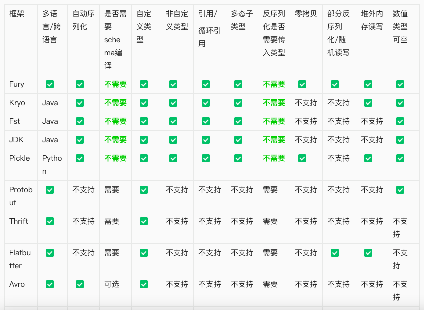 
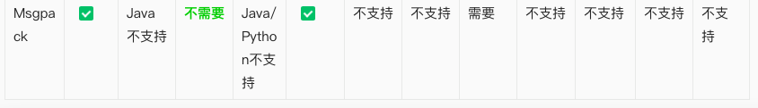 

#### 性能比较(数值越小越好)
这里给出在纯Java序列化场景对比其它框架的性能测试结果。其它语言的性能测试将在后续文章当中发布。

##### 测试环境：
- 操作系统：4.9.151-015.ali3000.alios7.x86_64 
- CPU型号：Intel(R) Xeon(R) Platinum 8163 CPU @ 2.50GHz 
- Byte Order：Little Endian 
- L1d cache：32K 
- L1i cache：32K 
- L2 cache：1024K 
- L3 cache：33792K
##### 测试原则：

自定义类型序列化测试数据使用的是kryo-benchmark[8]的数据，保证测试结果对Fury没有任何偏向性。尽管Kryo测试数据里面有大量基本类型数组，为了保证测试的公平性我们并没有开启Fury的Out-Of-Band零拷贝序列化能力。然后使用我们自己创建的对象单独准备了一组零拷贝测试用例。

##### 测试工具：

为了避免JVM JIT给测试带来的影响，我们使用JMH[9]工具进行测试，每组测试在五个子进程依次进行，避免受到进程CPU调度的影响，同时每个进程里面执行三组Warmup和5组正式测试，避免受到偶然的环境波动影响。

下面是我们使用JMH测试fury/kryo/fst/hession/protostuff/jdk序列化框架在序列化到堆内存和堆外内存时的性能(数值越小越好)。

**自定义类型性能对比**

Struct

Struct类型主要是有纯基本类型的字段组成，对于这类对象，Fury通过JIT等技术，可以达到Kryo 20倍的性能。
```java
public class Struct implements Serializable {
int f1;
long f2;
float f3;
double f4;
...
int f97;
long f98;
float f99;
double f100;
}
```
序列化：
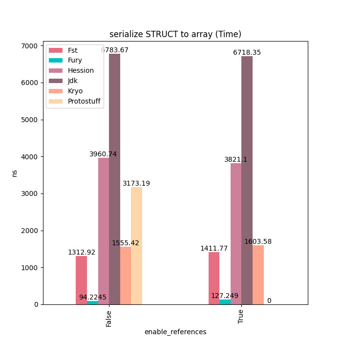
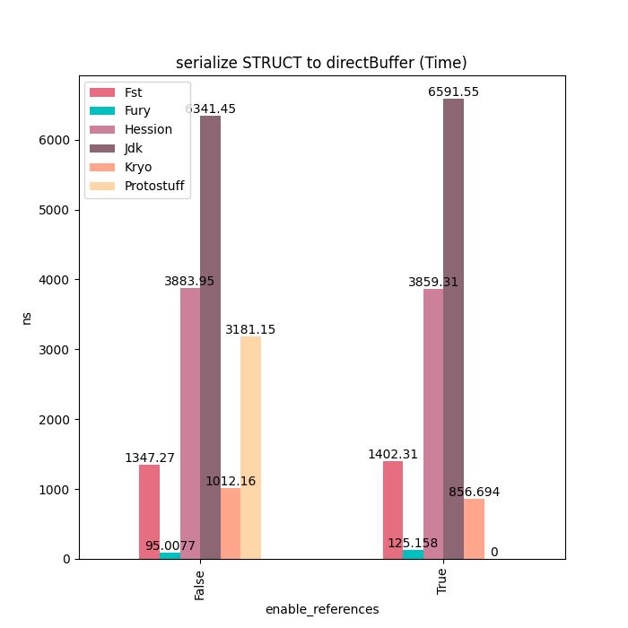
反序列化：
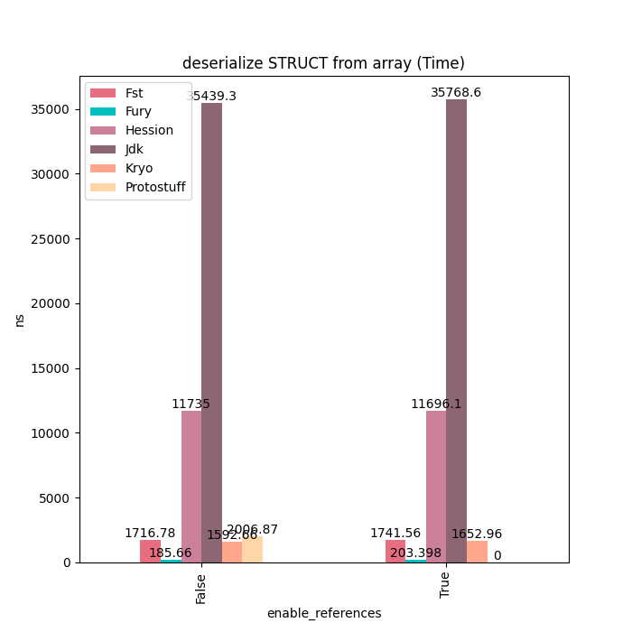
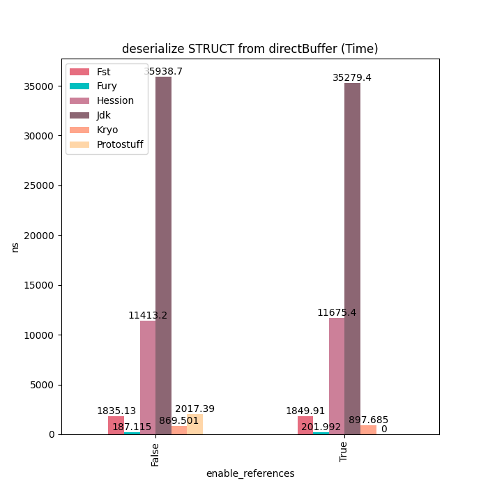

Sample

Sample类型主要由基本类型、装箱类型、字符串和数组等类型字段组成，对于这种类型的对象，Fury的性能可以达到Kryo的6~7倍。没有更快的原因是因为这里的多个基本类型数组需要进行拷贝，这块占用一定的耗时。如果使用Fury的Out-Of-Band序列化的话。这些额外的拷贝就可以完全避免掉，但这样比较不太公平，因此这里没有开启。
```java
public final class Sample implements Serializable {
public int intValue;
public long longValue;
public float floatValue;
public double doubleValue;
public short shortValue;
public char charValue;
public boolean booleanValue;
public Integer IntValue;
public Long LongValue;
public Float FloatValue;
public Double DoubleValue;
public Short ShortValue;
public Character CharValue;
public Boolean BooleanValue;

public int[] intArray;
public long[] longArray;
public float[] floatArray;
public double[] doubleArray;
public short[] shortArray;
public char[] charArray;
public boolean[] booleanArray;

public String string; // Can be null.
public Sample sample; // Can be null.

public Sample() {}

public Sample populate(boolean circularReference) {
intValue = 123;
longValue = 1230000;
floatValue = 12.345f;
doubleValue = 1.234567;
shortValue = 12345;
charValue = '!';
booleanValue = true;

    IntValue = 321;
    LongValue = 3210000L;
    FloatValue = 54.321f;
    DoubleValue = 7.654321;
    ShortValue = 32100;
    CharValue = '$';
    BooleanValue = Boolean.FALSE;

    intArray = new int[] {-1234, -123, -12, -1, 0, 1, 12, 123, 1234};
    longArray = new long[] {-123400, -12300, -1200, -100, 0, 100, 1200, 12300, 123400};
    floatArray = new float[] {-12.34f, -12.3f, -12, -1, 0, 1, 12, 12.3f, 12.34f};
    doubleArray = new double[] {-1.234, -1.23, -12, -1, 0, 1, 12, 1.23, 1.234};
    shortArray = new short[] {-1234, -123, -12, -1, 0, 1, 12, 123, 1234};
    charArray = "asdfASDF".toCharArray();
    booleanArray = new boolean[] {true, false, false, true};

    string = "ABCDEFGHIJKLMNOPQRSTUVWXYZ0123456789";
    if (circularReference) {
      sample = this;
    }
    return this;
}
}
```
序列化：
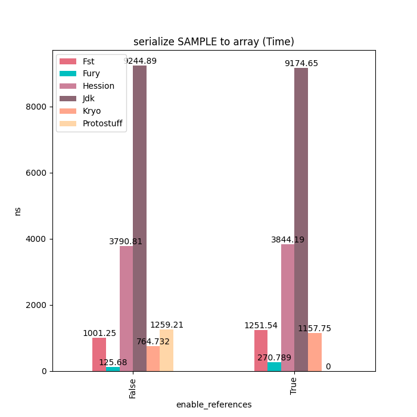
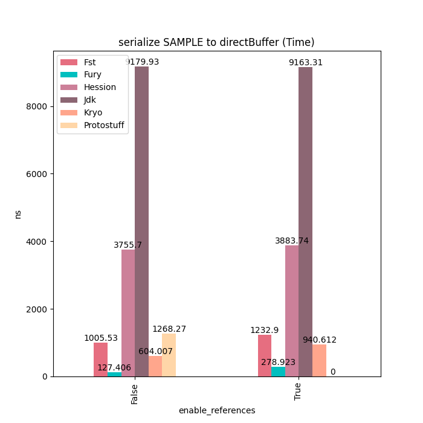
反序列化：
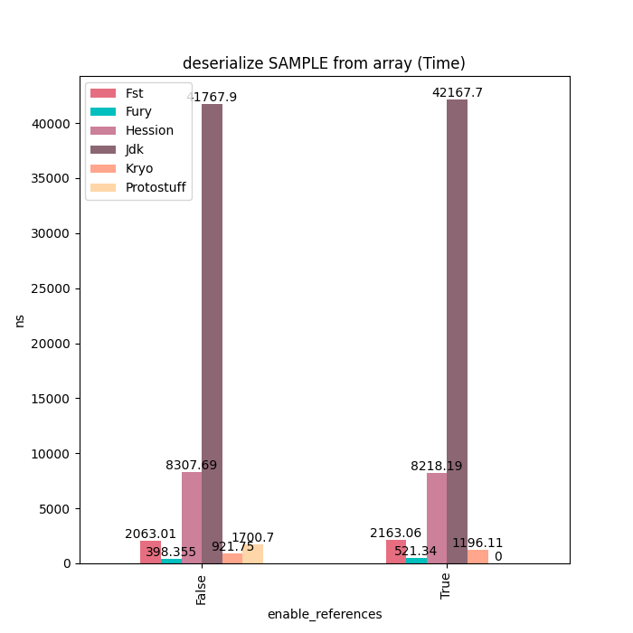 
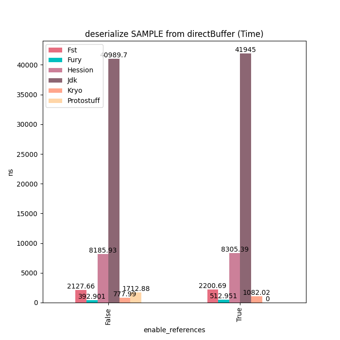

MediaContent

对于MediaContent这类包含大量String的数据结构，Fury性能大概是Kryo的4~5倍。没有更快的原因是因为String序列化开销比较大，部分摊平了Fury JIT带来的性能提升。用户如果对String序列化有更好的性能要求的话，可以使用Fury的String零拷贝序列化协议，在序列化时直接把String内部的Buffer抽取出来，然后直接放到Out-Of-Band buffer里面，完全避免掉String序列化的开销。
```java
public final class Media implements java.io.Serializable {
public String uri;
public String title; // Can be null.
public int width;
public int height;
public String format;
public long duration;
public long size;
public int bitrate;
public boolean hasBitrate;
public List< String> persons;
public Player player;
public String copyright; // Can be null.

public Media() {}

public enum Player {
JAVA,
FLASH;
}
}
public final class MediaContent implements java.io.Serializable {
public Media media;
public List< Image> images;

public MediaContent() {}

public MediaContent(Media media, List< Image> images) {
this.media = media;
this.images = images;
}
public MediaContent populate(boolean circularReference) {
media = new Media();
media.uri = "http://javaone.com/keynote.ogg";
media.width = 641;
media.height = 481;
media.format = "video/theora\u1234";
media.duration = 18000001;
media.size = 58982401;
media.persons = new ArrayList();
media.persons.add("Bill Gates, Jr.");
media.persons.add("Steven Jobs");
media.player = Media.Player.FLASH;
media.copyright = "Copyright (c) 2009, Scooby Dooby Doo";
images = new ArrayList();
Media media = circularReference ? this.media : null;
images.add(
new Image(
"http://javaone.com/keynote_huge.jpg",
"Javaone Keynote\u1234",
32000,
24000,
Image.Size.LARGE,
media));
images.add(
new Image(
"http://javaone.com/keynote_large.jpg", null, 1024, 768, Image.Size.LARGE, media));
images.add(
new Image("http://javaone.com/keynote_small.jpg", null, 320, 240, Image.Size.SMALL, media));
return this;
}
}
```
序列化：
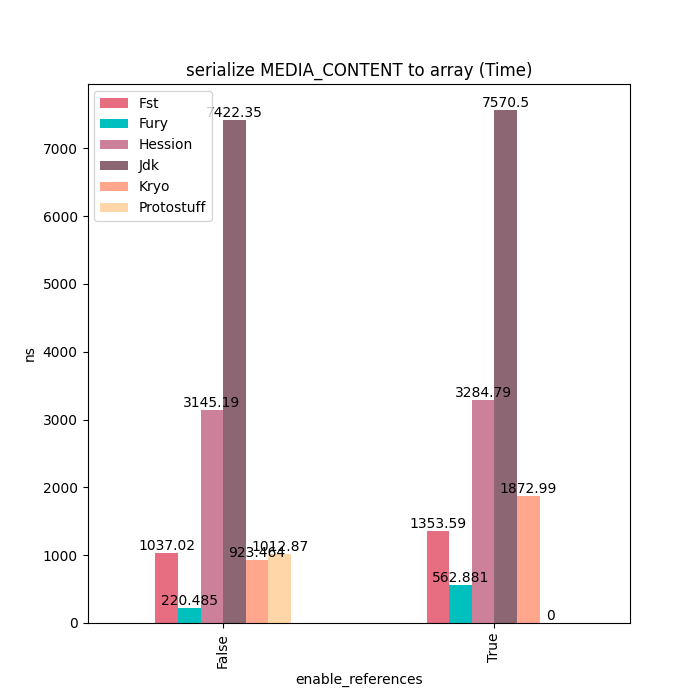
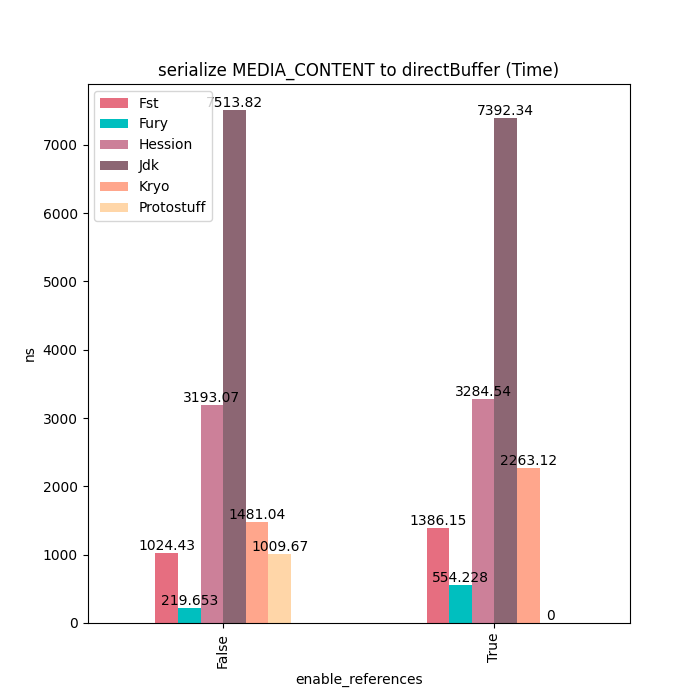
反序列化：
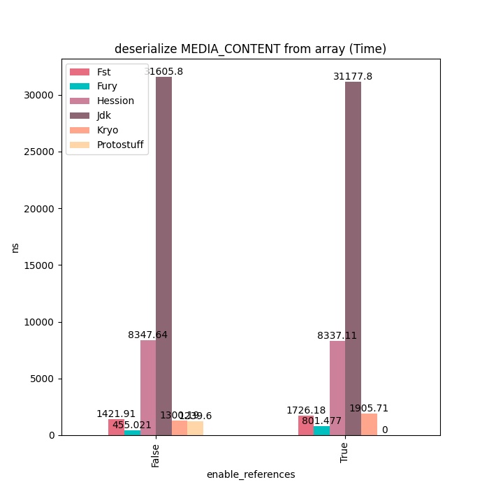
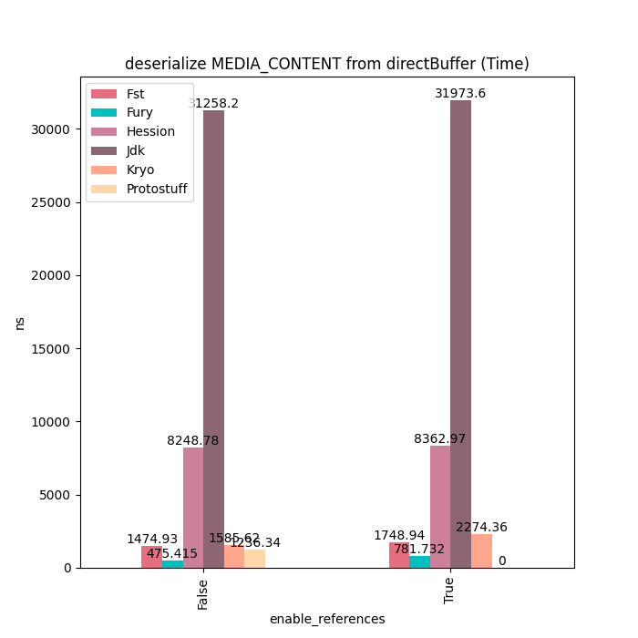


[更多比对结果参看原文](https://developer.aliyun.com/article/992485#slide-5)