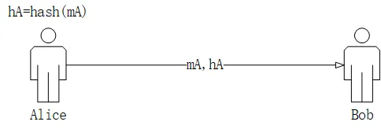
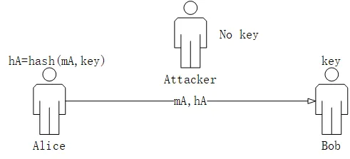
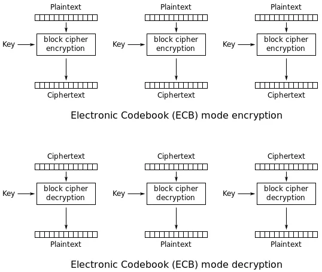
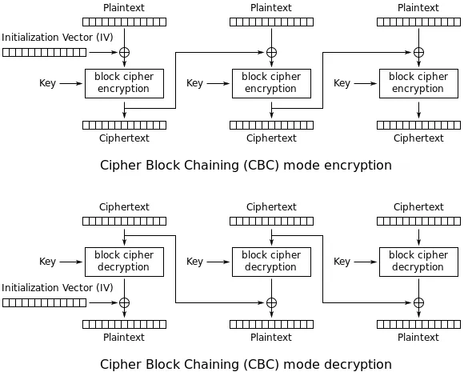
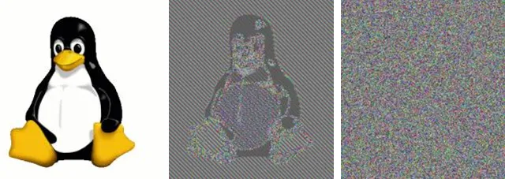
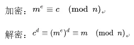
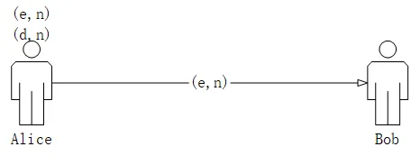
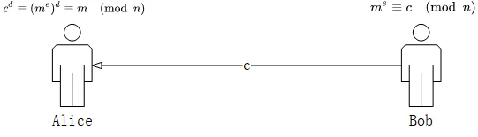
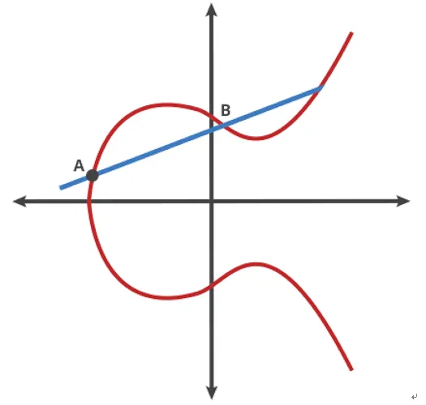
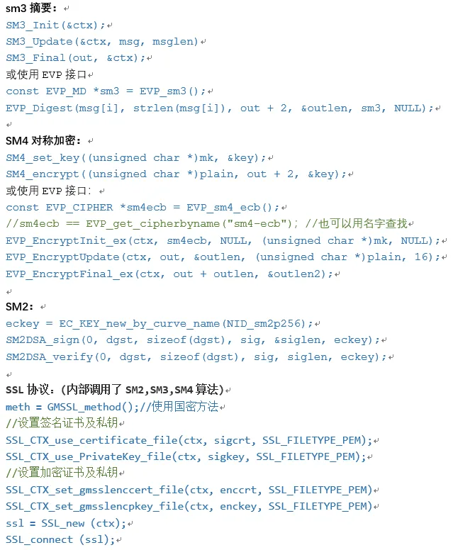

## 引言
随着信息化的推进，信息安全越来越受到人们的重视。这篇文章简单介绍了常用的密码算法、原理、使用场景，简单比较国密算法，可作为业务使用的入门指导。
## 消息摘要
消息摘要算法，是指把消息映射到固定长度编码（结果的长度视摘要算法而定，比如sha-1是20字节，sha256和sm3是32字节）的一种单向、不可逆（即不能从摘要恢复消息）的算法，可用于校验消息完整性。一般原理是把消息分块，通过多轮迭代混淆，得到最终结果。算法在设计上要求给定消息m1，很难找到不同的消息m2，使得hash(m1)=hash(m2)。由于这个特性，摘要算法可以防止消息传输过程中失真或被篡改。

举个例子，Alice要发一段消息mA给Bob，Alice担心传输过程中发生意外，比如网线松动、电磁干扰，导致Bob收到的消息不完整或不正确，那么Alice可以把消息的摘要hA和消息mA一起发给Bob，Bob收到h和m后（因为hA和mA在传输过程中都有可能失真，所以这里记为h和m），计算hB=hash(m)，如果hB=h，那么可以认为消息正确传输，即hB=hA=h，m=mA。

但是上述过程不能防止中间人篡改消息，如果中间人劫持消息，它可以篡改消息同时计算新的摘要，一起发给Bob，那么Bob就发现不了问题。要防篡改，Alice和Bob可以约定一个key，在做摘要时，同消息一起传入算法，即hash(m,key)。Bob收到消息后，使用相同的算法和key，可计算相同的摘要。由于中间人不知道key，他劫持并修改了消息，也不能计算出与消息一致的摘要。这就是HMAC算法。

目前常用摘要算法有sha1、sha256、md5。我国在2012年发布了sm3算法标准，算法把消息大小填充到32字节的倍数，按32字节一块进行多轮混淆，最终得到16字节的摘要。sm3使用了同sha-1/md5相同的迭代模式（Merkle-Damgard[1]），只是在处理每一块数据时使用了不同的混淆方法。谷歌公司在2017年使用110个GPU算了1年，找到相同摘要的两个消息[2]，并已在多年前建议不要使用sha-1算法。md5的碰撞只需要一部近几年的智能手机花费30秒时间[2]。sha256算法相对安全，比特币的工作量证明正是用了sha256来实现的。
## 对称加密
对称，即加密和解密使用相同的密钥，主要分流加密和块加密。常见的DES，3DES，AES都是块加密算法，这里主要介绍块加密。

块加密算法把明文分块处理，通过可逆的混淆置换，得到一块长度相同的密文，接着处理下一块明文。如果把这些密文块拼在一起当作最终的密文，就是ECB块模式。这种模式下，密文块之间没有关系，可单独解密。解密的过程就是加密的逆过程。

ECB块模式是不安全的，相同的明文块加密会得到相同的密文块，容易被分析破解。如图3[3]所示，图的上半部分展示了把消息分为3个明文块（plaintext），独立加密得到3个密文块（ciphertext），下半部分展示了三个密文块独立解密。图4[3]展示了一种更安全的块模式：CBC。CBC模式下，前一个密文块会作为下一个明文块加密的输入。所以有些算法会让调用者提供一个初始化向量（IV），即加密第一块明文时需要的额外的参数，这个IV不需要保密，也不是必须，但是加密和解密必须一致。图5[3]展示了ECB模式和CBC模式的加密效果，ECB模式的密文还能区分出明文块，通俗的说，密文不够乱，混淆不够彻底。注意IV并不是加密算法本身的一部分，而是块模式的一部分。对称加密算法本身只关注块大小，如何加密单个明文块。

常见的DES算法密钥是8位，已不建议使用。3DES使用24字节密钥加密，实际则是把24字节拆分成3个8字节密钥，对DES简单的叠加。

**密文块 = Ek3(Dk2(Ek1(明文块)))**

**明文块 = Dk1(Ek2(Dk3(密文块)))**

k1、k2、k3表示24字节密钥拆分出来的3部分密钥，Ek1、Dk1分别表示以k1为密钥用DES算法加、解密。可以看出，如果k1=k2=k3，该算法等同于DES。

如果想知道DES的实现，但惧怕它的复杂性，或找不到通俗易懂的材料，可以看看SDES（Simplified DES）[4]算法。

我国在2012年发布了SM4对称加密算法。SM4的密钥长度为16字节，分组块长度为16字节。SM4与DES不同的是，它采用了非平衡Feistel结构，能更好的抵抗分析破解。
## 非对称加密
非对称算法普遍采用RSA。RSA算法依据了一些数论理论，1、大数分解是困难的；2、两个数m、c可以通过模运算（如费马小定理、中国余数理论）互相转换。

大概的过程是这样：Alice选择两个质数p、q，令n=p*q，选1<e<n, d，令(e,n)为公钥，(d,n)为私钥。其中e、d、p、q满足一定的运算关系[5][6]。Alice把公钥发给Bob，传输过程不需要加密；私钥由Alice自己保管。Bob使用公钥加密，Alice使用私钥解密。加解密时把消息/密文当作大数处理，运算过程如下所示。其中m就是消息，c是密文，m<n, c<n。这就是RSA加密对消息由长度限制的原因。这个算法的安全性在于知道了n，无法轻易的确定p和q。实际使用中的RSA位数，就是大数n的位数，位数越大越难分解。目前建议时所用>=2048位的rsa密钥。

### 签名，验签
由于RSA对消息长度的限制，不能用于加密大的消息，而且大数运算效率低，所以实际使用中RSA很少用于加密数据。数据加密一般使用对称加密算法。非对称一般用户签名算法，即用于身份认证。在签名时，使用私钥加密。比如Alice向Bob发了一个消息，Bob怎么能确定这个消息真的来自Alice，而不是其他人假冒Alice？Alice可以把消息m做摘要得到h，用私钥对h加密得到c，把m和c发给Bob，Bob把c解密得到h，对m做摘要，与h对比，一致则消息是来自Alice，因为只有Alice有私钥（排除私钥泄露、极小概率与别人的公私钥一样）。

### 椭圆曲线算法（ECC）
近年来ECC越来越受到大家的关注，它更安全，更高效。

打个比喻，能很好的帮助理解ECC算法的安全性。你一个人在台球室，桌上只有一个球，把那个球放在桌上点G，经过一次撞击后，球经过一次或多次反弹，停在了点P。这时你把另一个人叫来，告诉他点G和点P，让他猜出你的撞击力度和方向。如果这个游戏放在椭圆曲线（elliptic curve）上，就是ECC算法。G是基点（起点），P是公钥（终点），你撞击的力度和方向就是私钥，记为d。

我国在2012年发布了SM2 ECC算法，支持签名验签、加解密、密钥交换。SM2 ECC算法与RSA主要区别在:他们的安全性依赖了不同的数据难题。ECC算法更先进更有效。2020年，已公开的RSA被破解的最长密钥是829位，但是256位ecc密钥就有RSA 3072位的安全性。

## 为什么需要国密
从算法设计上来看，sm2，sm3，sm4对应美国标准ecdsa、sha-256、des，他们有相同的算法结构，只是在一些步骤上有区别，比如数据块的大小不一样、迭代次数不同、使用了不同的参数。相比较，国密的这几个算法的计算量都大于美国标准，但计算量本身不意味着他们具有更好的安全性。
 
我认为推行国密算法主要有下面两点意义：
1. 安全性。RSA、ECDSA算法本身没有问题，但很多地方可以做手脚，比如密钥生成算法、随机数生成算法、密码产品的实现[7]。DES多年来也被怀疑有后门，只是一直没有发现确凿的证据。DES加密过程中一些参数的选取原则，是没有公开的。我们国家的信息安全不能被别的国家掌控。
2. 使用限制。现在大多数算法都是美国标准、美国专利，政府可以控制这些标准、专利、产品的出口使用。就像芯片技术、芯片产品。所以我们很有必要研究和推广自己的密码算法和产品，以备不时之需。

其它国密标准还有：
1. sm1，对称加密算法，算法未公开发布，仅支持在硬件上实现；
2. sm7，对称密码算法，适用于非接触式IC卡、支付、通卡类应用；
3. sm9，标识密码算法，将用户的标识（如邮件地址、手机号码）作为公钥，不需要申请数字证书，适用于互联网等各种新兴领域的安全保障。
## 国密算法库使用举例
目前很多厂商都提供了成熟的硬件产品，比如加密机、加密卡。国家密码使用规范也要求服务端需要采用硬件密码产品。在其他一些场合比如客户端是允许使用软件加密的。

我们公司在2017年在openssl-1.0.2基础上实现了sm2、sm3、sm4算法及SSL VPN握手协议。接口与openssl原生提供的算法一直，sm3、sm4也提供了EVP接口。使用方法如下：

