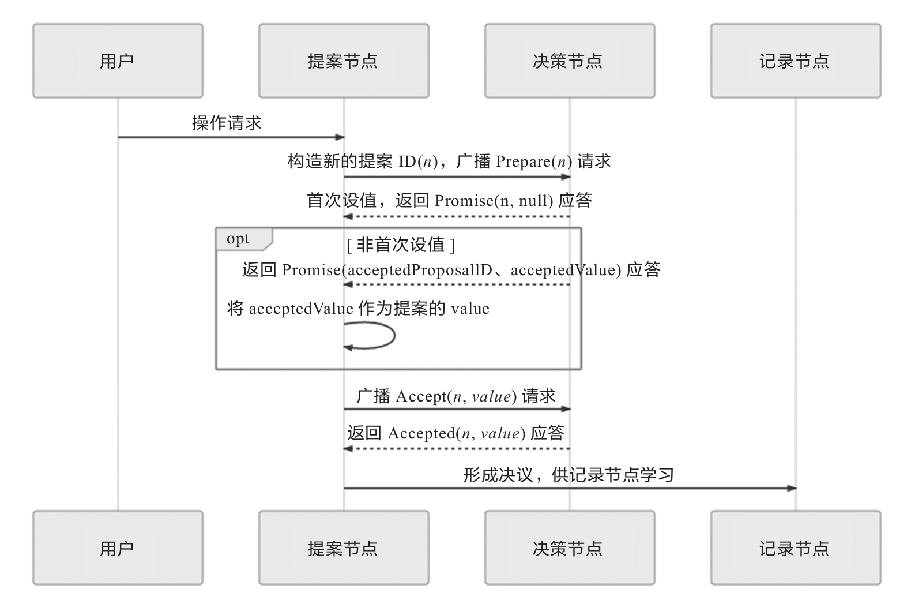
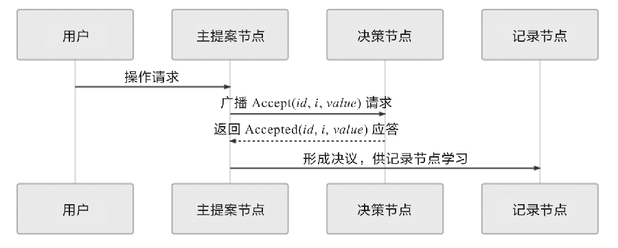
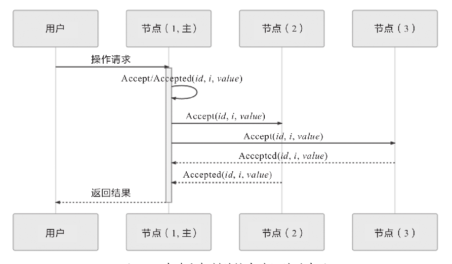

# Paxos
>世界上只有一种共识协议，就是Paxos，其他所有共识算法都是Paxos的退化版本。——Mike Burrows，Google Chubby作者

Paxos是由Leslie Lamport（就是大名鼎鼎的LaTeX中的“La”）提出的一种基于消息传递的协商共识算法，是当今分布式系统最重要的理论基础，几乎就是“共识”二字的代名词。这个极高的评价出自于提出Raft算法的论文，更显分量十足。虽然笔者认为Mike Burrows所言有些夸张，但是如果没有Paxos，那后续的Raft、ZAB等算法，ZooKeeper、etcd等分布式协调框架、Hadoop、Consul等在此基础上的各类分布式应用都很可能会延后好几年面世。
## Paxos的诞生
为了解释清楚Paxos算法，Lamport虚构了一个名为“Paxos”的希腊城邦，这个城邦按照民主制度制定法律，却没有一个中心化的专职立法机构，而是靠着“兼职议会”（Part-Time Parliament）来完成立法，无法保证所有城邦居民都能够及时了解新的法律提案，也无法保证居民会及时为提案投票。Paxos算法的目标就是让城邦能够在每一位居民都不承诺一定会及时参与的情况下，依然可以按照少数服从多数的原则，最终达成一致意见。但是Paxos算法并不考虑拜占庭将军问题，即假设信息可能丢失也可能延迟，但不会被错误传递。

Lamport在1990年首次发表了Paxos算法，选的论文题目就是“The Part-Time Parliament”。由于算法本身极为复杂，用希腊城邦作为比喻反而使得描述更晦涩，论文的三个审稿人一致要求他把希腊城邦的故事删掉。这令Lamport感觉颇为不爽，干脆就撤稿不发了，所以Paxos刚刚被提出的时候并没有引起什么反响。八年之后（1998年），Lamport将此文章重新整理后投到ACM Transactions on Computer Systems。这次论文成功发表，Lamport的名气也确实吸引了一些人去研究，但并没有多少人能弄懂他在说什么。时间又过去了三年（2001年），Lamport认为前两次的论文没有引起反响，是因为同行们无法理解他以“希腊城邦”来讲故事的幽默感，所以这一次他以“Paxos Made Simple”为题，在SIGACT News杂志上发表文章，放弃了“希腊城邦”的比喻，尽可能用（他认为）简单直接、（他认为）可读性较强的方式去介绍Paxos算法。情况虽然比前两次要好上一些，但以Paxos本应获得的重视程度来说，这次依然只能算是应者寥寥。这一段听起来如同网络段子一般的经历被Lamport以自嘲的形式放到了他的个人网站上[1]。尽管我们作为后辈应该尊重Lamport老爷子，但当笔者翻开“Paxos Made Simple”的论文，见到只有“The Paxos algorithm,when presented in plain English,is very simple.”这一句话的“摘要”时，心里实在是不得不怀疑Lamport这样写论文是不是在恶搞审稿人和读者，在嘲讽“你们这些愚蠢的人类”。

虽然Lamport本人连发三篇文章都没能让大多数同行理解Paxos，但2006年，在Google的Chubby、Megastore以及Spanner等分布式系统都使用Paxos解决了分布式共识的问题，并将其整理成正式的论文发表之后，得益于Google的行业影响力，辅以Chubby作者Mike Burrows那略显夸张但足够吸引眼球的评价推波助澜，Paxos算法一夜间成为计算机科学分布式这条分支中最炙手可热的概念，开始被学术界众人争相研究。Lamport本人因其对分布式系统的杰出理论贡献获得了2013年的图灵奖，随后才有了Paxos在区块链、分布式系统、云计算等多个领域大放异彩的故事。
## 算法流程
>在本文中Paxos均特指最早的Basic Paxos算法

Paxos算法将分布式系统中的节点分为三类。
- 提案节点：称为Proposer，提出对某个值进行设置操作的节点，设置值这个行为就被称为提案（Proposal），值一旦设置成功，就是不会丢失也不可变的。注意，Paxos是典型的基于操作转移模型而非状态转移模型来设计的算法，不要把这里的“设置值”类比成程序中变量赋值操作，而应该类比成日志记录操作，在后面介绍的Raft算法中就直接把“提案”叫作“日志”了。
- 决策节点：称为Acceptor，是应答提案的节点，决定该提案是否可被投票、是否可被接受。提案一旦得到过半数决策节点的接受，即称该提案被批准（Accept）。提案被批准即意味着该值不能被更改，也不会丢失，且最终所有节点都会接受它。
- 记录节点：称为Learner，不参与提案，也不参与决策，只是单纯地从提案、决策节点中学习已经达成共识的提案，譬如少数派节点从网络分区中恢复时，将会进入这种状态。

在使用Paxos算法的分布式系统里，所有的节点都是平等的，它们都可以承担以上某一种或者多种的角色，不过为了便于确保有明确的多数派，决策节点的数量应该被设定为奇数个，且在系统初始化时，网络中每个节点都应该知道整个网络所有决策节点的数量、地址等信息。

在分布式环境下，如果我们说各个节点“就某个值（提案）达成一致”，指的是“不存在某个时刻有一个值为A，另一个时刻又为B的情景”。解决这个问题的复杂度主要来源于以下两个方面因素的共同影响。
- 系统内部各个节点通信是不可靠的，不论是对于系统中企图设置数据的提案节点抑或是决定是否批准设置操作的决策节点，其发出、收到的信息可能延迟送达、可能丢失，但不去考虑消息有传递错误的情况。
- 系统外部各个用户访问是可并发的，如果系统只会有一个用户，或者每次只对系统进行串行访问，那单纯地应用Quorum机制，少数节点服从多数节点，就足以保证值被正确地读写。

第一点是网络通信中客观存在的现象，也是所有共识算法都要重点解决的问题。对于第二点，详细解释如下。现在我们讨论的是“分布式环境下并发操作的共享数据”的问题，即使先不考虑是否在分布式的环境下，只考虑并发操作，假设有一个变量i当前在系统中存储的数值为2，同时有外部请求A、B分别对系统发送操作指令，“把i的值加1”和“把i的值乘3”，如果不加任何并发控制，将可能得到“(2+1)×3=9”与“2×3+1=7”这两种可能的结果。因此，对同一个变量的并发修改必须先加锁后操作，不能让A、B的请求被交替处理，这也可以说是程序设计的基本常识。而在分布式的环境下，由于要同时考虑到分布式系统内可能在任何时刻出现的通信故障，如果一个节点在取得锁之后、在释放锁之前发生崩溃失联，这将导致整个操作被无限期的等待所阻塞，因此算法中的加锁就不完全等同于并发控制中以互斥量来实现的加锁，还必须提供一个其他节点能抢占锁的机制，以避免因通信问题而出现死锁。

为了解决这个问题，分布式环境中的锁必须是可抢占的。Paxos算法包括两个阶段，第一阶段“准备”（Prepare）就相当于上面抢占锁的过程。如果某个提案节点准备发起提案，必须先向所有的决策节点广播一个许可申请（称为Prepare请求）。提案节点的Prepare请求中会附带一个全局唯一且单调递增的数字n作为提案ID，决策节点收到后，将会给予提案节点两个承诺与一个应答。
- 两个承诺是指：
    - 承诺不会再接受提案ID小于或等于n的Prepare请求；
    - 承诺不会再接受提案ID小于n的Accept请求。
- 一个应答是指：
    - 在不违背以前的承诺的前提下，回复已经批准过的提案中ID最大的那个提案所设定的值和提案ID，如果该值从来没有被任何提案设定过，则返回空值。如果违反此前做出的承诺，即收到的提案ID并不是决策节点收到的最大的ID，那允许直接对此Prepare请求不予理会。

当提案节点收到了多数派决策节点的应答（称为Promise应答）后，就可以开始第二阶段的“批准”（Accept）过程，这时有如下两种可能的结果：
- 如果提案节点发现所有响应的决策节点此前都没有批准过该值（即为空），那说明它是第一个设置值的节点，可以随意地决定要设定的值，将自己选定的值与提案ID组成一个二元组“（id,value）”，再次广播给全部决策节点（称为Accept请求）；
- 如果提案节点发现响应的决策节点中已经有至少一个节点的应答中包含值了，那它就不能够随意取值，而是必须无条件地从应答中找出提案ID最大的那个值并接收，组成一个二元组“（id,maxAcceptValue）”，再次广播给全部决策节点（称为Accept请求）。

当每一个决策节点收到Accept请求时，都会在不违背以前的承诺的前提下，接收并持久化当前提案ID和提案附带的值。如果违反此前做出的承诺，即收到的提案ID并不是决策节点收到过的最大的ID，那允许直接对此Accept请求不予理会。

当提案节点收到了多数派决策节点的应答（称为Accepted应答）后，协商结束，共识决议形成，然后将形成的决议发送给所有记录节点进行学习。整个过程的时序图如图所示。

整个Paxos算法的工作流程至此结束。

## Multi Paxos
Basic Paxos的活锁问题，即两个提案节点争相提出自己的提案，抢占同一个值的修改权限，导致整个系统在持续性地“反复横跳”，外部看起来就像被锁住了一样。此外，笔者还讲述过一个观点，分布式共识的复杂性主要来源于网络的不可靠与请求的可并发两大因素，活锁问题与许多Basic Paxos异常场景中所遭遇的麻烦，都可以看作源于任何一个提案节点都能够完全平等地、与其他节点并发地提出提案而带来的复杂问题。为此，Lamport提出了一种Paxos的改进版本——Multi Paxos算法，希望能够找到一种两全其美的办法，既不破坏Paxos中“众节点平等”的原则，又能在提案节点中实现主次之分，限制每个节点都有不受控的提案权利。这两个目标听起来似乎是矛盾的，但现实世界中的选举就很符合这种在平等节点中挑选意见领袖的情景。

Multi Paxos对Basic Paxos的核心改进是增加了“选主”的过程，提案节点会通过定时轮询（心跳），确定当前网络中的所有节点里是否存在一个主提案节点，一旦没有发现主节点，节点就会在心跳超时后使用Basic Paxos中定义的准备、批准的两轮网络交互过程，向所有其他节点广播自己希望竞选主节点的请求，希望整个分布式系统对“由我作为主节点”这件事情协商达成一致共识，如果得到了决策节点中多数派的批准，便宣告竞选成功。选主完成之后，除非主节点失联之后发起重新竞选，否则从此往后，就只有主节点本身才能够提出提案。此时，无论哪个提案节点接收到客户端的操作请求，都会将请求转发给主节点来完成提案，而主节点提案时，就无须再次经过准备过程，因为可以认为在经过选举时的那一次准备之后，后续的提案都是对相同提案ID的一连串的批准过程。也可以通俗理解为选主过后，就不会再有其他节点与它竞争，相当于处于无并发的环境当中的有序操作，所以此时系统中要对某个值达成一致，只需要进行一次批准的交互即可，如图所示。

可能有人注意到这时候的二元组（id,value）已经变成了三元组（id,i,value），这是因为需要给主节点增加一个“任期编号”，这个编号必须是严格单调递增的，以应付主节点陷入网络分区后重新恢复，但另外一部分节点仍然有多数派，且已经完成了重新选主的情况，此时必须以任期编号大的主节点为准。节点有了选主机制的支持后，在整体来看，就可以进一步简化节点角色，不去区分提案、决策和记录节点，而是统统以“节点”来代替，节点只有主（Leader）和从（Follower）的区别，此时协商共识的时序图如图所示。

下面我们换一个角度来重新思考“分布式系统中如何对某个值达成一致”这个问题，可以把该问题划分为三个子问题来考虑，可以证明（具体证明就不列在这里了，感兴趣的读者可参考Raft的论文）当以下三个问题同时被解决时，即等价于达成共识：
- 如何选主（Leader Election）；
- 如何把数据复制到各个节点上（Entity Replication）；
- 如何保证过程是安全的（Safety）。

尽管选主问题还涉及许多工程上的细节，譬如心跳、随机超时、并行竞选等，但只论原理的话，如果你已经理解了Paxos算法的操作步骤，相信对选主并不会有什么疑惑，因为这本质上仅仅是分布式系统对“谁来当主节点”这件事情达成的共识而已，我们在前一节已经讲述了分布式系统该如何对一件事情达成共识，这里就不再赘述了，下面直接来解决数据（Paxos中的提案、Raft中的日志）在网络各节点间的复制问题。

在正常情况下，客户端向主节点发起一个操作请求，譬如提出“将某个值设置为X”，此时主节点将X写入自己的变更日志，但先不提交，接着在下一次心跳包中把变更X的信息广播给所有的从节点，并要求从节点回复“确认收到”的消息，从节点收到信息后，将操作写入自己的变更日志，然后向主节点发送“确认签收”的消息，主节点收到过半数的签收消息后，提交自己的变更、应答客户端并且给从节点广播可以提交的消息，从节点收到提交消息后提交自己的变更，至此，数据在节点间的复制宣告完成。

在异常情况下，网络出现了分区，部分节点失联，但只要仍能正常工作的节点的数量能够满足多数派（过半数）的要求，分布式系统就可以正常工作，这时的数据复制过程如下。
- 假设有S1、S2、S3、S4、S5五个节点，S1是主节点，由于网络故障，导致S1、S2和S3、S4、S5之间彼此无法通信，形成网络分区。
- 一段时间后，S3、S4、S5三个节点中的某一个（譬如是S3）最先达到心跳超时的阈值，获知当前分区中已经不存在主节点，则它向所有节点发出自己要竞选的广播，并收到了S4、S5节点的批准响应，加上自己一共三票，即得到了多数派的批准，竞选成功，此时系统中会同时存在S1和S3两个主节点，但由于网络分区，它们不会知道对方的存在。
- 这种情况下，客户端发起操作请求。
- 如果客户端连接到了S1、S2其中之一，都将由S1处理，但由于操作只能获得最多两个节点的响应，不构成多数派的批准，所以任何变更都无法成功提交。
- 如果客户端连接到了S3、S4、S5其中之一，都将由S3处理，此时操作可以获得最多三个节点的响应，构成多数派的批准，是有效的，变更可以被提交，即系统可以继续提供服务。
- 事实上，以上两种情景很少能够并存。网络分区是由于软、硬件或者网络故障而导致的，内部网络出现了分区，但两个分区仍然能分别与外部网络的客户端正常通信的情况甚为少见。更多的场景是算法能容忍网络里下线了一部分节点，按照这个例子来说，如果下线了两个节点，系统仍能正常工作，如果下线了三个节点，那剩余的两个节点就不可能继续提供服务了。
- 假设现在故障恢复，分区解除，五个节点可以重新通信：
- S1和S3都向所有节点发送心跳包，从各自的心跳中可以得知两个主节点里S3的任期编号更大，它是最新的，此时五个节点均只承认S3是唯一的主节点。
- S1、S2回滚它们所有未被提交的变更。
- S1、S2从主节点发送的心跳包中获得它们失联期间发生的所有变更，将变更提交并写入本地磁盘。
- 此时分布式系统各节点的状态达成最终一致。

下面我们来看第三个问题：“如何保证过程是安全的”。不知你是否感觉到这个问题与前两个问题的差异呢？选主、数据复制都是很具体的行为，但是“安全”就很模糊，什么算安全或者算不安全？

在分布式理论中，Safety和Liveness两种属性是有预定义的术语，在专业的资料中一般翻译成“协定性”和“终止性”，这两个概念也是由Lamport最先提出，当时给出的定义如下。
- 协定性（Safety）：所有的坏事都不会发生。
- 终止性（Liveness）：所有的好事都终将发生，但不知道是什么时候。

这里我们不去纠结严谨的定义，仍通过举例来说明它们的具体含义。譬如以选主问题为例，协定性保证了选主的结果一定有且只有唯一的一个主节点，不可能同时出现两个主节点；而终止性则要保证选主过程一定可以在某个时刻结束。由前面对活锁的介绍可知，在终止性这个属性上选主问题是存在理论上的瑕疵的，可能会由于活锁而导致一直无法选出明确的主节点，所以Raft论文中只写了对Safety的保证，但由于工程实现上的处理，现实中几乎不可能会出现终止性的问题。

以上这种把共识问题分解为“选主”、“复制”和“安全”三个问题来思考、解决的思路，即“Raft算法”（在Raft的《一种可以让人理解的共识算法》中提出），并获得了USENIX ATC 2014大会的Best Paper，后来更是成为etcd、LogCabin、Consul等重要分布式程序的实现基础，ZooKeeper的ZAB算法与Raft的思路也非常类似，这些算法都被认为是Multi Paxos的等价派生实现。
## Gossip协议
Paxos、Raft、ZAB等分布式算法经常会被称作“强一致性”的分布式共识协议，其实这样的描述有语病嫌疑，但我们都明白它的意思其实是：“尽管系统内部节点可以存在不一致的状态，但从系统外部看来，不一致的情况并不会被观察到，所以整体上看系统是强一致性的。”与它们相对的，还有另一类被冠以“最终一致性”的分布式共识协议，这表明系统中不一致的状态有可能会在一定时间内被外部直接观察到。一种典型且极为常见的最终一致的分布式系统就是DNS系统，在各节点缓存的TTL到期之前，都有可能与真实的域名翻译结果不一致。在本节中，笔者将介绍在比特币网络和许多重要分布式框架中都有应用的另一种具有代表性的“最终一致性”的分布式共识协议：Gossip协议。

Gossip最早由施乐公司Palo Alto研究中心在论文“Epidemic Algorithms for Replicated Database Maintenance”中提出的一种用于分布式数据库在多节点间复制同步数据的算法。从论文题目中可以看出，最初它是被称作“流行病算法”（Epidemic Algorithm）的，只是不太雅观，今天Gossip这个名字用得更为普遍，除此以外，它还有“流言算法”“八卦算法”“瘟疫算法”等别名，这些名字都很形象地反映了Gossip的特点：要同步的信息如同流言一般传播，病毒一般扩散。

笔者按照习惯也把Gossip称作“共识协议”，但首先必须强调它并不是直接与Paxos、Raft这些共识算法等价的，只是基于Gossip之上可以通过某些方法去实现与Paxos、Raft相类似的目标而已。一个最典型的例子是比特币网络中使用了Gossip协议，用于在各个分布式节点中互相同步区块头和区块体的信息，这是整个网络能够正常交换信息的基础，但并不能称作共识；然后比特币使用工作量证明（Proof of Work，PoW）来对“这个区块由谁来记账”这一件事情在全网达成共识，这样这个目标才可以认为与Paxos、Raft的目标是一致的。

下面，我们来了解Gossip的具体工作过程。相比Paxos、Raft等算法，Gossip的过程十分简单，它可以看作以下两个步骤的简单循环。
- 如果有某一项信息需要在整个网络的所有节点中传播，那从信息源开始，选择一个固定的传播周期（譬如1秒），随机选择它相连接的k个节点（称为Fan-Out）来传播消息。
- 每一个节点收到消息后，如果这个消息是它之前没有收到过的，则在下一个周期内，该节点将向除了发送消息给它的那个节点外的其他相邻的k个节点发送相同的消息，直到最终网络中所有节点都收到了消息。尽管这个过程需要一定时间，但是理论上最终网络的所有节点都会拥有相同的消息。

根据Gossip的过程描述，我们很容易发现Gossip对网络节点的连通性和稳定性几乎没有任何要求，它一开始就将网络某些节点只能与一部分节点部分连通（Partially Connected Network）而不是以全连通网络（Fully Connected Network）作为前提；能够容忍网络上节点随意地增加或者减少，随意地宕机或者重启；新增加或者重启的节点的状态最终会与其他节点同步达成一致。Gossip把网络上所有节点都视为平等而普通的一员，没有任何中心化节点或者主节点的概念，这些特点使得Gossip具有极强的鲁棒性，而且非常适合在公众互联网中应用。

同时我们也很容易找到Gossip的缺点。消息最终是通过多个轮次的散播到达全网的，因此它必然会存在全网各节点状态不一致的情况，而且由于是随机选取发送消息的节点，所以尽管可以在整体上测算出统计学意义上的传播速率，但对于个体消息来说，无法准确地预计需要多长时间才能达成全网一致。另外一个缺点是消息的冗余，同样是由于随机选取发送消息的节点，所以就不可避免地存在消息重复发送给同一节点的情况，增加了网络的传输压力，也给消息节点带来了额外的处理负载。

达到一致性耗费的时间与网络传播中消息冗余量这两个缺点存在一定对立，如果要改善其中一个，就会恶化另外一个，由此，Gossip设计了两种可能的消息传播模式：反熵（Anti-Entropy）和传谣（Rumor-Mongering）。熵（Entropy）是生活中少见但科学中很常用的概念，它代表着事物的混乱程度。反熵的意思就是反混乱，以提升网络各个节点之间的相似度为目标。所以在反熵模式下，会同步节点的全部数据，以消除各节点之间的差异，目标是使整个网络各节点完全一致。但是，在节点本身就会发生变动的前提下，这个目标将使得整个网络中消息的数量非常庞大，给网络带来巨大的传输开销。而传谣模式是以传播消息为目标，只发送新到达节点的数据，即只对外发送变更消息，这样消息数据量将显著缩减，网络开销也相对减小。
