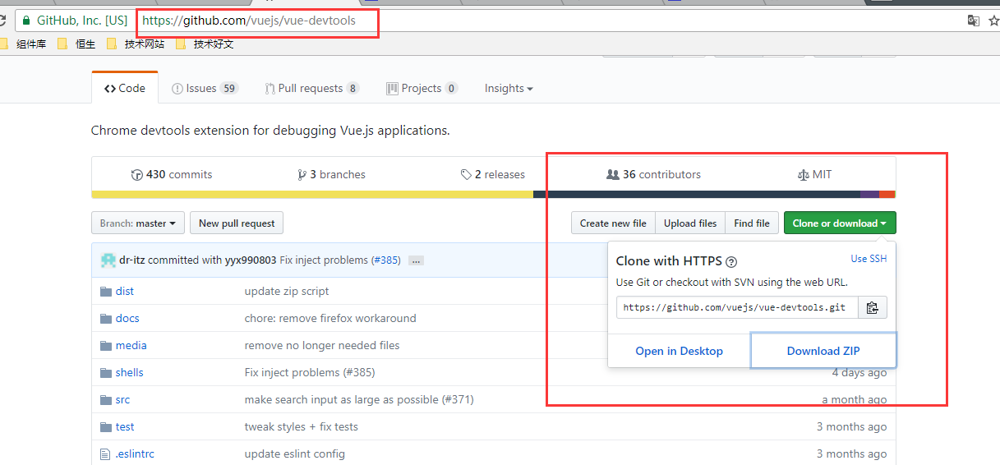
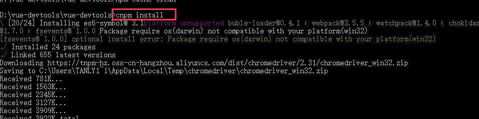
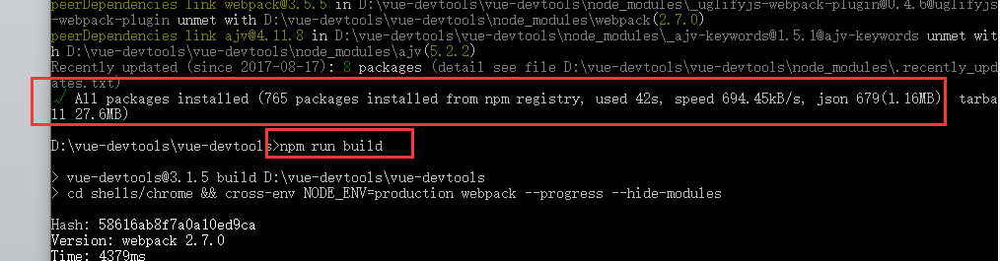
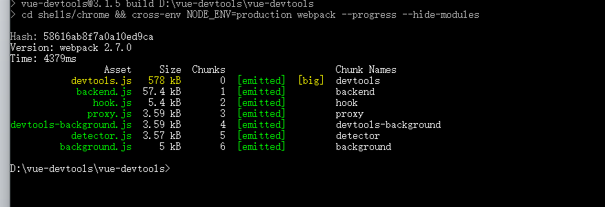
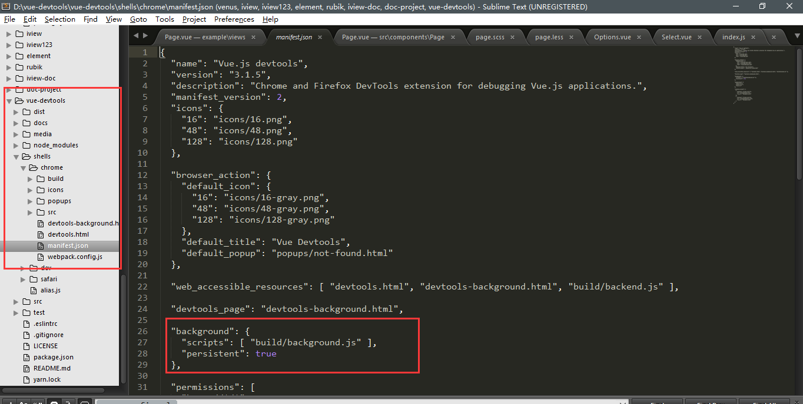
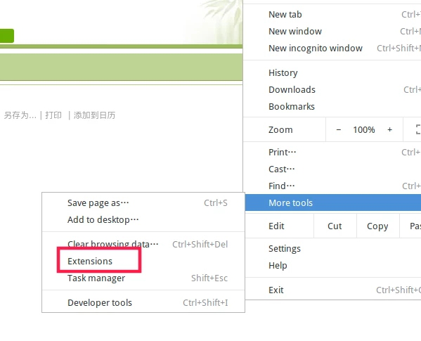
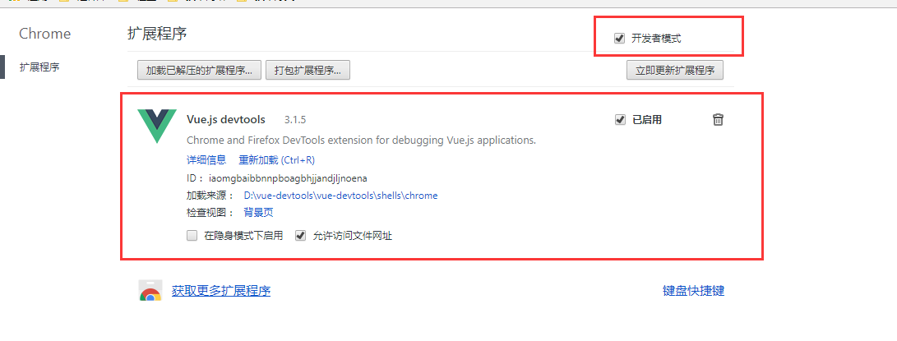
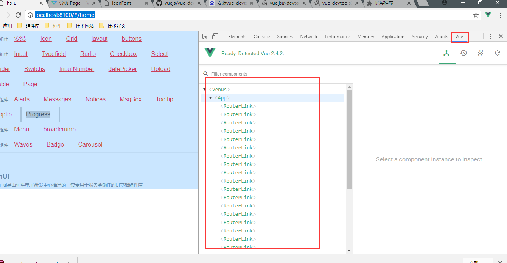

# vue-devtools的安装与使用
1. 在github上下载安装包（也可以直接解压tools里面的vue-devtools-master压缩包）
>github下载地址：<https://github.com/vuejs/vue-devtools>

>
2. 下载好后进入vue-devtools-master工程，执行npm install ----->npm run build（此处npm install下载较慢，建议使用cnpm install）

3. 在npm run build执行成功后，修改manifest.json中的persistent为true

修改manifest.json

4. 打开谷歌浏览器设置->扩展程序->勾选开发者模式->添加工程中的shells->chrome的内容或者直接拖动shells->chrome到此页面，至此恭喜已经安装成功！！！

5. 打开自己的vue项目中，如果是有vue-cli构建的项目，执行npm run dev,打开http://localhost:8080/ 服务器调试地址；至此完成devtools的安装

